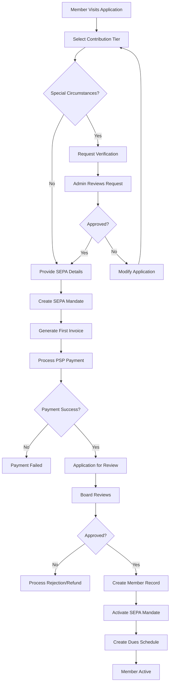
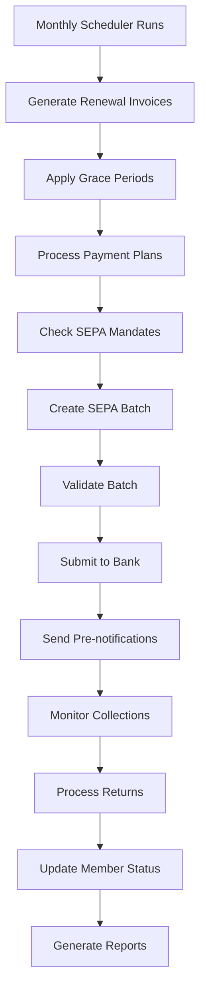

# Membership Dues System - Comprehensive Implementation Plan
*Reconciled from V1 and V2 Plans - January 2025*

This document combines the comprehensive member-focused features from V1 with the sophisticated SEPA integration requirements from V2, creating a complete implementation roadmap.

## Table of Contents
1. [Core Philosophy & Design Principles](#core-philosophy--design-principles)
2. [System Architecture Overview](#system-architecture-overview)
3. [SEPA Integration & Batch Processing](#sepa-integration--batch-processing)
4. [Member Experience & Contribution System](#member-experience--contribution-system)
5. [Payment Processing & Lifecycle](#payment-processing--lifecycle)
6. [Data Model & Relationships](#data-model--relationships)
7. [Business Process Flows](#business-process-flows)
8. [Technical Implementation](#technical-implementation)
9. [User Interface & Experience](#user-interface--experience)
10. [Operational Procedures](#operational-procedures)
11. [Migration Strategy](#migration-strategy)
12. [Monitoring & Maintenance](#monitoring--maintenance)

---

## 1. Core Philosophy & Design Principles

### 1.1 Member-Centric Approach (From V1)
- **Member Choice**: Support multiple contribution tiers and payment plans
- **Transparency**: Clear communication about fees, coverage periods, and payment schedules
- **Flexibility**: Handle hardship cases, student discounts, and custom amounts
- **Accessibility**: Multiple payment methods and grace period options

### 1.2 SEPA-First Design (From V2)
- **Monthly Batch Processing**: Efficient collection on 26th/27th of each month
- **Compliance**: Full SEPA regulation compliance with proper pre-notification
- **Anniversary Billing**: Members pay based on their approval date anniversary
- **No Proration**: Full period payments for clarity and simplicity

### 1.3 Operational Excellence
- **Manual Review**: All payment failures require human review
- **Audit Trail**: Comprehensive logging of all changes and actions
- **Fail-Safe**: Never suspend without explicit authorization
- **Performance**: Optimized for large membership bases

---

## 2. System Architecture Overview

### 2.1 Core Components Integration

```python
# Enhanced from both V1 and V2
class MembershipDuesSystem:
    """
    Comprehensive dues management system combining:
    - V1: Flexible contribution tiers and payment plans
    - V2: SEPA-first batch processing
    - Enhanced: Unified member experience
    """

    # Core Management
    dues_scheduler: MembershipDuesScheduler
    sepa_batch_processor: SEPABatchProcessor
    notification_engine: DuesNotificationEngine

    # Member Experience
    contribution_tier_manager: ContributionTierManager
    payment_plan_wizard: PaymentPlanWizard
    member_portal: MemberPortalInterface

    # Administrative
    failure_handler: PaymentFailureHandler
    audit_logger: DuesAuditLogger
    health_monitor: SystemHealthMonitor
```

### 2.2 Enhanced Data Architecture

**Core Entities:**
- `MembershipDuesSchedule` - Enhanced with contribution tiers and payment plans
- `SEPABatchConfig` - Organization-wide SEPA settings
- `ContributionTier` - Flexible fee structures
- `PaymentPlan` - Installment management
- `DuesNotificationLog` - Communication tracking
- `PaymentFailureLog` - Comprehensive failure handling

---

## 3. SEPA Integration & Batch Processing

### 3.1 Application Process with Payment-First Flow

```python
def process_membership_application_comprehensive(application_data):
    """
    Enhanced application process combining V1 flexibility with V2 SEPA requirements
    """
    # 1. Create application with contribution tier selection
    application = frappe.new_doc("Membership Application")
    application.update(application_data)

    # 2. Handle contribution tier selection (V1 feature)
    if application.contribution_tier:
        tier = frappe.get_doc("Contribution Tier", application.contribution_tier)
        application.first_payment_amount = tier.amount
    elif application.custom_amount:
        application.first_payment_amount = application.custom_amount
    else:
        # Default to standard membership type amount
        membership_type = frappe.get_doc("Membership Type", application.membership_type)
        application.first_payment_amount = membership_type.amount

    # 3. Create SEPA mandate (V2 requirement)
    if application.sepa_mandate_consent:
        mandate = create_pending_sepa_mandate(application)
        application.sepa_mandate = mandate.name

    # 4. Create first invoice with clear coverage period
    invoice = create_application_invoice_with_coverage(application)
    application.first_invoice = invoice.name

    # 5. Process first payment via PSP
    payment_request = create_application_payment_request(application, invoice)

    return {
        "application": application.name,
        "mandate": mandate.name if mandate else None,
        "invoice": invoice.name,
        "payment_request": payment_request,
        "next_step": "complete_payment"
    }
```

### 3.2 Monthly Batch Processing with Enhanced Logic

```python
def create_comprehensive_sepa_batch():
    """
    Enhanced batch creation combining V2 SEPA requirements with V1 flexibility
    """
    config = frappe.get_single("SEPA Batch Config")
    target_date = config.get_target_batch_date()

    # Get eligible invoices with enhanced filtering
    eligible_invoices = frappe.db.sql("""
        SELECT DISTINCT
            si.name as invoice,
            si.customer,
            si.outstanding_amount,
            m.name as member,
            mds.name as dues_schedule,
            sm.name as mandate,
            mds.payment_plan,
            mds.contribution_tier,
            # Enhanced sequence type determination
            CASE
                WHEN smu.last_usage_date IS NULL THEN 'FRST'
                WHEN sm.sign_date > smu.last_usage_date THEN 'FRST'
                ELSE 'RCUR'
            END as sequence_type
        FROM `tabSales Invoice` si
        INNER JOIN `tabMember` m ON si.member = m.name
        INNER JOIN `tabSEPA Mandate` sm ON sm.party = si.customer
        INNER JOIN `tabMembership Dues Schedule` mds ON mds.member = m.name
        LEFT JOIN `tabSEPA Mandate Usage` smu ON smu.mandate = sm.name
        WHERE
            si.outstanding_amount > 0
            AND si.is_membership_invoice = 1
            AND si.docstatus = 1
            AND sm.status = 'Active'
            AND mds.status = 'Active'
            AND mds.payment_method = 'SEPA Direct Debit'
            AND NOT EXISTS (
                SELECT 1 FROM `tabDirect Debit Transaction` ddt
                WHERE ddt.sales_invoice = si.name
                AND ddt.status IN ('Pending', 'Processing', 'Completed')
            )
            # Enhanced grace period handling
            AND (
                mds.grace_period_until IS NULL
                OR mds.grace_period_until < CURDATE()
            )
            # Payment plan consideration
            AND (
                mds.payment_plan IS NULL
                OR (
                    SELECT COUNT(*) FROM `tabPayment Plan Installment` ppi
                    WHERE ppi.parent = mds.payment_plan
                    AND ppi.due_date <= CURDATE()
                    AND ppi.status = 'Pending'
                ) > 0
            )
        ORDER BY sequence_type DESC, m.member_id
    """, as_dict=True)

    # Create batch with enhanced tracking
    batch = create_enhanced_batch(eligible_invoices, target_date)

    return batch
```

---

## 4. Member Experience & Contribution System

### 4.1 Enhanced Contribution Tier System

```python
class ContributionTier(Document):
    """
    Flexible contribution system from V1 with SEPA integration
    """
    # Basic Information
    tier_name: Data  # "Standard", "Student", "Hardship", "Supporter"
    display_name: Data  # "Standard Contribution"
    amount: Currency

    # Eligibility & Validation
    requires_verification: Check  # For student/hardship rates
    verification_documents: Table[TierVerificationDocument]
    auto_approval_criteria: Text

    # SEPA Integration
    sepa_description: Data  # Description in SEPA transactions

    # Member Portal Display
    is_publicly_visible: Check
    display_order: Int
    description: Text
    benefits: Text

    def validate_member_eligibility(self, member):
        """Check if member is eligible for this tier"""
        if self.tier_name == "Student":
            return self.validate_student_status(member)
        elif self.tier_name == "Hardship":
            return self.validate_hardship_eligibility(member)
        return True
```

### 4.2 Member Portal Interface

```html
<!-- Enhanced member portal combining V1 flexibility with V2 SEPA clarity -->
<div class="membership-contribution-selector">
    <h3>Choose Your Contribution Level</h3>

    <!-- Contribution Tiers -->
    <div class="contribution-tiers">
        
        <div class="tier-card {{ 'recommended' if tier.is_recommended else '' }}">
            <h4>{{ tier.display_name }}</h4>
            <div class="tier-amount">€{{ tier.amount }}/month</div>
            <div class="tier-description">{{ tier.description }}</div>

            
            <div class="tier-benefits">
                <strong>Benefits:</strong>
                <ul>
                    
                    <li>{{ benefit }}</li>
                    
                </ul>
            </div>
            

            <button class="tier-select-btn" data-tier="{{ tier.name }}" data-amount="{{ tier.amount }}">
                Select {{ tier.display_name }}
            </button>
        </div>
        

        <!-- Custom Amount Option -->
        <div class="tier-card custom-amount-card">
            <h4>Custom Amount</h4>
            <div class="custom-amount-input">
                <input type="number" id="custom-amount" min="{{ minimum_contribution }}"
                       placeholder="Enter amount (min €{{ minimum_contribution }})">
                <span class="currency-symbol">€/month</span>
            </div>
            <div class="custom-amount-note">
                <small>Choose an amount that works for your situation</small>
            </div>
            <button class="tier-select-btn" id="custom-amount-btn">
                Select Custom Amount
            </button>
        </div>
    </div>

    <!-- Special Circumstances -->
    <div class="special-circumstances">
        <h4>Special Circumstances</h4>
        <div class="circumstances-options">
            <label>
                <input type="checkbox" id="student-discount">
                I am a student (verification required)
            </label>
            <label>
                <input type="checkbox" id="hardship-request">
                I need financial hardship consideration
            </label>
            <label>
                <input type="checkbox" id="payment-plan">
                I would like to discuss a payment plan
            </label>
        </div>
    </div>

    <!-- SEPA Information -->
    <div class="sepa-information">
        <h4>Payment Information</h4>
        <div class="sepa-details">
            <p><strong>Payment Method:</strong> SEPA Direct Debit (automatic monthly collection)</p>
            <p><strong>First Payment:</strong> Due immediately via online payment</p>
            <p><strong>Recurring Payments:</strong> Collected around the {{ batch_day }}th of each month</p>
            <p><strong>Coverage:</strong> Each payment covers the upcoming month</p>
        </div>
    </div>
</div>
```

---

## 5. Payment Processing & Lifecycle

### 5.1 Enhanced Payment Status System

```python
class PaymentStatusCalculator:
    """
    Enhanced payment status from V1 with SEPA batch integration
    """

    STATUS_HIERARCHY = {
        'current': 1,           # Paid for current period
        'grace_period': 2,      # Overdue but within grace period
        'payment_plan': 3,      # On approved payment plan
        'pending_batch': 4,     # Included in next SEPA batch
        'failed_payment': 5,    # Payment failed, needs attention
        'suspended': 6          # Suspended (manual action required)
    }

    def calculate_payment_status(self, dues_schedule):
        """Calculate comprehensive payment status"""
        # Check current payment status
        if self.is_current_period_paid(dues_schedule):
            return 'current'

        # Check grace period
        if self.is_in_grace_period(dues_schedule):
            return 'grace_period'

        # Check payment plan
        if self.has_active_payment_plan(dues_schedule):
            return 'payment_plan'

        # Check SEPA batch inclusion
        if self.is_pending_in_batch(dues_schedule):
            return 'pending_batch'

        # Check recent failures
        if self.has_recent_payment_failure(dues_schedule):
            return 'failed_payment'

        return 'suspended'

    def is_in_grace_period(self, dues_schedule):
        """Enhanced grace period calculation"""
        if not dues_schedule.grace_period_until:
            return False

        grace_end = getdate(dues_schedule.grace_period_until)
        today_date = getdate(today())

        return today_date <= grace_end
```

### 5.2 Payment Plan Management

```python
class PaymentPlanWizard:
    """
    Payment plan system from V1 with SEPA integration
    """

    def create_payment_plan(self, member, total_amount, plan_type="monthly"):
        """Create flexible payment plan"""
        plan = frappe.new_doc("Payment Plan")
        plan.member = member
        plan.total_amount = total_amount
        plan.plan_type = plan_type
        plan.status = "Draft"

        # Calculate installments
        installments = self.calculate_installments(total_amount, plan_type)

        for installment in installments:
            plan.append("installments", installment)

        return plan

    def calculate_installments(self, total_amount, plan_type):
        """Calculate installment schedule"""
        installment_configs = {
            "monthly": {"count": 3, "interval": 1},
            "quarterly": {"count": 4, "interval": 3},
            "biannual": {"count": 2, "interval": 6}
        }

        config = installment_configs.get(plan_type, installment_configs["monthly"])
        installment_amount = total_amount / config["count"]

        installments = []
        for i in range(config["count"]):
            due_date = add_months(today(), i * config["interval"])
            installments.append({
                "installment_number": i + 1,
                "amount": installment_amount,
                "due_date": due_date,
                "status": "Pending"
            })

        return installments
```

---

## 6. Data Model & Relationships

### 6.1 Enhanced Membership Dues Schedule

```python
class MembershipDuesSchedule(Document):
    """
    Comprehensive schedule combining V1 flexibility with V2 SEPA requirements
    """
    # Core Information (V2)
    member: Link[Member]
    membership: Link[Membership]

    # Contribution System (V1)
    contribution_tier: Link[ContributionTier]
    use_custom_amount: Check
    custom_amount: Currency
    custom_amount_reason: Text
    custom_amount_approved_by: Link[User]
    custom_amount_approved_date: Date

    # Billing Configuration (V2)
    billing_frequency: Select["Monthly", "Annual"] = "Monthly"
    billing_day: Int  # Anniversary day
    amount: Currency

    # Payment Plan Integration (V1)
    payment_plan: Link[PaymentPlan]
    payment_plan_active: Check

    # Grace Period Management (V1)
    grace_period_until: Date
    grace_period_type: Select["Standard", "Extended", "Hardship", "Custom"]
    grace_period_reason: Text

    # SEPA Integration (V2)
    payment_method: Select["SEPA Direct Debit", "Bank Transfer", "PSP"] = "SEPA Direct Debit"
    active_mandate: Link[SEPAMandate]
    next_sequence_type: Select["FRST", "RCUR"]

    # Coverage Tracking (V2)
    current_coverage_start: Date
    current_coverage_end: Date
    next_invoice_date: Date

    # Status & Monitoring (V1)
    status: Select["Active", "Paused", "Grace Period", "Payment Plan", "Suspended"]
    last_payment_date: Date
    consecutive_failures: Int
    under_manual_review: Check

    # Audit Trail (V1)
    modification_history: Table[DuesModificationLog]

    def get_effective_amount(self):
        """Get effective dues amount considering all factors"""
        if self.use_custom_amount and self.custom_amount:
            return self.custom_amount
        elif self.contribution_tier:
            tier = frappe.get_doc("Contribution Tier", self.contribution_tier)
            return tier.amount
        elif self.payment_plan and self.payment_plan_active:
            # Return next installment amount
            return self.get_next_installment_amount()
        else:
            # Default to membership type amount
            membership = frappe.get_doc("Membership", self.membership)
            membership_type = frappe.get_doc("Membership Type", membership.membership_type)
            return membership_type.amount
```

### 6.2 Enhanced Notification System

```python
class DuesNotificationEngine:
    """
    Comprehensive notification system from V1 with SEPA timing
    """

    NOTIFICATION_STAGES = {
        'pre_invoice': {
            'days_before': 5,
            'template': 'upcoming_invoice_notification',
            'channels': ['email', 'portal']
        },
        'invoice_generated': {
            'days_before': 0,
            'template': 'invoice_generated_notification',
            'channels': ['email']
        },
        'sepa_pre_notification': {
            'days_before': 2,  # SEPA requirement
            'template': 'sepa_pre_notification',
            'channels': ['email'],
            'required': True
        },
        'payment_reminder': {
            'days_after': 3,
            'template': 'payment_reminder',
            'channels': ['email', 'sms']
        },
        'grace_period_start': {
            'days_after': 7,
            'template': 'grace_period_notification',
            'channels': ['email', 'sms', 'portal']
        },
        'final_notice': {
            'days_after': 21,
            'template': 'final_notice',
            'channels': ['email', 'sms', 'letter']
        },
        'suspension_warning': {
            'days_after': 28,
            'template': 'suspension_warning',
            'channels': ['email', 'sms', 'letter', 'phone']
        }
    }

    def process_notification_queue(self):
        """Process all due notifications"""
        for stage_name, config in self.NOTIFICATION_STAGES.items():
            schedules = self.get_schedules_for_stage(stage_name, config)

            for schedule in schedules:
                self.send_notification(schedule, stage_name, config)
```

---

## 7. Business Process Flows

### 7.1 Complete Member Onboarding Flow



### 7.2 Monthly Billing & Collection Flow



---

## 8. Technical Implementation

### 8.1 Database Schema Changes

```sql
-- Enhanced Membership Dues Schedule
ALTER TABLE `tabMembership Dues Schedule` ADD COLUMN `contribution_tier` VARCHAR(140);
ALTER TABLE `tabMembership Dues Schedule` ADD COLUMN `use_custom_amount` TINYINT(1) DEFAULT 0;
ALTER TABLE `tabMembership Dues Schedule` ADD COLUMN `custom_amount` DECIMAL(18,6);
ALTER TABLE `tabMembership Dues Schedule` ADD COLUMN `grace_period_until` DATE;
ALTER TABLE `tabMembership Dues Schedule` ADD COLUMN `payment_plan` VARCHAR(140);

-- New Contribution Tier table
CREATE TABLE `tabContribution Tier` (
    `name` VARCHAR(140) PRIMARY KEY,
    `tier_name` VARCHAR(140),
    `amount` DECIMAL(18,6),
    `requires_verification` TINYINT(1),
    `is_publicly_visible` TINYINT(1),
    `display_order` INT,
    `creation` DATETIME,
    `modified` DATETIME
);

-- Enhanced Payment Plan table
CREATE TABLE `tabPayment Plan` (
    `name` VARCHAR(140) PRIMARY KEY,
    `member` VARCHAR(140),
    `total_amount` DECIMAL(18,6),
    `plan_type` VARCHAR(50),
    `status` VARCHAR(50),
    `creation` DATETIME,
    `modified` DATETIME
);

-- Enhanced SEPA Mandate Usage tracking
ALTER TABLE `tabSEPA Mandate Usage` ADD COLUMN `sequence_type` VARCHAR(10);
ALTER TABLE `tabSEPA Mandate Usage` ADD COLUMN `batch_reference` VARCHAR(140);
ALTER TABLE `tabSEPA Mandate Usage` ADD COLUMN `collection_date` DATE;
```

### 8.2 Performance Optimizations

```python
# Enhanced caching strategy from V1
class DuesPaymentCache:
    """Redis-based caching for payment status"""

    def get_cached_payment_status(self, member_id):
        """Get cached payment status with intelligent refresh"""
        cache_key = f"payment_status:{member_id}"
        cached_data = frappe.cache().get(cache_key)

        if cached_data:
            # Check if cache is still valid
            if self.is_cache_valid(cached_data):
                return cached_data

        # Refresh cache
        fresh_data = self.calculate_payment_status(member_id)
        frappe.cache().set(cache_key, fresh_data, ttl=3600)

        return fresh_data

    def invalidate_payment_cache(self, member_id):
        """Invalidate cache on payment events"""
        cache_key = f"payment_status:{member_id}"
        frappe.cache().delete(cache_key)
```

---

## 9. User Interface & Experience

### 9.1 Enhanced Member Dashboard

```html
<!-- Comprehensive member dashboard -->
<div class="member-dues-dashboard">
    <!-- Payment Status Card -->
    <div class="payment-status-card status-{{ payment_status }}">
        <div class="status-icon">
            <i class="fa fa-{{ status_icon }}"></i>
        </div>
        <div class="status-content">
            <h3>{{ status_display }}</h3>
            <p class="status-message">{{ status_message }}</p>
        </div>
    </div>

    <!-- Contribution Information -->
    <div class="contribution-info">
        <h4>Your Contribution</h4>
        <div class="contribution-details">
            <div class="current-tier">
                <span class="tier-name">{{ current_tier.display_name }}</span>
                <span class="tier-amount">€{{ current_amount }}/month</span>
            </div>
            
            <div class="payment-plan-info">
                <p><i class="fa fa-calendar"></i> Payment Plan Active</p>
                <p>Next installment: €{{ next_installment.amount }} on {{ next_installment.due_date }}</p>
            </div>
            
        </div>
        <div class="contribution-actions">
            <button class="btn btn-outline" onclick="showContributionOptions()">
                Modify Contribution
            </button>
            
            <button class="btn btn-link" onclick="showPaymentPlanOptions()">
                Request Payment Plan
            </button>
            
        </div>
    </div>

    <!-- Coverage & Next Payment -->
    <div class="coverage-info">
        <h4>Coverage & Next Payment</h4>
        <div class="coverage-timeline">
            <div class="coverage-period">
                <span class="period-label">Current Coverage</span>
                <span class="period-dates">{{ coverage_start }} - {{ coverage_end }}</span>
            </div>
            <div class="next-payment">
                <span class="payment-label">Next Payment</span>
                <span class="payment-date">{{ next_payment_date }}</span>
                <span class="payment-method">via {{ payment_method }}</span>
            </div>
        </div>
    </div>

    <!-- Grace Period Notice -->
    
    <div class="grace-period-notice">
        <div class="alert alert-warning">
            <i class="fa fa-clock-o"></i>
            <strong>Grace Period Active</strong>
            <p>You have until {{ grace_period_end }} to update your payment method or contact us.</p>
            <button class="btn btn-primary" onclick="showPaymentOptions()">
                Update Payment Method
            </button>
        </div>
    </div>
    
</div>
```

### 9.2 Administrative Interface

```html
<!-- Comprehensive admin dashboard -->
<div class="dues-admin-dashboard">
    <!-- System Health -->
    <div class="health-indicators">
        <div class="health-card">
            <h4>System Health</h4>
            <div class="health-metrics">
                <div class="metric">
                    <span class="metric-label">Active Schedules</span>
                    <span class="metric-value">{{ health.active_schedules }}</span>
                </div>
                <div class="metric">
                    <span class="metric-label">Pending Batches</span>
                    <span class="metric-value">{{ health.pending_batches }}</span>
                </div>
                <div class="metric">
                    <span class="metric-label">Failed Payments</span>
                    <span class="metric-value">{{ health.failed_payments }}</span>
                </div>
            </div>
        </div>
    </div>

    <!-- Batch Management -->
    <div class="batch-management">
        <h4>SEPA Batch Management</h4>
        <div class="batch-summary">
            <p><strong>Next Batch Date:</strong> {{ next_batch_date }}</p>
            <p><strong>Eligible Invoices:</strong> {{ eligible_count }}</p>
            <p><strong>Total Amount:</strong> €{{ total_amount }}</p>
        </div>
        <div class="batch-actions">
            <button class="btn btn-primary" onclick="createSEPABatch()">
                Create SEPA Batch
            </button>
            <button class="btn btn-outline" onclick="previewBatch()">
                Preview Batch
            </button>
        </div>
    </div>

    <!-- Payment Failures -->
    <div class="failure-management">
        <h4>Payment Failures Requiring Review</h4>
        <div class="failure-list">
            
            <div class="failure-item">
                <div class="failure-member">
                    <strong>{{ failure.member_name }}</strong>
                    <span class="failure-date">{{ failure.failure_date }}</span>
                </div>
                <div class="failure-details">
                    <span class="failure-type">{{ failure.failure_type }}</span>
                    <span class="failure-amount">€{{ failure.amount }}</span>
                </div>
                <div class="failure-actions">
                    <button class="btn btn-sm btn-outline" onclick="reviewFailure('{{ failure.name }}')">
                        Review
                    </button>
                    <button class="btn btn-sm btn-link" onclick="contactMember('{{ failure.member }}')">
                        Contact
                    </button>
                </div>
            </div>
            
        </div>
    </div>
</div>
```

---

## 10. Operational Procedures

### 10.1 Enhanced Monthly Checklist

```python
def get_comprehensive_monthly_checklist():
    """
    Complete monthly checklist combining V1 operational procedures with V2 SEPA requirements
    """
    return {
        "Pre-Month Planning (25th of previous month)": [
            "Review contribution tier requests and approvals",
            "Process payment plan modifications",
            "Verify SEPA mandate validity for all active members",
            "Check grace period expirations",
            "Review and approve custom amount requests",
            "Update member statuses based on payment history"
        ],

        "Invoice Generation (1st of month)": [
            "Run automated invoice generation",
            "Verify invoice amounts match contribution tiers",
            "Check payment plan installment scheduling",
            "Review custom amount applications",
            "Validate grace period extensions",
            "Generate monthly dues report"
        ],

        "Pre-Batch Preparation (20th-24th)": [
            "Review payment failures from previous month",
            "Process SEPA mandate updates",
            "Verify bank account details for new mandates",
            "Check grace period statuses",
            "Review payment plan compliance",
            "Prepare batch creation parameters"
        ],

        "Batch Creation & Submission (25th-26th)": [
            "Create SEPA batch with enhanced validation",
            "Review FRST vs RCUR distribution",
            "Verify batch totals and member counts",
            "Check pre-notification timing requirements",
            "Submit batch to bank with proper lead time",
            "Send SEPA pre-notifications to members"
        ],

        "Collection & Reconciliation (27th-30th)": [
            "Monitor bank for batch acceptance",
            "Process successful collections",
            "Handle R-transactions and failures",
            "Update member payment statuses",
            "Generate collection reports",
            "Initiate failure review process"
        ],

        "Month-End Analysis (30th-31st)": [
            "Generate comprehensive dues report",
            "Analyze payment success rates",
            "Review contribution tier effectiveness",
            "Update payment plan statuses",
            "Prepare board report on membership finances",
            "Plan next month's activities"
        ]
    }
```

### 10.2 System Health Monitoring

```python
@frappe.whitelist()
def comprehensive_system_health_check():
    """
    Enhanced health check from V1 with SEPA monitoring
    """
    health_status = {
        "overall_status": "healthy",
        "issues": [],
        "metrics": {}
    }

    # Check dues schedules
    inactive_schedules = frappe.db.count("Membership Dues Schedule",
                                        {"status": "Inactive"})
    if inactive_schedules > 0:
        health_status["issues"].append(f"{inactive_schedules} inactive schedules need review")

    # Check SEPA mandates
    expiring_mandates = frappe.db.sql("""
        SELECT COUNT(*) as count
        FROM `tabSEPA Mandate`
        WHERE status = 'Active'
        AND expiry_date <= DATE_ADD(CURDATE(), INTERVAL 30 DAY)
    """)[0][0]

    if expiring_mandates > 0:
        health_status["issues"].append(f"{expiring_mandates} SEPA mandates expiring soon")

    # Check payment failures
    unresolved_failures = frappe.db.count("Payment Failure Log",
                                         {"status": "Pending Review"})
    if unresolved_failures > 5:
        health_status["issues"].append(f"{unresolved_failures} unresolved payment failures")

    # Check grace periods
    extended_grace_periods = frappe.db.sql("""
        SELECT COUNT(*) as count
        FROM `tabMembership Dues Schedule`
        WHERE grace_period_until IS NOT NULL
        AND grace_period_until < CURDATE() - INTERVAL 7 DAY
    """)[0][0]

    if extended_grace_periods > 0:
        health_status["issues"].append(f"{extended_grace_periods} extended grace periods need attention")

    # Overall health assessment
    if len(health_status["issues"]) > 3:
        health_status["overall_status"] = "needs_attention"
    elif len(health_status["issues"]) > 0:
        health_status["overall_status"] = "warning"

    return health_status
```

---

## 11. Migration Strategy

### 11.1 Comprehensive Migration Plan

```python
def execute_comprehensive_migration():
    """
    Complete migration strategy combining V1 member data with V2 SEPA requirements
    """

    # Phase 1: Data Structure Migration
    migrate_existing_member_data()
    create_contribution_tiers()
    setup_sepa_configuration()

    # Phase 2: Member Assignment
    assign_members_to_tiers()
    create_initial_dues_schedules()
    migrate_sepa_mandates()

    # Phase 3: System Integration
    setup_notification_templates()
    configure_batch_processing()
    initialize_health_monitoring()

    # Phase 4: Validation & Testing
    validate_migration_integrity()
    test_batch_processing()
    verify_member_portal_access()

def migrate_existing_member_data():
    """Migrate existing member fee overrides to new system"""
    members_with_overrides = frappe.get_all("Member",
                                           filters={"membership_fee_override": [">", 0]},
                                           fields=["name", "membership_fee_override", "fee_override_reason"])

    for member in members_with_overrides:
        # Create dues schedule with custom amount
        dues_schedule = frappe.new_doc("Membership Dues Schedule")
        dues_schedule.member = member.name
        dues_schedule.use_custom_amount = 1
        dues_schedule.custom_amount = member.membership_fee_override
        dues_schedule.custom_amount_reason = member.fee_override_reason or "Migrated from legacy system"
        dues_schedule.status = "Active"
        dues_schedule.insert()

        # Update member record
        member_doc = frappe.get_doc("Member", member.name)
        member_doc.dues_schedule = dues_schedule.name
        member_doc.save()
```

---

## 12. Monitoring & Maintenance

### 12.1 Performance Monitoring

```python
class DuesSystemMonitor:
    """
    Comprehensive monitoring system
    """

    def collect_performance_metrics(self):
        """Collect system performance metrics"""
        metrics = {
            "batch_processing_time": self.measure_batch_processing_time(),
            "notification_delivery_rate": self.calculate_notification_success_rate(),
            "payment_success_rate": self.calculate_payment_success_rate(),
            "system_response_time": self.measure_system_response_time(),
            "cache_hit_rate": self.calculate_cache_hit_rate()
        }

        # Store metrics for trending
        self.store_metrics(metrics)

        return metrics

    def generate_health_report(self):
        """Generate comprehensive health report"""
        return {
            "system_health": comprehensive_system_health_check(),
            "performance_metrics": self.collect_performance_metrics(),
            "operational_status": self.check_operational_status(),
            "upcoming_maintenance": self.get_maintenance_schedule()
        }
```

---

## Implementation Phases

### Phase 1: Foundation (Months 1-2)
- Implement enhanced data model
- Create contribution tier system
- Set up basic SEPA integration
- Develop member portal interface

### Phase 2: Core Features (Months 3-4)
- Payment plan management
- Enhanced notification system
- Batch processing improvements
- Administrative interfaces

### Phase 3: Advanced Features (Months 5-6)
- Grace period management
- Payment failure handling
- Performance optimizations
- Comprehensive monitoring

### Phase 4: Integration & Testing (Months 7-8)
- Full system integration
- Migration execution
- User acceptance testing
- Performance tuning

This comprehensive plan combines the member-focused flexibility of V1 with the sophisticated SEPA requirements of V2, creating a robust, scalable, and user-friendly membership dues system.
