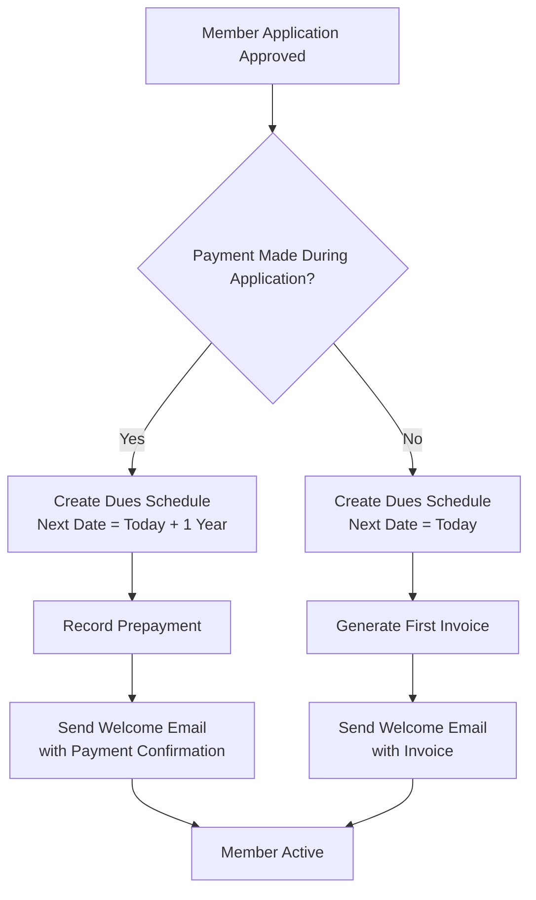

# Membership Dues System - Detailed Implementation Guide

## Table of Contents
1. [System Architecture Details](#system-architecture-details)
2. [Data Model & Relationships](#data-model--relationships)
3. [Business Process Flows](#business-process-flows)
4. [Technical Implementation Details](#technical-implementation-details)
5. [User Experience Flows](#user-experience-flows)
6. [Integration Points](#integration-points)
7. [Migration Strategy](#migration-strategy)
8. [Operational Procedures](#operational-procedures)

---

## 1. System Architecture Details

### Core Philosophy
The system treats memberships as **perpetual relationships** with **periodic financial obligations**, not commercial subscriptions. This fundamental shift drives all design decisions.

### Component Architecture

```
┌─────────────────────────────────────────────────────────────┐
│                      Member Portal                           │
│  (Payment Status, History, Self-Service)                    │
└────────────────────┬────────────────────────────────────────┘
                     │
┌────────────────────┴────────────────────────────────────────┐
│                   Dues Management Layer                      │
│  ┌─────────────┐  ┌──────────────┐  ┌─────────────────┐   │
│  │   Schedule   │  │   Invoice    │  │  Notification   │   │
│  │   Engine     │  │  Generator   │  │    Engine       │   │
│  └─────────────┘  └──────────────┘  └─────────────────┘   │
└────────────────────┬────────────────────────────────────────┘
                     │
┌────────────────────┴────────────────────────────────────────┐
│                    Data Layer (ERPNext)                      │
│  ┌─────────┐  ┌──────────────┐  ┌────────────────────┐    │
│  │ Member  │  │  Membership  │  │  Sales Invoice     │    │
│  │         │  │              │  │  Payment Entry     │    │
│  │ Payment │  │  Dues        │  │  SEPA Mandate      │    │
│  │ History │  │  Schedule    │  │                    │    │
│  └─────────┘  └──────────────┘  └────────────────────┘    │
└─────────────────────────────────────────────────────────────┘
```

### Key Design Principles

1. **Separation of Concerns**
   - Membership status ≠ Payment status
   - Billing schedule ≠ Membership validity
   - Invoice generation ≠ Subscription processing

2. **Fail-Safe Operations**
   - Never suspend without human review option
   - Always log decisions for audit
   - Graceful degradation for edge cases

3. **Member-Centric Design**
   - Clear communication at every step
   - Self-service options
   - Respect for member circumstances

---

## 2. Data Model & Relationships

### Enhanced Membership Dues Schedule

```python
# Core Fields
member: Link[Member] (required)
membership: Link[Membership] (required)
billing_frequency: Select["Annual", "Semi-Annual", "Quarterly", "Monthly", "Custom"]
amount: Currency

# Schedule Management
next_invoice_date: Date
last_invoice_date: Date
invoice_days_before: Int (default: 30)
status: Select["Active", "Paused", "Cancelled", "Test"]

# Grace Period Configuration
grace_period_days: Int (default: 30)
grace_period_type: Select["Standard", "Extended", "Hardship", "Custom"]
grace_period_reason: Text

# Notification Settings
notification_enabled: Check (default: 1)
notification_channels: Table[
  - channel: Select["Email", "SMS", "Portal"]
  - enabled: Check
  - template_override: Link[Email Template]
]
reminder_frequency_days: Int (default: 14)
last_reminder_date: Date

# Payment Plan Integration
has_payment_plan: Check (readonly)
payment_plan_reference: Data (readonly)
original_schedule: Link[Membership Dues Schedule]

# Audit Trail
created_from: Select["Application", "Migration", "Manual", "Payment Plan"]
notes: Text
modification_history: Table[
  - date: Datetime
  - user: Link[User]
  - change_type: Data
  - old_value: Data
  - new_value: Data
  - reason: Text
]
```

### Calculated Fields & Virtual Properties

```python
# Payment Status (calculated from Member Payment History)
@property
def payment_status(self):
    """
    Returns: Current, Late, Overdue, Seriously Overdue, Suspended
    """
    return calculate_payment_status(self.member, self.grace_period_days)

@property
def days_until_next_invoice(self):
    return (self.next_invoice_date - today()).days

@property
def outstanding_amount(self):
    return get_outstanding_dues(self.member, self.name)

@property
def can_generate_invoice(self):
    # Complex logic considering:
    # - Schedule status
    # - Date calculations
    # - Existing invoices
    # - Payment plans
    # - Special circumstances
    pass
```

---

## 3. Business Process Flows

### 3.1 New Member Onboarding Flow



**Implementation Details:**

```python
def handle_approved_application(application):
    # 1. Create member and membership (existing process)
    member = create_member_from_application(application)
    membership = create_membership(member, application.membership_type)

    # 2. Determine billing parameters
    membership_type = frappe.get_doc("Membership Type", application.membership_type)

    # Check for special pricing
    if application.custom_amount and application.custom_amount_approved:
        amount = application.custom_amount
    else:
        amount = membership_type.fee

    # 3. Create dues schedule
    schedule = frappe.new_doc("Membership Dues Schedule")
    schedule.member = member.name
    schedule.membership = membership.name
    schedule.billing_frequency = membership_type.billing_frequency or "Annual"
    schedule.amount = amount

    # 4. Handle payment timing
    if application.payment_id:
        # Payment already made
        schedule.last_invoice_date = today()
        schedule.next_invoice_date = calculate_next_billing_date(
            today(),
            schedule.billing_frequency
        )
        schedule.notes = f"Initial payment: {application.payment_id}"
    else:
        # Need to invoice
        schedule.next_invoice_date = today()
        schedule.invoice_days_before = 0  # Invoice immediately

    # 5. Set grace period based on member type
    if member.is_senior:
        schedule.grace_period_days = 60
        schedule.grace_period_type = "Extended"
    elif member.is_student:
        schedule.grace_period_days = 45
        schedule.grace_period_type = "Extended"
    else:
        schedule.grace_period_days = 30
        schedule.grace_period_type = "Standard"

    schedule.created_from = "Application"
    schedule.insert()

    # 6. Generate invoice if needed
    if not application.payment_id:
        invoice = schedule.generate_invoice(force=True)
        send_welcome_with_invoice(member, invoice)
    else:
        send_welcome_with_confirmation(member, application.payment_id)
```

### 3.2 Invoice Generation Cycle

**Daily Process (Runs at 6 AM):**

```python
def daily_dues_processor():
    """
    Main scheduled job for dues processing
    Runs every day at 6 AM
    """

    # 1. Generate new invoices
    generate_upcoming_invoices()

    # 2. Update payment statuses
    update_all_payment_statuses()

    # 3. Send notifications
    process_payment_notifications()

    # 4. Handle status changes
    process_membership_status_changes()

    # 5. Generate daily report
    create_daily_dues_report()

def generate_upcoming_invoices():
    """Generate invoices for schedules within the invoice window"""

    schedules = frappe.db.sql("""
        SELECT name
        FROM `tabMembership Dues Schedule`
        WHERE status = 'Active'
        AND auto_generate = 1
        AND next_invoice_date <= DATE_ADD(CURDATE(), INTERVAL invoice_days_before DAY)
        AND (last_invoice_date IS NULL OR last_invoice_date != next_invoice_date)
    """, as_dict=True)

    results = {
        "generated": 0,
        "errors": [],
        "skipped": []
    }

    for schedule_data in schedules:
        try:
            schedule = frappe.get_doc("Membership Dues Schedule", schedule_data.name)

            # Additional checks
            if has_recent_payment_plan(schedule.member):
                results["skipped"].append({
                    "schedule": schedule.name,
                    "reason": "Active payment plan"
                })
                continue

            if is_member_deceased(schedule.member):
                schedule.pause_schedule("Member deceased")
                results["skipped"].append({
                    "schedule": schedule.name,
                    "reason": "Member deceased"
                })
                continue

            # Generate invoice
            invoice = schedule.generate_invoice()
            if invoice:
                results["generated"] += 1

                # Send invoice notification
                send_invoice_notification(schedule.member, invoice)

        except Exception as e:
            results["errors"].append({
                "schedule": schedule_data.name,
                "error": str(e)
            })
            frappe.log_error(f"Invoice generation error: {str(e)}",
                           f"Schedule: {schedule_data.name}")

    return results
```

### 3.3 Payment Status Lifecycle

```
┌─────────┐     T+0      ┌──────┐    T+7     ┌─────────┐
│ Current │─────────────>│ Due  │───────────>│  Late   │
└─────────┘              └──────┘            └─────────┘
                                                   │
                                                   │ T+14
                                                   ▼
┌───────────┐   T+90    ┌───────────────┐   ┌──────────┐
│ Suspended │<──────────│ Seriously     │<──│ Overdue  │
└───────────┘           │ Overdue       │   └──────────┘
                        └───────────────┘         ▲
                              │ T+30              │
                              └───────────────────┘
```

**Status Calculation Logic:**

```python
def calculate_member_payment_status(member_name, grace_period_days=30):
    """
    Calculate payment status based on oldest unpaid invoice
    """

    # Get oldest unpaid invoice
    oldest_unpaid = frappe.db.sql("""
        SELECT
            si.due_date,
            si.name as invoice,
            si.outstanding_amount,
            DATEDIFF(CURDATE(), si.due_date) as days_overdue
        FROM `tabSales Invoice` si
        LEFT JOIN `tabMember Payment History` mph
            ON mph.invoice = si.name AND mph.parent = %(member)s
        WHERE si.customer = %(member)s
        AND si.outstanding_amount > 0
        AND si.docstatus = 1
        AND (mph.payment_status != 'Paid' OR mph.payment_status IS NULL)
        ORDER BY si.due_date ASC
        LIMIT 1
    """, {"member": member_name}, as_dict=True)

    if not oldest_unpaid:
        return {
            "status": "Current",
            "days_overdue": 0,
            "oldest_invoice": None,
            "outstanding_amount": 0
        }

    days_overdue = oldest_unpaid.days_overdue

    # Determine status based on days and grace period
    if days_overdue <= 0:
        status = "Current"
    elif days_overdue <= 7:
        status = "Late"
    elif days_overdue <= grace_period_days:
        status = "Overdue"
    elif days_overdue <= grace_period_days + 30:
        status = "Seriously Overdue"
    else:
        status = "Suspended"

    # Check for mitigating factors
    if status in ["Seriously Overdue", "Suspended"]:
        # Check if payment plan exists
        if has_active_payment_plan(member_name):
            status = "Payment Plan"

        # Check if hardship exemption
        elif has_hardship_exemption(member_name):
            status = "Hardship"

    return {
        "status": status,
        "days_overdue": days_overdue,
        "oldest_invoice": oldest_unpaid.invoice,
        "outstanding_amount": oldest_unpaid.outstanding_amount,
        "grace_period_remaining": max(0, grace_period_days - days_overdue)
    }
```

### 3.4 Notification Engine Details

**Multi-Stage Notification System:**

```python
class DuesNotificationEngine:
    def __init__(self):
        self.stages = [
            # (days_relative_to_due, template, condition)
            (-30, "upcoming_dues", self.should_send_upcoming),
            (-14, "invoice_ready", self.should_send_invoice),
            (0, "due_date_reminder", self.should_send_due_reminder),
            (7, "gentle_reminder", self.should_send_gentle),
            (14, "overdue_notice", self.should_send_overdue),
            (30, "final_notice", self.should_send_final),
            (60, "suspension_warning", self.should_send_suspension_warning),
            (90, "suspension_notice", self.should_send_suspension)
        ]

    def process_notifications(self):
        """Run daily to process all notification stages"""

        for days_offset, template, condition_func in self.stages:
            members = self.get_members_at_stage(days_offset)

            for member in members:
                if condition_func(member):
                    self.send_notification(member, template)

    def should_send_upcoming(self, member):
        """Check if upcoming dues reminder should be sent"""
        # Skip if:
        # - Member opted out of early reminders
        # - Member has auto-pay enabled
        # - Member is on payment plan

        if member.notification_preferences.get("skip_upcoming_reminder"):
            return False

        if has_active_sepa_mandate(member.name):
            return False

        if has_active_payment_plan(member.name):
            return False

        return True

    def send_notification(self, member, template_name):
        """Send notification with smart delivery"""

        # Get member's preferred channels
        channels = get_notification_channels(member)

        # Get template
        template = get_notification_template(template_name, member.language)

        # Prepare context
        context = self.prepare_context(member, template_name)

        # Send via each channel
        for channel in channels:
            if channel == "email":
                send_email_notification(member, template, context)
            elif channel == "sms" and template.sms_enabled:
                send_sms_notification(member, template, context)
            elif channel == "portal":
                create_portal_notification(member, template, context)

        # Log notification
        log_notification_sent(member, template_name, channels)

    def prepare_context(self, member, template_name):
        """Prepare template context with member-specific data"""

        payment_status = calculate_member_payment_status(member.name)

        context = {
            "member": member,
            "first_name": member.first_name,
            "payment_status": payment_status,
            "outstanding_amount": payment_status.outstanding_amount,
            "days_overdue": payment_status.days_overdue,
            "portal_link": get_member_portal_link(member),
            "payment_link": get_payment_link(member),
            "contact_link": get_contact_link()
        }

        # Add template-specific context
        if template_name == "upcoming_dues":
            schedule = get_active_dues_schedule(member.name)
            context.update({
                "due_date": schedule.next_invoice_date,
                "amount": schedule.amount,
                "billing_period": get_billing_period_description(schedule)
            })

        elif template_name == "suspension_warning":
            context.update({
                "suspension_date": add_days(today(), 30),
                "prevention_options": get_suspension_prevention_options(),
                "consequences": get_suspension_consequences()
            })

        return context
```

### 3.5 Payment Plan Management

**Creating Payment Plans:**

```python
def create_payment_plan_wizard(member_name, outstanding_amount):
    """
    Interactive payment plan creation
    """

    # 1. Analyze member's payment history
    payment_analysis = analyze_payment_history(member_name)

    # 2. Suggest payment plan options
    options = []

    # Standard options
    options.extend([
        {
            "name": "3 Month Plan",
            "installments": 3,
            "amount_per_installment": outstanding_amount / 3,
            "fee": 0,
            "description": "Pay off balance in 3 monthly installments"
        },
        {
            "name": "6 Month Plan",
            "installments": 6,
            "amount_per_installment": outstanding_amount / 6,
            "fee": 0,
            "description": "Pay off balance in 6 monthly installments"
        }
    ])

    # Custom option based on history
    if payment_analysis.average_payment_amount > 0:
        suggested_installments = ceil(outstanding_amount / payment_analysis.average_payment_amount)
        options.append({
            "name": "Custom Plan",
            "installments": suggested_installments,
            "amount_per_installment": payment_analysis.average_payment_amount,
            "fee": 0,
            "description": f"Based on your typical payment amount of €{payment_analysis.average_payment_amount}"
        })

    return options

def implement_payment_plan(member_name, plan_details):
    """
    Create payment plan with multiple dues schedules
    """

    # 1. Pause main schedule
    main_schedule = get_active_dues_schedule(member_name)
    main_schedule.pause_schedule("Payment plan active")

    # 2. Create payment plan record
    plan = frappe.new_doc("Member Payment Plan")
    plan.member = member_name
    plan.total_amount = plan_details.total_amount
    plan.installments = plan_details.installments
    plan.start_date = plan_details.start_date or today()
    plan.notes = plan_details.notes
    plan.insert()

    # 3. Create installment schedules
    installment_amount = plan.total_amount / plan.installments

    for i in range(plan.installments):
        schedule = frappe.new_doc("Membership Dues Schedule")
        schedule.member = member_name
        schedule.membership = main_schedule.membership
        schedule.billing_frequency = "Custom"
        schedule.amount = installment_amount
        schedule.next_invoice_date = add_months(plan.start_date, i)
        schedule.grace_period_days = 14  # Shorter grace for payment plans
        schedule.auto_generate = 1
        schedule.original_schedule = main_schedule.name
        schedule.payment_plan_reference = plan.name
        schedule.notes = f"Payment plan installment {i+1} of {plan.installments}"
        schedule.insert()

    # 4. Send confirmation
    send_payment_plan_confirmation(member_name, plan)

    return plan
```

---

## 4. Technical Implementation Details

### 4.1 Database Optimizations

**Indexes for Performance:**

```sql
-- For finding schedules due for processing
CREATE INDEX idx_dues_schedule_processing
ON `tabMembership Dues Schedule` (status, auto_generate, next_invoice_date);

-- For payment status queries
CREATE INDEX idx_sales_invoice_member_status
ON `tabSales Invoice` (customer, outstanding_amount, due_date, docstatus);

-- For notification tracking
CREATE INDEX idx_notification_log_lookup
ON `tabNotification Log` (reference_doctype, reference_name, template, sent_date);
```

### 4.2 Caching Strategy

```python
# Cache payment status for dashboard performance
def get_cached_payment_status(member_name):
    cache_key = f"payment_status:{member_name}"

    # Try cache first
    cached = frappe.cache().get_value(cache_key)
    if cached:
        return cached

    # Calculate fresh
    status = calculate_member_payment_status(member_name)

    # Cache for 1 hour
    frappe.cache().set_value(cache_key, status, expires_in_sec=3600)

    return status

# Invalidate on payment events
def invalidate_payment_cache(doc, method):
    if doc.doctype == "Payment Entry" and doc.party_type == "Customer":
        cache_key = f"payment_status:{doc.party}"
        frappe.cache().delete_value(cache_key)
```

### 4.3 Error Handling & Recovery

```python
class DuesProcessingError(Exception):
    """Custom exception for dues processing errors"""
    pass

def safe_invoice_generation(schedule_name):
    """
    Generate invoice with comprehensive error handling
    """
    max_retries = 3
    retry_count = 0

    while retry_count < max_retries:
        try:
            schedule = frappe.get_doc("Membership Dues Schedule", schedule_name)

            # Pre-flight checks
            if not schedule.can_generate_invoice():
                return {
                    "success": False,
                    "reason": "Invoice generation criteria not met"
                }

            # Begin transaction
            frappe.db.begin()

            # Generate invoice
            invoice = schedule.generate_invoice()

            # Post-generation validation
            validate_generated_invoice(invoice)

            # Commit transaction
            frappe.db.commit()

            return {
                "success": True,
                "invoice": invoice,
                "schedule": schedule_name
            }

        except frappe.ValidationError as e:
            frappe.db.rollback()
            # Don't retry validation errors
            return {
                "success": False,
                "error": str(e),
                "error_type": "validation"
            }

        except Exception as e:
            frappe.db.rollback()
            retry_count += 1

            if retry_count >= max_retries:
                # Log critical error
                frappe.log_error(
                    f"Failed to generate invoice after {max_retries} attempts",
                    f"Schedule: {schedule_name}"
                )

                # Notify admins
                notify_critical_error(
                    "Invoice Generation Failed",
                    f"Schedule {schedule_name} failed after {max_retries} attempts: {str(e)}"
                )

                return {
                    "success": False,
                    "error": str(e),
                    "error_type": "critical",
                    "retries": retry_count
                }

            # Wait before retry
            time.sleep(2 ** retry_count)  # Exponential backoff
```

### 4.4 Monitoring & Alerting

```python
# Health check endpoint
@frappe.whitelist(allow_guest=True)
def dues_system_health_check():
    """
    Comprehensive health check for monitoring
    """

    health = {
        "status": "healthy",
        "timestamp": now_datetime(),
        "checks": {}
    }

    # Check 1: Recent invoice generation
    last_generation = frappe.db.sql("""
        SELECT MAX(creation) as last_run
        FROM `tabSales Invoice`
        WHERE remarks LIKE '%Dues Schedule%'
        AND creation > DATE_SUB(NOW(), INTERVAL 1 DAY)
    """)[0][0]

    if not last_generation:
        health["status"] = "warning"
        health["checks"]["invoice_generation"] = "No invoices in last 24 hours"
    else:
        health["checks"]["invoice_generation"] = "OK"

    # Check 2: Stuck schedules
    stuck_schedules = frappe.db.count("Membership Dues Schedule", {
        "status": "Active",
        "next_invoice_date": ["<", add_days(today(), -7)]
    })

    if stuck_schedules > 0:
        health["status"] = "critical"
        health["checks"]["stuck_schedules"] = f"{stuck_schedules} schedules overdue"
    else:
        health["checks"]["stuck_schedules"] = "OK"

    # Check 3: Notification queue
    pending_notifications = frappe.db.count("Email Queue", {
        "status": "Not Sent",
        "creation": ["<", add_hours(now_datetime(), -2)]
    })

    if pending_notifications > 100:
        health["status"] = "warning"
        health["checks"]["notification_queue"] = f"{pending_notifications} stuck emails"
    else:
        health["checks"]["notification_queue"] = "OK"

    return health
```

---

## 5. User Experience Flows

### 5.1 Member Portal Experience

**Dashboard View:**

```html
<!-- Member Payment Dashboard -->
<div class="payment-status-card">
    <div class="status-indicator {{ status_class }}">
        <i class="fa fa-{{ status_icon }}"></i>
        <span>{{ status_text }}</span>
    </div>

    
    <div class="next-due-info">
        <p>Your next payment of €{{ next_amount }} is due on {{ next_date|date:"F d, Y" }}</p>
        <button class="btn btn-sm btn-primary">Enable Auto-Pay</button>
    </div>
    

    
    <div class="outstanding-alert">
        <p>You have an outstanding balance of €{{ outstanding_amount }}</p>
        <div class="action-buttons">
            <button class="btn btn-primary" onclick="payNow()">Pay Now</button>
            <button class="btn btn-secondary" onclick="requestPaymentPlan()">Payment Plan</button>
            <button class="btn btn-link" onclick="contactUs()">Need Help?</button>
        </div>
    </div>
    

    <div class="payment-history-summary">
        <h4>Recent Payments</h4>
        
        <div class="payment-row">
            <span>{{ payment.date|date:"M d" }}</span>
            <span>€{{ payment.amount }}</span>
            <span class="status-badge {{ payment.status|lower }}">{{ payment.status }}</span>
        </div>
        
        <a href="/payment-history">View Full History →</a>
    </div>
</div>
```

**Self-Service Actions:**

```python
@frappe.whitelist()
def member_request_payment_plan():
    """
    Member-initiated payment plan request
    """
    member = get_current_member()

    # Check eligibility
    eligibility = check_payment_plan_eligibility(member)

    if not eligibility.eligible:
        return {
            "success": False,
            "reason": eligibility.reason,
            "next_eligible_date": eligibility.next_eligible_date
        }

    # Get outstanding amount
    outstanding = get_total_outstanding(member.name)

    # Generate options
    options = generate_payment_plan_options(member.name, outstanding)

    return {
        "success": True,
        "outstanding_amount": outstanding,
        "options": options,
        "terms": get_payment_plan_terms()
    }

@frappe.whitelist()
def member_update_payment_method():
    """
    Update payment method with validation
    """
    member = get_current_member()
    data = frappe.form_dict

    if data.payment_method == "sepa_direct_debit":
        # Validate IBAN
        iban_validation = validate_iban(data.iban)
        if not iban_validation.valid:
            return {"success": False, "error": iban_validation.error}

        # Create/update SEPA mandate
        mandate = create_or_update_sepa_mandate(
            member.name,
            data.iban,
            data.account_holder_name
        )

        # Update dues schedules
        update_member_payment_method(member.name, "SEPA Direct Debit")

        return {
            "success": True,
            "mandate_reference": mandate.name,
            "next_debit_date": get_next_debit_date()
        }

    elif data.payment_method == "bank_transfer":
        # Just update preference
        update_member_payment_method(member.name, "Bank Transfer")

        return {
            "success": True,
            "bank_details": get_organization_bank_details()
        }
```

### 5.2 Staff Administration Interface

**Enhanced Overdue Payments Report:**

```javascript
// Add action buttons to report
frappe.query_reports["Overdue Member Payments"] = {
    onload: function(report) {
        // Add custom buttons
        report.page.add_inner_button(__("Send Bulk Reminders"), function() {
            handle_bulk_reminders(report);
        });

        report.page.add_inner_button(__("Create Payment Plans"), function() {
            handle_bulk_payment_plans(report);
        });

        report.page.add_inner_button(__("Export for Mail Merge"), function() {
            export_for_mail_merge(report);
        });
    },

    formatter: function(value, row, column, data, default_formatter) {
        value = default_formatter(value, row, column, data);

        // Add action buttons to each row
        if (column.fieldname == "member_name" && data) {
            value += `
                <div class="row-actions" style="float: right;">
                    <button class="btn btn-xs btn-default"
                        onclick="send_reminder('${data.member_name}')">
                        <i class="fa fa-envelope"></i>
                    </button>
                    <button class="btn btn-xs btn-default"
                        onclick="create_payment_plan('${data.member_name}')">
                        <i class="fa fa-calendar"></i>
                    </button>
                    <button class="btn btn-xs btn-default"
                        onclick="view_history('${data.member_name}')">
                        <i class="fa fa-history"></i>
                    </button>
                </div>
            `;
        }

        return value;
    }
};

function handle_bulk_reminders(report) {
    // Get selected members or all if none selected
    let members = report.get_checked_items() || report.data;

    frappe.prompt([
        {
            fieldname: 'template',
            label: 'Reminder Template',
            fieldtype: 'Select',
            options: [
                'Gentle Reminder',
                'Overdue Notice',
                'Final Notice',
                'Custom'
            ],
            default: 'Gentle Reminder'
        },
        {
            fieldname: 'custom_message',
            label: 'Additional Message',
            fieldtype: 'Text',
            depends_on: 'eval:doc.template=="Custom"'
        },
        {
            fieldname: 'skip_recent',
            label: 'Skip if contacted in last X days',
            fieldtype: 'Int',
            default: 7
        }
    ],
    function(values) {
        frappe.call({
            method: 'verenigingen.api.send_bulk_payment_reminders',
            args: {
                members: members.map(m => m.member_name),
                template: values.template,
                custom_message: values.custom_message,
                skip_recent_days: values.skip_recent
            },
            callback: function(r) {
                frappe.msgprint(`Sent ${r.message.sent} reminders, skipped ${r.message.skipped}`);
                report.refresh();
            }
        });
    },
    'Send Bulk Reminders',
    'Send'
    );
}
```

**Quick Action Dialogs:**

```javascript
function create_payment_plan(member_name) {
    frappe.call({
        method: 'verenigingen.api.get_member_outstanding_details',
        args: { member: member_name },
        callback: function(r) {
            let outstanding = r.message.outstanding_amount;
            let options = r.message.suggested_plans;

            let dialog = new frappe.ui.Dialog({
                title: `Create Payment Plan for ${member_name}`,
                fields: [
                    {
                        fieldname: 'outstanding_display',
                        fieldtype: 'HTML',
                        options: `<h4>Outstanding Amount: €${outstanding}</h4>`
                    },
                    {
                        fieldname: 'plan_type',
                        label: 'Payment Plan Type',
                        fieldtype: 'Select',
                        options: options.map(o => o.name).join('\n'),
                        default: options[0].name,
                        onchange: function() {
                            update_plan_preview(dialog, options);
                        }
                    },
                    {
                        fieldname: 'start_date',
                        label: 'Start Date',
                        fieldtype: 'Date',
                        default: frappe.datetime.get_today()
                    },
                    {
                        fieldname: 'preview',
                        fieldtype: 'HTML',
                        label: 'Payment Schedule Preview'
                    },
                    {
                        fieldname: 'notes',
                        label: 'Notes',
                        fieldtype: 'Text'
                    },
                    {
                        fieldname: 'send_confirmation',
                        label: 'Send Confirmation Email',
                        fieldtype: 'Check',
                        default: 1
                    }
                ],
                primary_action_label: 'Create Plan',
                primary_action(values) {
                    frappe.call({
                        method: 'verenigingen.api.create_payment_plan',
                        args: {
                            member: member_name,
                            plan_type: values.plan_type,
                            start_date: values.start_date,
                            notes: values.notes,
                            send_confirmation: values.send_confirmation
                        },
                        callback: function(r) {
                            dialog.hide();
                            frappe.show_alert({
                                message: 'Payment plan created successfully',
                                indicator: 'green'
                            });
                            frappe.set_route('Form', 'Member Payment Plan', r.message);
                        }
                    });
                }
            });

            dialog.show();
            update_plan_preview(dialog, options);
        }
    });
}
```

---

## 6. Integration Points

### 6.1 SEPA Direct Debit Integration

```python
def process_dues_with_sepa():
    """
    Monthly SEPA batch generation for dues
    """

    # Find members with active SEPA mandates and due invoices
    eligible_members = frappe.db.sql("""
        SELECT DISTINCT
            m.name as member,
            sm.name as mandate,
            sm.iban,
            sm.bic,
            SUM(si.outstanding_amount) as amount
        FROM `tabMember` m
        INNER JOIN `tabSEPA Mandate` sm ON sm.party = m.name
        INNER JOIN `tabSales Invoice` si ON si.customer = m.name
        WHERE sm.status = 'Active'
        AND si.outstanding_amount > 0
        AND si.due_date <= CURDATE()
        AND m.name IN (
            SELECT member
            FROM `tabMembership Dues Schedule`
            WHERE status = 'Active'
        )
        GROUP BY m.name, sm.name
    """, as_dict=True)

    if not eligible_members:
        return

    # Create SEPA batch
    batch = frappe.new_doc("Direct Debit Batch")
    batch.batch_type = "Membership Dues"
    batch.execution_date = add_days(today(), 3)  # SEPA requires 3 days notice

    for member_data in eligible_members:
        batch.append("transactions", {
            "party_type": "Customer",
            "party": member_data.member,
            "mandate": member_data.mandate,
            "amount": member_data.amount,
            "currency": "EUR",
            "description": f"Membership dues {today().strftime('%B %Y')}"
        })

    batch.insert()

    # Notify members about upcoming debit
    for member_data in eligible_members:
        send_sepa_pre_notification(
            member_data.member,
            member_data.amount,
            batch.execution_date
        )

    return batch
```

### 6.2 Accounting Integration

```python
def setup_dues_accounting():
    """
    Setup chart of accounts for dues system
    """

    accounts_to_create = [
        {
            "account_name": "Membership Dues Receivable",
            "parent_account": "Accounts Receivable",
            "account_type": "Receivable",
            "account_currency": "EUR"
        },
        {
            "account_name": "Membership Dues Income",
            "parent_account": "Direct Income",
            "account_type": "Income Account",
            "account_currency": "EUR"
        },
        {
            "account_name": "Membership Dues Discounts",
            "parent_account": "Direct Expenses",
            "account_type": "Expense Account",
            "account_currency": "EUR"
        },
        {
            "account_name": "Membership Dues Write-offs",
            "parent_account": "Indirect Expenses",
            "account_type": "Expense Account",
            "account_currency": "EUR"
        }
    ]

    for account_data in accounts_to_create:
        if not frappe.db.exists("Account", account_data["account_name"]):
            account = frappe.new_doc("Account")
            account.update(account_data)
            account.insert()

def get_dues_item_accounting_details():
    """
    Get accounting configuration for dues items
    """
    return {
        "income_account": "Membership Dues Income",
        "receivable_account": "Membership Dues Receivable",
        "cost_center": get_membership_cost_center(),
        "tax_template": get_membership_tax_template()  # Usually tax-exempt
    }
```

### 6.3 Communication Integration

```python
def setup_communication_templates():
    """
    Create all required email templates
    """

    templates = [
        {
            "name": "Membership Dues - Upcoming Reminder",
            "subject": "Your membership dues will be due soon",
            "use_html": 1,
            "response_html": """
                <p>Dear {{ first_name }},</p>

                <p>This is a friendly reminder that your annual membership dues
                of €{{ amount }} will be due on {{ due_date }}.</p>

                <p>You can pay online through your member portal or set up
                automatic payments to avoid future reminders.</p>

                <p><a href="{{ portal_link }}" class="btn btn-primary">
                View Account</a></p>

                <p>Thank you for your continued support!</p>
            """
        },
        {
            "name": "Membership Dues - Payment Plan Confirmation",
            "subject": "Your payment plan has been approved",
            "use_html": 1,
            "response_html": """
                <p>Dear {{ first_name }},</p>

                <p>We've set up your payment plan as requested. Here are the details:</p>

                <ul>
                    <li>Total Amount: €{{ total_amount }}</li>
                    <li>Number of Installments: {{ installments }}</li>
                    <li>Amount per Installment: €{{ installment_amount }}</li>
                    <li>First Payment Due: {{ first_payment_date }}</li>
                </ul>

                <p>You'll receive an invoice before each installment is due.</p>

                <p>Thank you for working with us to keep your membership active.</p>
            """
        }
    ]

    for template_data in templates:
        if not frappe.db.exists("Email Template", template_data["name"]):
            template = frappe.new_doc("Email Template")
            template.update(template_data)
            template.insert()
```

---

## 7. Migration Strategy

### 7.1 Pre-Migration Analysis

```python
def analyze_migration_readiness():
    """
    Comprehensive analysis before migration
    """

    analysis = {
        "timestamp": now_datetime(),
        "statistics": {},
        "issues": [],
        "recommendations": []
    }

    # 1. Count active subscriptions
    active_subs = frappe.db.count("Subscription", {"status": "Active"})
    analysis["statistics"]["active_subscriptions"] = active_subs

    # 2. Find problematic subscriptions
    problematic = frappe.db.sql("""
        SELECT name, party, status, current_invoice_start
        FROM `tabSubscription`
        WHERE status = 'Active'
        AND (
            current_invoice_start > CURDATE()
            OR current_invoice_start < DATE_SUB(CURDATE(), INTERVAL 2 YEAR)
            OR party NOT IN (SELECT name FROM `tabMember`)
        )
    """, as_dict=True)

    if problematic:
        analysis["issues"].append({
            "type": "problematic_subscriptions",
            "count": len(problematic),
            "details": problematic
        })

    # 3. Check data integrity
    orphaned_subs = frappe.db.sql("""
        SELECT s.name, s.party
        FROM `tabSubscription` s
        LEFT JOIN `tabMembership` m ON m.member = s.party
        WHERE s.status = 'Active'
        AND m.name IS NULL
    """, as_dict=True)

    if orphaned_subs:
        analysis["issues"].append({
            "type": "orphaned_subscriptions",
            "count": len(orphaned_subs),
            "details": orphaned_subs
        })

    # 4. Payment method analysis
    payment_methods = frappe.db.sql("""
        SELECT
            COUNT(*) as count,
            CASE
                WHEN sm.name IS NOT NULL THEN 'SEPA'
                ELSE 'Manual'
            END as method
        FROM `tabMember` m
        LEFT JOIN `tabSEPA Mandate` sm ON sm.party = m.name AND sm.status = 'Active'
        WHERE m.status = 'Active'
        GROUP BY method
    """, as_dict=True)

    analysis["statistics"]["payment_methods"] = payment_methods

    # 5. Generate recommendations
    if active_subs > 1000:
        analysis["recommendations"].append(
            "Consider phased migration due to large number of subscriptions"
        )

    if len(analysis["issues"]) > 0:
        analysis["recommendations"].append(
            "Resolve data issues before migration"
        )

    return analysis
```

### 7.2 Migration Execution

```python
def migrate_subscriptions_to_dues_schedules(test_mode=True, limit=None):
    """
    Main migration function with safety controls
    """

    migration_log = {
        "start_time": now_datetime(),
        "test_mode": test_mode,
        "processed": 0,
        "success": 0,
        "errors": [],
        "mappings": []
    }

    # Get subscriptions to migrate
    filters = {"status": "Active", "docstatus": 1}
    if limit:
        subscriptions = frappe.get_all("Subscription",
            filters=filters,
            limit=limit,
            order_by="creation")
    else:
        subscriptions = frappe.get_all("Subscription", filters=filters)

    for sub_data in subscriptions:
        try:
            result = migrate_single_subscription_safe(
                sub_data.name,
                test_mode=test_mode
            )

            migration_log["processed"] += 1

            if result["success"]:
                migration_log["success"] += 1
                migration_log["mappings"].append({
                    "subscription": sub_data.name,
                    "dues_schedule": result.get("schedule_name"),
                    "member": result.get("member")
                })
            else:
                migration_log["errors"].append({
                    "subscription": sub_data.name,
                    "error": result.get("error")
                })

        except Exception as e:
            migration_log["errors"].append({
                "subscription": sub_data.name,
                "error": str(e),
                "traceback": frappe.get_traceback()
            })

    migration_log["end_time"] = now_datetime()
    migration_log["duration"] = (
        migration_log["end_time"] - migration_log["start_time"]
    ).total_seconds()

    # Save migration log
    if not test_mode:
        save_migration_log(migration_log)

    return migration_log

def migrate_single_subscription_safe(subscription_name, test_mode=True):
    """
    Safely migrate a single subscription with validation
    """

    try:
        sub = frappe.get_doc("Subscription", subscription_name)

        # Validate subscription
        validation = validate_subscription_for_migration(sub)
        if not validation["valid"]:
            return {
                "success": False,
                "error": validation["reason"]
            }

        # Find associated membership
        membership = find_membership_for_subscription(sub)
        if not membership:
            return {
                "success": False,
                "error": "No associated membership found"
            }

        # Calculate migration parameters
        params = calculate_migration_parameters(sub, membership)

        if test_mode:
            return {
                "success": True,
                "test_mode": True,
                "would_create": params
            }

        # Create dues schedule
        schedule = frappe.new_doc("Membership Dues Schedule")
        schedule.update(params)
        schedule.insert()

        # Link old subscription
        sub.add_comment("Info",
            f"Migrated to Dues Schedule: {schedule.name}")

        # Cancel subscription (optional - can run parallel first)
        # sub.cancel()

        return {
            "success": True,
            "schedule_name": schedule.name,
            "member": schedule.member
        }

    except Exception as e:
        return {
            "success": False,
            "error": str(e)
        }
```

### 7.3 Post-Migration Validation

```python
def validate_migration_completeness():
    """
    Ensure migration was successful
    """

    validation_report = {
        "timestamp": now_datetime(),
        "checks": [],
        "issues": [],
        "summary": "PASS"
    }

    # Check 1: All active members have dues schedules
    members_without_schedules = frappe.db.sql("""
        SELECT m.name, m.full_name
        FROM `tabMember` m
        LEFT JOIN `tabMembership Dues Schedule` mds ON mds.member = m.name
        WHERE m.status = 'Active'
        AND mds.name IS NULL
    """, as_dict=True)

    validation_report["checks"].append({
        "name": "Members with dues schedules",
        "result": len(members_without_schedules) == 0,
        "details": f"{len(members_without_schedules)} members without schedules"
    })

    # Check 2: No duplicate schedules
    duplicate_schedules = frappe.db.sql("""
        SELECT member, COUNT(*) as count
        FROM `tabMembership Dues Schedule`
        WHERE status = 'Active'
        GROUP BY member
        HAVING count > 1
    """, as_dict=True)

    validation_report["checks"].append({
        "name": "No duplicate schedules",
        "result": len(duplicate_schedules) == 0,
        "details": f"{len(duplicate_schedules)} members with duplicates"
    })

    # Check 3: Invoice generation working
    recent_invoices = frappe.db.count("Sales Invoice", {
        "creation": [">", add_days(now_datetime(), -1)],
        "remarks": ["like", "%Dues Schedule%"]
    })

    validation_report["checks"].append({
        "name": "Invoice generation active",
        "result": recent_invoices > 0,
        "details": f"{recent_invoices} invoices in last 24 hours"
    })

    # Determine overall status
    if any(not check["result"] for check in validation_report["checks"]):
        validation_report["summary"] = "FAIL"

    return validation_report
```

---

## 8. Operational Procedures

### 8.1 Daily Operations Checklist

```markdown
# Daily Dues Management Checklist

## Morning (9 AM)
- [ ] Review overnight invoice generation report
- [ ] Check for failed invoice generations
- [ ] Review critical overdue accounts (>60 days)
- [ ] Process any pending payment plan requests

## Afternoon (2 PM)
- [ ] Review payment notifications queue
- [ ] Handle member inquiries about dues
- [ ] Process manual adjustments/corrections
- [ ] Update payment plans as needed

## End of Day (5 PM)
- [ ] Verify tomorrow's invoice generation queue
- [ ] Review suspension candidates
- [ ] Check system health dashboard
- [ ] Note any issues for next day
```

### 8.2 Month-End Procedures

```python
def month_end_dues_reconciliation():
    """
    Monthly reconciliation and reporting
    """

    report_date = today()
    report_month = report_date.replace(day=1)

    report = {
        "month": report_month.strftime("%B %Y"),
        "invoices_generated": 0,
        "amount_invoiced": 0,
        "amount_collected": 0,
        "collection_rate": 0,
        "aging_analysis": {},
        "payment_plans": {
            "created": 0,
            "completed": 0,
            "defaulted": 0
        }
    }

    # Calculate metrics
    report["invoices_generated"] = frappe.db.count("Sales Invoice", {
        "posting_date": ["between", [report_month, report_date]],
        "remarks": ["like", "%Dues Schedule%"]
    })

    # ... (additional calculations)

    # Generate PDF report
    return generate_month_end_report(report)
```

### 8.3 Exception Handling Procedures

```markdown
# Exception Handling Guide

## Member Claims Non-Receipt of Invoice
1. Check Email Queue for delivery status
2. Verify email address on file
3. Check spam folder instructions
4. Resend invoice with delivery confirmation
5. Update communication preferences if needed

## Payment Plan Default
1. Check if payment was attempted
2. Review bank rejection reasons
3. Contact member within 48 hours
4. Offer modified plan or alternatives
5. Document all communications

## System Errors
1. Check error logs for details
2. Verify schedule configuration
3. Run manual invoice generation if needed
4. Notify IT if systematic issue
5. Update affected members on resolution

## Disputed Charges
1. Review membership history
2. Verify invoice accuracy
3. Check for system errors
4. Involve supervisor if needed
5. Document resolution
```

---

## Summary

This comprehensive plan provides:

1. **Clean Architecture**: Separates membership from billing cleanly
2. **Robust Operations**: Handles all edge cases and exceptions
3. **Member-Friendly**: Multiple payment options and clear communication
4. **Staff-Efficient**: Automation with human oversight where needed
5. **Migration-Safe**: Careful transition from existing system
6. **Future-Proof**: Extensible for new requirements

The system respects the reality that association memberships are relationships, not subscriptions, while leveraging ERPNext's strengths in accounting and document management.

---

## 9. Access Control & Permissions

### 9.1 Role-Based Financial Access

The system implements comprehensive role-based access control for financial information, ensuring appropriate visibility while maintaining member privacy.

#### Hierarchical Access Structure

```
┌─────────────────────────────────────────────────────────────┐
│                    System Manager                            │
│              (Full access to all financial data)             │
└──────────────────────────┬──────────────────────────────────┘
                           │
┌──────────────────────────┴──────────────────────────────────┐
│              Verenigingen Manager/Administrator              │
│              (Full access to all financial data)             │
└──────────────────────────┬──────────────────────────────────┘
                           │
┌──────────────────────────┴──────────────────────────────────┐
│                   National Board Members                     │
│            (Access to all members' financial data)           │
└──────────────────────────┬──────────────────────────────────┘
                           │
┌──────────────────────────┴──────────────────────────────────┐
│              Chapter Board Members (Finance)                 │
│        (Access to their chapter members' data only)          │
└──────────────────────────┬──────────────────────────────────┘
                           │
┌──────────────────────────┴──────────────────────────────────┐
│              Chapter Board Members (Non-Finance)             │
│          (Limited/summary access to chapter data)            │
└──────────────────────────┬──────────────────────────────────┘
                           │
┌──────────────────────────┴──────────────────────────────────┐
│                    Regular Members                           │
│              (Access to own financial data only)             │
└─────────────────────────────────────────────────────────────┘
```

### 9.2 Permission Implementation

#### Core Permission Model

```python
def get_financial_access_level(user, member_name=None):
    """
    Determine user's access level for financial data
    Returns: 'full', 'chapter', 'limited', 'own', 'none'
    """

    # System-wide access roles
    admin_roles = [
        "System Manager",
        "Verenigingen Administrator",
        "Verenigingen Manager"
    ]

    if any(role in frappe.get_roles(user) for role in admin_roles):
        return 'full'

    # Get user's member record
    user_member = frappe.db.get_value("Member", {"user": user}, "name")
    if not user_member:
        return 'none'

    # Check national board membership
    if is_national_board_member(user_member):
        return 'full'

    # Check chapter board membership
    board_access = get_chapter_board_access(user_member)

    if board_access.get('has_finance_access'):
        # Can see financial data for their chapters
        return 'chapter'
    elif board_access.get('is_board_member'):
        # Board member without finance access - limited view
        return 'limited'
    elif member_name and member_name == user_member:
        # Member viewing own data
        return 'own'
    else:
        return 'none'

def get_chapter_board_access(member_name):
    """
    Get chapter board access details for a member
    """
    access_info = {
        'is_board_member': False,
        'has_finance_access': False,
        'chapters': [],
        'permissions_level': None
    }

    # Get volunteer record
    volunteer = frappe.db.get_value(
        "Volunteer",
        {"member": member_name},
        "name"
    )

    if not volunteer:
        return access_info

    # Get active board positions
    board_positions = frappe.get_all(
        "Chapter Board Member",
        filters={
            "volunteer": volunteer,
            "is_active": 1
        },
        fields=["parent", "chapter_role"]
    )

    for position in board_positions:
        access_info['is_board_member'] = True
        access_info['chapters'].append(position.parent)

        # Check role permissions
        role_doc = frappe.get_doc("Chapter Role", position.chapter_role)

        if role_doc.permissions_level in ["Admin", "Finance"]:
            access_info['has_finance_access'] = True
            access_info['permissions_level'] = role_doc.permissions_level

    return access_info

def is_national_board_member(member_name):
    """
    Check if member is on national board with appropriate access
    """
    settings = frappe.get_single("Verenigingen Settings")

    if not hasattr(settings, "national_chapter") or not settings.national_chapter:
        return False

    volunteer = frappe.db.get_value(
        "Volunteer",
        {"member": member_name},
        "name"
    )

    if not volunteer:
        return False

    # Check for national board position with appropriate permissions
    national_positions = frappe.get_all(
        "Chapter Board Member",
        filters={
            "parent": settings.national_chapter,
            "volunteer": volunteer,
            "is_active": 1
        },
        fields=["chapter_role"]
    )

    for position in national_positions:
        role_doc = frappe.get_doc("Chapter Role", position.chapter_role)
        if role_doc.permissions_level in ["Admin", "Finance", "Membership"]:
            return True

    return False
```

### 9.3 Financial Data Views by Role

#### Full Access View (Admin/National Board)

```python
@frappe.whitelist()
def get_member_financial_details_admin(member_name):
    """
    Complete financial view for administrators
    """
    access_level = get_financial_access_level(frappe.session.user)

    if access_level != 'full':
        frappe.throw(_("Insufficient permissions"))

    return {
        # Complete financial history
        "payment_history": get_complete_payment_history(member_name),

        # All dues schedules (including paused/cancelled)
        "dues_schedules": get_all_dues_schedules(member_name),

        # Outstanding amounts with aging
        "outstanding_analysis": get_detailed_outstanding_analysis(member_name),

        # Payment methods and mandates
        "payment_methods": get_all_payment_methods(member_name),

        # Communication history
        "reminder_history": get_reminder_history(member_name),

        # Special arrangements
        "payment_plans": get_payment_plan_history(member_name),
        "exemptions": get_exemption_history(member_name),

        # Actions available
        "available_actions": [
            "create_payment_plan",
            "adjust_dues_amount",
            "grant_exemption",
            "write_off_debt",
            "suspend_membership",
            "send_custom_reminder"
        ]
    }
```

#### Chapter Board View (Finance Access)

```python
@frappe.whitelist()
def get_member_financial_details_chapter(member_name):
    """
    Financial view for chapter board members with finance access
    """
    access_info = get_chapter_board_access(get_current_member())

    if not access_info.get('has_finance_access'):
        frappe.throw(_("Insufficient permissions"))

    # Verify member belongs to accessible chapter
    member_chapters = get_member_chapters(member_name)
    if not any(ch in access_info['chapters'] for ch in member_chapters):
        frappe.throw(_("Member not in your chapter"))

    return {
        # Current status and recent history
        "payment_status": get_payment_status_summary(member_name),
        "recent_payments": get_recent_payments(member_name, months=6),

        # Active dues schedule only
        "active_schedule": get_active_dues_schedule(member_name),

        # Outstanding summary (not detailed aging)
        "outstanding_amount": get_total_outstanding(member_name),

        # Active payment plans
        "active_payment_plan": get_active_payment_plan(member_name),

        # Limited actions
        "available_actions": [
            "send_reminder",
            "view_payment_history",
            "recommend_payment_plan",
            "add_note"
        ]
    }
```

#### Chapter Board View (Non-Finance)

```python
@frappe.whitelist()
def get_member_financial_summary_chapter(member_name):
    """
    Limited financial view for chapter board members without finance access
    """
    access_info = get_chapter_board_access(get_current_member())

    if not access_info.get('is_board_member'):
        frappe.throw(_("Insufficient permissions"))

    # Verify member belongs to accessible chapter
    member_chapters = get_member_chapters(member_name)
    if not any(ch in access_info['chapters'] for ch in member_chapters):
        frappe.throw(_("Member not in your chapter"))

    return {
        # High-level status only
        "membership_status": get_membership_status(member_name),
        "payment_status_category": get_payment_status_category(member_name),

        # Aggregated statistics (no amounts)
        "payments_this_year": count_payments_this_year(member_name),
        "is_current": is_member_current(member_name),

        # No financial amounts or details
        "available_actions": [
            "view_member_profile",
            "send_message"
        ]
    }
```

#### Member Self-Service View

```python
@frappe.whitelist()
def get_my_financial_details():
    """
    Member viewing their own financial information
    """
    member = get_current_member()

    if not member:
        frappe.throw(_("Member record not found"))

    return {
        # Complete own payment history
        "payment_history": get_complete_payment_history(member.name),

        # Own dues schedule
        "dues_schedule": get_active_dues_schedule(member.name),

        # Outstanding with payment options
        "outstanding_amount": get_total_outstanding(member.name),
        "payment_options": get_available_payment_options(member.name),

        # Own payment plans
        "payment_plans": get_payment_plan_history(member.name),

        # Self-service actions
        "available_actions": [
            "make_payment",
            "request_payment_plan",
            "update_payment_method",
            "download_invoices",
            "contact_support"
        ]
    }
```

### 9.4 Report Access Control

#### Enhanced Report Permissions

```python
def apply_report_permissions(report_name, data, user):
    """
    Filter report data based on user permissions
    """
    access_level = get_financial_access_level(user)

    if report_name == "Overdue Member Payments":
        if access_level == 'full':
            # No filtering needed
            return data

        elif access_level == 'chapter':
            # Filter to accessible chapters
            access_info = get_chapter_board_access(get_current_member())
            filtered_data = []

            for row in data:
                member_chapters = get_member_chapters(row['member_name'])
                if any(ch in access_info['chapters'] for ch in member_chapters):
                    filtered_data.append(row)

            return filtered_data

        elif access_level == 'limited':
            # Summary data only - remove amounts
            filtered_data = []

            for row in data:
                summary_row = {
                    'member_name': row['member_name'],
                    'member_full_name': row['member_full_name'],
                    'chapter': row['chapter'],
                    'status_indicator': row['status_indicator'],
                    'days_overdue': row['days_overdue']
                    # Exclude financial amounts
                }
                filtered_data.append(summary_row)

            return filtered_data
        else:
            # No access
            return []
```

#### Report Column Visibility

```javascript
// Dynamic column visibility based on permissions
frappe.query_reports["Overdue Member Payments"] = {
    onload: function(report) {
        frappe.call({
            method: 'verenigingen.api.get_user_financial_access_level',
            callback: function(r) {
                const access_level = r.message;

                // Hide financial columns for limited access
                if (access_level === 'limited') {
                    report.columns = report.columns.filter(col =>
                        !['total_overdue', 'outstanding_amount'].includes(col.fieldname)
                    );
                    report.refresh();
                }

                // Add appropriate action buttons
                if (access_level === 'full' || access_level === 'chapter') {
                    report.page.add_inner_button(__("Financial Actions"), function() {
                        show_financial_actions_menu(report, access_level);
                    });
                }
            }
        });
    }
};
```

### 9.5 Dashboard Access Control

#### Payment Health Dashboard Permissions

```python
@frappe.whitelist()
def get_payment_health_dashboard_data():
    """
    Return dashboard data based on user permissions
    """
    access_level = get_financial_access_level(frappe.session.user)

    if access_level == 'none':
        frappe.throw(_("Insufficient permissions"))

    dashboard_data = {}

    if access_level == 'full':
        # Complete organizational view
        dashboard_data = {
            "total_members": get_total_active_members(),
            "payment_status_breakdown": get_payment_status_breakdown(),
            "outstanding_by_chapter": get_outstanding_by_chapter(),
            "collection_trends": get_collection_trends(months=12),
            "at_risk_members": get_at_risk_members(),
            "payment_method_distribution": get_payment_method_stats()
        }

    elif access_level == 'chapter':
        # Chapter-specific view
        access_info = get_chapter_board_access(get_current_member())
        dashboard_data = {
            "chapter_members": get_chapter_member_count(access_info['chapters']),
            "chapter_payment_status": get_chapter_payment_status(access_info['chapters']),
            "chapter_outstanding": get_chapter_outstanding_total(access_info['chapters']),
            "chapter_collection_rate": get_chapter_collection_rate(access_info['chapters']),
            "chapter_at_risk": get_chapter_at_risk_members(access_info['chapters'])
        }

    elif access_level == 'limited':
        # High-level statistics only
        access_info = get_chapter_board_access(get_current_member())
        dashboard_data = {
            "chapter_members": get_chapter_member_count(access_info['chapters']),
            "members_current": count_current_members(access_info['chapters']),
            "members_overdue": count_overdue_members(access_info['chapters'])
            # No financial amounts
        }

    return dashboard_data
```

### 9.6 Audit Trail for Financial Access

```python
def log_financial_access(user, action, target_member, details=None):
    """
    Create audit trail for financial data access
    """
    audit_log = frappe.new_doc("Financial Access Log")
    audit_log.user = user
    audit_log.timestamp = now_datetime()
    audit_log.action = action
    audit_log.target_member = target_member
    audit_log.access_level = get_financial_access_level(user)
    audit_log.ip_address = frappe.local.request_ip
    audit_log.details = details or {}

    # Add user context
    user_member = frappe.db.get_value("Member", {"user": user}, "name")
    if user_member:
        board_access = get_chapter_board_access(user_member)
        audit_log.user_chapters = board_access.get('chapters', [])
        audit_log.user_role = board_access.get('permissions_level')

    audit_log.insert(ignore_permissions=True)

    # Alert on suspicious access patterns
    check_access_patterns(user, target_member)

def check_access_patterns(user, target_member):
    """
    Detect suspicious access patterns
    """
    # Check for excessive access
    recent_access_count = frappe.db.count("Financial Access Log", {
        "user": user,
        "timestamp": [">", add_hours(now_datetime(), -1)]
    })

    if recent_access_count > 50:
        notify_security_alert(
            f"Excessive financial data access by {user}",
            f"User accessed {recent_access_count} records in past hour"
        )
```

### 9.7 Permission Configuration UI

```python
# Chapter Role Enhancement
class ChapterRole(Document):
    def validate(self):
        """Enhanced validation for finance permissions"""

        # Define permission capabilities by level
        permission_capabilities = {
            "Admin": ["view_all", "edit_all", "financial_full"],
            "Finance": ["view_financial", "edit_financial", "send_reminders"],
            "Membership": ["view_summary", "send_communications"],
            "General": ["view_limited"]
        }

        # Set capabilities based on level
        if self.permissions_level in permission_capabilities:
            self.capabilities = json.dumps(
                permission_capabilities[self.permissions_level]
            )
```

### 9.8 Security Best Practices

```markdown
## Financial Data Security Guidelines

1. **Principle of Least Privilege**
   - Users only see data necessary for their role
   - Financial amounts hidden from non-finance roles
   - Sensitive actions require additional confirmation

2. **Data Masking**
   - Bank account numbers partially hidden
   - IBAN shown as NL**TEST****6789
   - Full details only for authorized users

3. **Access Logging**
   - All financial data access is logged
   - Audit trail includes user, time, and action
   - Suspicious patterns trigger alerts

4. **Session Security**
   - Financial sessions timeout after 15 minutes
   - Re-authentication required for sensitive actions
   - IP-based access restrictions available

5. **Regular Access Reviews**
   - Monthly review of board member permissions
   - Automatic deactivation of inactive board members
   - Annual audit of access logs
```

---

## Summary

The access control system ensures that:
- **National board members** and **administrators** have full visibility for organizational oversight
- **Chapter board members with finance access** can effectively manage their chapter's financial health
- **Chapter board members without finance access** can see member status without sensitive financial details
- **Regular members** have full transparency into their own financial situation
- All access is **logged and auditable** for security and compliance
