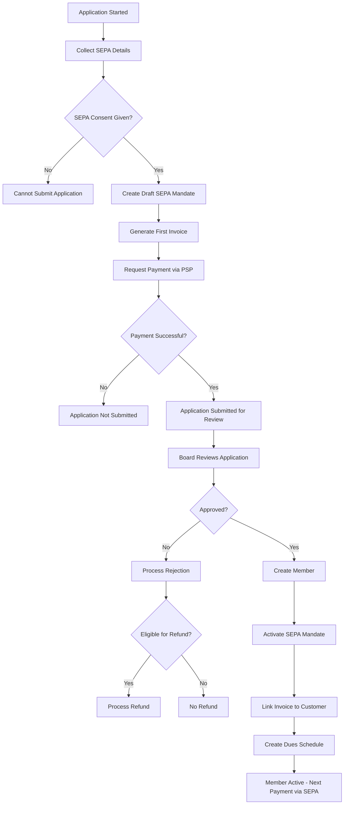

# Membership Dues System - Detailed Implementation Guide V2
*Updated: January 2025 - Incorporating SEPA Direct Debit Requirements*

## Table of Contents
1. [System Architecture Details](#system-architecture-details)
2. [SEPA Integration & Batch Processing](#sepa-integration--batch-processing)
3. [Data Model & Relationships](#data-model--relationships)
4. [Business Process Flows](#business-process-flows)
5. [Technical Implementation Details](#technical-implementation-details)
6. [User Experience Flows](#user-experience-flows)
7. [Integration Points](#integration-points)
8. [Operational Procedures](#operational-procedures)

---

## 1. System Architecture Details

### Core Philosophy
The system treats memberships as **perpetual relationships** with **periodic financial obligations**, not commercial subscriptions. Members pay dues based on their approval date anniversary, collected via monthly SEPA batches.

### Key Design Principles

1. **SEPA-First Design**
   - Monthly batch execution on 26th/27th
   - 5 business days pre-notification for FRST (first)
   - 2 business days pre-notification for RCUR (recurring)
   - No automatic retry on failures

2. **Coverage Period Clarity**
   - Membership starts on approval date
   - No proration - full period payment
   - Clear invoice coverage dates

3. **Manual Review Focus**
   - All payment failures require manual review
   - No automatic suspensions
   - PSP/Tikkie fallback options available

---

## 2. SEPA Integration & Batch Processing

### 2.1 SEPA Batch Configuration

```python
class SEPABatchConfig(Document):
    """
    Organization-wide SEPA batch configuration
    """
    # Batch Timing
    batch_execution_day: Int = 26  # Target day of month for SEPA execution

    # Pre-notification Requirements (SEPA regulations)
    frst_prenotification_days: Int = 5  # Business days for first payment
    rcur_prenotification_days: Int = 2  # Business days for recurring

    # Invoice Generation
    invoice_generation_day: Int = 1  # Generate renewal invoices on 1st

    # Batch Creation Options
    batch_creation_mode: Select["Manual", "Scheduled"] = "Manual"
    batch_creation_reminder_day: Int = 20  # Send reminder to treasurer

    # Fallback Options
    enable_psp_fallback: Check = 1
    psp_provider: Select["Mollie", "Tikkie", "Manual"] = "Tikkie"

    def get_target_batch_date(self):
        """Get the target batch execution date for this month"""
        today = frappe.utils.today()
        target = today.replace(day=self.batch_execution_day)

        # If we've passed this month's target, return next month's
        if today.day > self.batch_execution_day:
            target = (today.replace(day=1) + relativedelta(months=1)).replace(day=self.batch_execution_day)

        # Adjust for weekends/holidays
        return self.adjust_for_business_day(target)

    def get_required_submission_date(self, batch_date, has_frst=False):
        """Calculate when batch must be submitted to bank"""
        if has_frst:
            # Need 5 business days for FRST
            return batch_date - BDay(self.frst_prenotification_days)
        else:
            # Only 2 business days for RCUR
            return batch_date - BDay(self.rcur_prenotification_days)
```

### 2.2 Application Process with First Payment & SEPA

```python
def process_membership_application_submission(application_data):
    """
    Handle membership application submission with first payment and SEPA consent
    NOTE: Payment and consent are required BEFORE approval can happen
    """
    # 1. Create application record
    application = frappe.new_doc("Membership Application")
    application.update(application_data)

    # 2. Validate SEPA mandate data
    if not application.sepa_mandate_consent:
        frappe.throw("SEPA mandate consent is required to submit application")

    if not application.iban or not application.account_holder_name:
        frappe.throw("Valid IBAN and account holder name required")

    # 3. Create pending SEPA mandate (inactive until approval)
    mandate = frappe.new_doc("SEPA Mandate")
    mandate.party_type = "Customer"
    mandate.party = None  # Will be set after approval
    mandate.iban = application.iban
    mandate.account_holder = application.account_holder_name
    mandate.mandate_type = "RCUR"
    mandate.status = "Draft"  # Becomes Pending after payment, Active after approval
    mandate.consent_date = today()
    mandate.consent_method = "Online Application"
    mandate.application = application.name
    mandate.insert()

    application.sepa_mandate = mandate.name
    application.save()

    # 4. Create draft invoice for first membership period
    invoice = create_application_invoice(application)
    application.first_invoice = invoice.name
    application.save()

    # 5. Create payment request linked to invoice
    payment_request = create_application_payment_request(application, invoice)

    return {
        "application": application.name,
        "mandate": mandate.name,
        "invoice": invoice.name,
        "payment_request": payment_request,
        "next_step": "complete_payment"
    }

def create_application_invoice(application):
    """
    Create a draft invoice for the membership application
    Invoice remains draft until payment is confirmed
    """
    # Calculate coverage period (first full period)
    if application.billing_frequency == "Monthly":
        coverage_start = today()
        coverage_end = coverage_start + relativedelta(months=1, days=-1)
        amount = get_monthly_membership_fee(application.membership_type)
        description = f"Membership dues for {coverage_start.strftime('%B %Y')}"
    else:  # Annual
        coverage_start = today()
        coverage_end = coverage_start + relativedelta(years=1, days=-1)
        amount = get_annual_membership_fee(application.membership_type)
        description = f"Annual membership dues {coverage_start.year}-{coverage_end.year}"

    # Create invoice (no customer yet - will be linked after approval)
    invoice = frappe.new_doc("Sales Invoice")
    invoice.naming_series = "APP-INV-"  # Special series for application invoices
    invoice.applicant_name = application.full_name
    invoice.applicant_email = application.email
    invoice.posting_date = today()
    invoice.due_date = today()  # Immediate payment required
    invoice.is_membership_invoice = 1
    invoice.membership_application = application.name

    # Add membership item
    invoice.append("items", {
        "item_code": get_membership_item_code(application.billing_frequency),
        "description": description,
        "qty": 1,
        "rate": amount,
        "income_account": "Membership Dues Income"
    })

    # Add metadata
    invoice.membership_coverage_start = coverage_start
    invoice.membership_coverage_end = coverage_end
    invoice.payment_status = "Pending"  # Custom field to track application payment

    invoice.insert()

    return invoice

def process_application_first_payment(application_name, payment_data):
    """
    Process first payment via PSP for membership application
    """
    application = frappe.get_doc("Membership Application", application_name)

    # 1. Process payment via PSP
    payment_result = process_psp_payment(payment_data)

    if payment_result.success:
        # 2. Update invoice to paid status
        invoice = frappe.get_doc("Sales Invoice", application.first_invoice)
        invoice.payment_status = "Paid"
        invoice.submit()  # Submit the invoice

        # Create payment entry
        payment_entry = create_payment_entry_for_invoice(
            invoice,
            payment_result.reference,
            payment_result.amount,
            "PSP Payment - Application"
        )

        # 3. Update application
        application.first_payment_completed = 1
        application.first_payment_date = today()
        application.first_payment_reference = payment_result.reference
        application.first_payment_amount = payment_result.amount
        application.payment_entry = payment_entry.name
        application.status = "Pending Review"  # Ready for board review

        # 4. Update SEPA mandate to pending
        mandate = frappe.get_doc("SEPA Mandate", application.sepa_mandate)
        mandate.status = "Pending"
        mandate.save()

        application.save()

        # 5. Notify reviewers
        notify_application_reviewers(application)

        return {"success": True, "message": "Payment successful. Application submitted for review."}
    else:
        # Payment failed
        application.add_comment("Payment Failed", f"PSP payment failed: {payment_result.error}")
        return {"success": False, "error": payment_result.error}

def process_membership_approval(application):
    """
    Handle approved membership application
    NOTE: First payment and SEPA consent already completed
    """
    # 1. Verify prerequisites
    if not application.first_payment_completed:
        frappe.throw("Cannot approve - first payment not completed")

    if not application.sepa_mandate:
        frappe.throw("Cannot approve - SEPA mandate not created")

    if not application.first_invoice:
        frappe.throw("Cannot approve - no invoice found")

    # 2. Create Member record
    member = create_member_from_application(application)
    member.membership_start_date = today()
    member.save()

    # 3. Link existing invoice to new customer
    invoice = frappe.get_doc("Sales Invoice", application.first_invoice)
    if invoice.docstatus == 1:  # Already submitted
        # Create amendment to link customer
        invoice_amendment = frappe.copy_doc(invoice)
        invoice_amendment.customer = member.customer
        invoice_amendment.member = member.name
        invoice_amendment.amended_from = invoice.name
        invoice_amendment.insert()
        invoice_amendment.submit()

        # Cancel original
        invoice.cancel()
    else:
        # Draft invoice - just update
        invoice.customer = member.customer
        invoice.member = member.name
        invoice.save()

    # 4. Activate SEPA Mandate
    mandate = frappe.get_doc("SEPA Mandate", application.sepa_mandate)
    mandate.party_type = "Customer"
    mandate.party = member.customer
    mandate.status = "Active"
    mandate.save()

    # 5. Create membership dues schedule
    dues_schedule = frappe.new_doc("Membership Dues Schedule")
    dues_schedule.member = member.name
    dues_schedule.membership = member.membership
    dues_schedule.billing_frequency = application.billing_frequency
    dues_schedule.billing_day = today().day
    dues_schedule.amount = invoice.grand_total
    dues_schedule.payment_method = "SEPA Direct Debit"
    dues_schedule.active_mandate = mandate.name
    dues_schedule.current_coverage_start = invoice.membership_coverage_start
    dues_schedule.current_coverage_end = invoice.membership_coverage_end
    dues_schedule.status = "Active"
    dues_schedule.insert()

    # 6. Schedule next payment
    next_invoice_date = dues_schedule.calculate_next_invoice_date()
    dues_schedule.next_invoice_date = next_invoice_date

    # Since they paid for current period via PSP, their first SEPA will be next period
    # This will always be a FRST payment per SEPA rules
    dues_schedule.next_sequence_type = "FRST"

    # Inform member about next payment
    message = f"Your next payment of €{dues_schedule.amount} will be collected via SEPA on or around the {sepa_config.batch_execution_day}th of {next_invoice_date.strftime('%B %Y')}"

    dues_schedule.save()
    member.dues_schedule = dues_schedule.name
    member.save()

    return {
        "member": member.name,
        "mandate": mandate.name,
        "invoice": invoice.name,
        "dues_schedule": dues_schedule.name,
        "sepa_message": message
    }

def process_membership_rejection(application, rejection_reason, rejection_details):
    """
    Handle rejected membership application with conditional refund
    """
    # 1. Update application status
    application.status = "Rejected"
    application.rejection_reason = rejection_reason
    application.rejection_details = rejection_details
    application.rejection_date = today()

    # 2. Cancel SEPA mandate
    if application.sepa_mandate:
        mandate = frappe.get_doc("SEPA Mandate", application.sepa_mandate)
        mandate.status = "Cancelled"
        mandate.cancellation_reason = "Application Rejected"
        mandate.save()

    # 3. Determine refund eligibility
    refund_eligible = determine_refund_eligibility(rejection_reason)

    if refund_eligible and application.first_payment_completed:
        # 4. Process refund
        refund = frappe.new_doc("Payment Refund")
        refund.application = application.name
        refund.amount = application.first_payment_amount
        refund.reason = f"Membership application rejected: {rejection_reason}"
        refund.payment_reference = application.first_payment_reference
        refund.insert()

        # Initiate refund via PSP
        refund_result = process_psp_refund(
            application.first_payment_reference,
            application.first_payment_amount
        )

        if refund_result.success:
            refund.status = "Processed"
            refund.processed_date = today()
            refund.transaction_id = refund_result.transaction_id
            application.refund_processed = 1
            application.refund_amount = application.first_payment_amount
        else:
            refund.status = "Failed"
            refund.error_message = refund_result.error

        refund.save()
    else:
        # No refund
        application.refund_processed = 0
        application.refund_reason = "Not eligible for refund" if not refund_eligible else "No payment to refund"

    application.save()

    # 5. Send notification
    send_rejection_notification(application, include_refund_info=refund_eligible)

    return {
        "status": "rejected",
        "refund_processed": application.refund_processed,
        "refund_amount": application.get("refund_amount", 0)
    }

def determine_refund_eligibility(rejection_reason):
    """
    Determine if rejected application is eligible for refund
    """
    # Reasons that DO NOT get refunds
    no_refund_reasons = [
        "Deliberate Misrepresentation",
        "Time Wasting",
        "Abusive Behavior",
        "Fraudulent Application",
        "Duplicate Application"
    ]

    # Reasons that DO get refunds
    refund_reasons = [
        "Geographic Ineligibility",
        "Age Requirement Not Met",
        "Incomplete Documentation",
        "Board Discretion",
        "Technical Error"
    ]

    if rejection_reason in no_refund_reasons:
        return False
    elif rejection_reason in refund_reasons:
        return True
    else:
        # Default to refund for unlisted reasons
        return True
```

### 2.3 Monthly Invoice and Batch Processing

```python
def generate_monthly_renewal_invoices():
    """
    Generate renewal invoices on the 1st of each month
    Called by scheduler or manually
    """
    if today().day != 1 and not frappe.flags.force_invoice_generation:
        frappe.throw("Renewal invoices are normally generated on the 1st of the month")

    # Find members needing renewal this month
    members_to_invoice = frappe.db.sql("""
        SELECT
            mds.name as schedule_name,
            mds.member,
            mds.amount,
            mds.billing_frequency,
            mds.next_invoice_date,
            m.customer
        FROM `tabMembership Dues Schedule` mds
        INNER JOIN `tabMember` m ON mds.member = m.name
        WHERE
            mds.status = 'Active'
            AND MONTH(mds.next_invoice_date) = MONTH(CURDATE())
            AND YEAR(mds.next_invoice_date) = YEAR(CURDATE())
            AND NOT EXISTS (
                SELECT 1 FROM `tabSales Invoice` si
                WHERE si.member = m.name
                AND MONTH(si.membership_coverage_start) = MONTH(CURDATE())
                AND YEAR(si.membership_coverage_start) = YEAR(CURDATE())
                AND si.docstatus != 2  -- Not cancelled
            )
    """, as_dict=True)

    invoices_created = []
    for member_data in members_to_invoice:
        invoice = generate_membership_invoice(
            member_data.member,
            frappe.get_doc("Membership Dues Schedule", member_data.schedule_name)
        )
        invoices_created.append(invoice.name)

    return {
        "invoices_created": len(invoices_created),
        "invoice_names": invoices_created
    }

def create_monthly_sepa_batch():
    """
    Create SEPA batch for current month's invoices
    Can be called manually by treasurer or via scheduler
    """
    config = frappe.get_single("SEPA Batch Config")
    target_date = config.get_target_batch_date()

    # 1. Find unpaid membership invoices with active mandates
    eligible_invoices = frappe.db.sql("""
        SELECT
            si.name as invoice,
            si.customer,
            si.outstanding_amount,
            m.name as member,
            sm.name as mandate,
            mds.next_sequence_type,
            CASE
                WHEN mds.last_successful_debit IS NULL THEN 'FRST'
                ELSE 'RCUR'
            END as sequence_type
        FROM `tabSales Invoice` si
        INNER JOIN `tabMember` m ON si.member = m.name
        INNER JOIN `tabSEPA Mandate` sm ON sm.party = si.customer
        INNER JOIN `tabMembership Dues Schedule` mds ON mds.member = m.name
        WHERE
            si.outstanding_amount > 0
            AND si.is_membership_invoice = 1
            AND si.docstatus = 1  -- Submitted
            AND sm.status = 'Active'
            AND mds.status = 'Active'
            AND mds.payment_method = 'SEPA Direct Debit'
            AND NOT EXISTS (
                SELECT 1 FROM `tabDirect Debit Transaction` ddt
                WHERE ddt.sales_invoice = si.name
                AND ddt.status IN ('Pending', 'Processing', 'Completed')
            )
        ORDER BY sequence_type DESC  -- FRST first for visibility
    """, as_dict=True)

    if not eligible_invoices:
        return {"message": "No invoices eligible for SEPA batch"}

    # 2. Check if we have enough time for FRST payments
    has_frst = any(inv.sequence_type == 'FRST' for inv in eligible_invoices)
    required_submission = config.get_required_submission_date(target_date, has_frst)

    if today() > required_submission:
        if has_frst:
            frappe.msgprint(
                f"Warning: The batch contains FRST payments which require {config.frst_prenotification_days} "
                f"business days notice. The batch should have been created by {required_submission}. "
                f"Consider postponing FRST payments to next month's batch."
            )

    # 3. Create batch
    batch = frappe.new_doc("Direct Debit Batch")
    batch.batch_date = today()
    batch.execution_date = target_date
    batch.batch_type = "Membership Dues"

    # 4. Add transactions
    for inv in eligible_invoices:
        batch.append("transactions", {
            "party_type": "Customer",
            "party": inv.customer,
            "mandate": inv.mandate,
            "amount": inv.outstanding_amount,
            "sales_invoice": inv.invoice,
            "sequence_type": inv.sequence_type,
            "description": f"Membership dues - {inv.customer}",
            "member": inv.member
        })

        # Update dues schedule to track sequence type
        if inv.sequence_type == "FRST":
            frappe.db.set_value("Membership Dues Schedule",
                {"member": inv.member},
                "next_sequence_type", "RCUR")

    batch.insert()

    # 5. Summary for treasurer
    summary = {
        "batch": batch.name,
        "execution_date": target_date,
        "submission_deadline": required_submission,
        "total_transactions": len(batch.transactions),
        "frst_count": len([t for t in batch.transactions if t.sequence_type == "FRST"]),
        "rcur_count": len([t for t in batch.transactions if t.sequence_type == "RCUR"]),
        "total_amount": sum(t.amount for t in batch.transactions),
        "can_submit_today": today() <= required_submission
    }

    # 6. Send pre-notifications if batch is approved
    if batch.workflow_state == "Approved":
        send_batch_prenotifications(batch)

    return summary
```

---

## 3. Data Model & Relationships

### 3.1 Enhanced Membership Dues Schedule

```python
class MembershipDuesSchedule(Document):
    # Core Fields
    member: Link[Member] (required)
    membership: Link[Membership] (required)

    # Billing Configuration
    billing_frequency: Select["Monthly", "Annual"] = "Monthly"
    billing_day: Int  # Day of month for anniversary
    amount: Currency  # Current dues amount

    # Status Management
    status: Select["Active", "Paused", "Cancelled"] = "Active"
    payment_method: Select["SEPA Direct Debit", "Bank Transfer", "PSP", "Cash"] = "SEPA Direct Debit"

    # SEPA Specific
    active_mandate: Link[SEPA Mandate]
    first_sepa_batch_date: Date  # When they'll first appear in batch
    last_successful_debit: Date

    # Coverage Tracking
    current_coverage_start: Date
    current_coverage_end: Date
    next_invoice_date: Date

    # Failure Handling
    consecutive_failures: Int = 0
    last_failure_date: Date
    last_failure_reason: Text
    under_manual_review: Check = 0

    def calculate_next_invoice_date(self):
        """Calculate next invoice date based on approval anniversary"""
        if not self.billing_day:
            # Extract from member approval date
            approval_date = frappe.db.get_value("Member", self.member, "membership_start_date")
            self.billing_day = approval_date.day

        # Find next occurrence of billing day
        today = frappe.utils.today()
        if today.day <= self.billing_day:
            next_date = today.replace(day=self.billing_day)
        else:
            next_date = (today.replace(day=1) + relativedelta(months=1)).replace(day=self.billing_day)

        return next_date

    def get_invoice_coverage_period(self, invoice_date):
        """Get the membership period this invoice covers"""
        if self.billing_frequency == "Monthly":
            start = invoice_date
            end = invoice_date + relativedelta(months=1, days=-1)
        else:  # Annual
            start = invoice_date
            end = invoice_date + relativedelta(years=1, days=-1)

        return start, end
```

### 3.2 Payment Failure Tracking

```python
class PaymentFailureLog(Document):
    # Reference
    member: Link[Member]
    invoice: Link[Sales Invoice]
    payment_method: Select["SEPA Direct Debit", "PSP", "Bank Transfer"]

    # Failure Details
    failure_date: Date
    failure_type: Select["Insufficient Funds", "Account Closed", "Mandate Cancelled", "Technical Error", "Other"]
    failure_code: Data  # R-transaction code for SEPA
    failure_description: Text

    # Resolution
    status: Select["Pending Review", "Retry Scheduled", "Alternative Payment", "Written Off", "Resolved"]
    resolution_date: Date
    resolution_method: Text
    handled_by: Link[User]

    # Follow-up
    member_contacted: Check = 0
    contact_date: Date
    contact_method: Select["Email", "Phone", "Letter", "In Person"]
    notes: Text

    # Chapter collaboration
    chapter_admin_notes: Text  # Separate field for chapter admin input
    shared_with_chapter: Check = 0
    chapter_admin_reviewer: Link[User]
```

### 3.3 Chapter Board Financial Administration

```python
# Extension to existing Chapter Member doctype
class ChapterMemberFinancialFields:
    """
    Additional fields for Chapter Member to support financial administration
    """
    # Financial admin designation
    financial_admin_flag: Check = 0  # Set to 1 for board members handling finances
    financial_admin_since: Date

    # Permissions scope
    can_view_payment_failures: Check = 1  # When financial_admin_flag is set
    can_add_payment_notes: Check = 1      # When financial_admin_flag is set
    can_contact_members: Check = 1        # When financial_admin_flag is set

    # Activity tracking
    last_payment_review_date: Date
    payment_cases_handled: Int = 0

    def validate_financial_admin_assignment(self):
        """Ensure only board members can be financial admins"""
        if self.financial_admin_flag and not self.is_board_member:
            frappe.throw("Only board members can be designated as financial administrators")

        # Check chapter limit (usually 1-2 per chapter)
        existing_admins = frappe.db.count("Chapter Member", {
            "chapter": self.chapter,
            "financial_admin_flag": 1,
            "name": ["!=", self.name]
        })

        if existing_admins >= 2:
            frappe.throw("Maximum 2 financial administrators allowed per chapter")
```

---

## 4. Business Process Flows

### 4.1 New Member Onboarding Flow



### 4.2 Monthly Billing Cycle

```python
def monthly_billing_workflow():
    """
    Simplified monthly billing workflow
    """
    # Step 1: Invoice Generation (1st of month)
    if today().day == 1:
        result = generate_monthly_renewal_invoices()
        print(f"Generated {result['invoices_created']} renewal invoices")

    # Step 2: Batch Creation (when treasurer is ready)
    # Can be any day, but typically around 20th-24th
    # to meet pre-notification requirements
    if frappe.flags.create_sepa_batch:
        batch_result = create_monthly_sepa_batch()

        if batch_result.get("can_submit_today"):
            print(f"Batch {batch_result['batch']} ready for submission")
            print(f"FRST: {batch_result['frst_count']}, RCUR: {batch_result['rcur_count']}")
            print(f"Total: €{batch_result['total_amount']}")
        else:
            print(f"Warning: Submission deadline was {batch_result['submission_deadline']}")

    # Step 3: Alternative Payment Handling (as needed)
    handle_non_sepa_payments()

    # Step 4: Failure Review (ongoing)
    review_payment_failures()

def treasurer_monthly_checklist():
    """
    Simplified treasurer checklist
    """
    config = frappe.get_single("SEPA Batch Config")
    target_date = config.get_target_batch_date()

    checklist = {
        "1st of month": [
            "✓ Verify renewal invoices were generated",
            "✓ Review any members with payment issues"
        ],

        "Before batch creation": [
            "✓ Review pending payment failures",
            "✓ Ensure all SEPA mandates are valid",
            "✓ Check for any manual payment arrangements"
        ],

        "Batch creation (flexible timing)": [
            f"✓ Create SEPA batch for {target_date}",
            "✓ Review FRST vs RCUR distribution",
            "✓ Verify total amounts match expectations",
            "✓ Submit to bank with appropriate lead time:",
            f"  - FRST needs submission by {target_date - BDay(5)}",
            f"  - RCUR needs submission by {target_date - BDay(2)}"
        ],

        "After batch submission": [
            "✓ Send pre-notifications to members",
            "✓ Monitor bank for acceptance confirmation",
            "✓ Prepare for R-transaction handling"
        ],

        "Month end": [
            "✓ Process any R-transactions",
            "✓ Follow up on payment failures",
            "✓ Generate monthly reports"
        ]
    }

    return checklist
```

### 4.3 Payment Failure Handling

```python
def handle_sepa_return(return_data):
    """
    Handle SEPA R-transactions (returns/failures)
    No automatic retry - all go to manual review
    """
    # 1. Log the failure
    failure = frappe.new_doc("Payment Failure Log")
    failure.member = return_data.member
    failure.invoice = return_data.invoice
    failure.payment_method = "SEPA Direct Debit"
    failure.failure_date = today()
    failure.failure_code = return_data.reason_code  # e.g., R01, R02
    failure.failure_type = map_r_code_to_type(return_data.reason_code)
    failure.failure_description = return_data.description
    failure.status = "Pending Review"
    failure.insert()

    # 2. Update invoice status
    invoice = frappe.get_doc("Sales Invoice", return_data.invoice)
    invoice.add_comment("SEPA Return", f"Payment failed: {return_data.reason_code} - {return_data.description}")

    # 3. Update member payment status
    dues_schedule = get_active_dues_schedule(return_data.member)
    dues_schedule.consecutive_failures += 1
    dues_schedule.last_failure_date = today()
    dues_schedule.last_failure_reason = return_data.description
    dues_schedule.under_manual_review = 1
    dues_schedule.save()

    # 4. Get member's chapter
    member = frappe.get_doc("Member", return_data.member)
    chapter = member.chapter

    # 5. Create tasks for both treasurer AND chapter financial admin
    # Organization-wide treasurer task
    treasurer_task = frappe.new_doc("Task")
    treasurer_task.subject = f"Payment failure review: {return_data.member}"
    treasurer_task.description = f"""
    Member: {return_data.member}
    Chapter: {chapter}
    Invoice: {return_data.invoice}
    Amount: €{return_data.amount}
    Failure: {return_data.reason_code} - {return_data.description}

    Suggested actions:
    - Contact member to update payment details
    - Offer alternative payment method
    - Consider payment plan if hardship
    """
    treasurer_task.assign_to = get_treasurer_user()
    treasurer_task.priority = "High" if dues_schedule.consecutive_failures > 2 else "Medium"
    treasurer_task.insert()

    # Chapter financial admin task (if exists)
    chapter_financial_admin = get_chapter_financial_admin(chapter)
    if chapter_financial_admin:
        chapter_task = frappe.new_doc("Task")
        chapter_task.subject = f"Chapter member payment failure: {return_data.member}"
        chapter_task.description = treasurer_task.description
        chapter_task.assign_to = chapter_financial_admin
        chapter_task.priority = treasurer_task.priority
        chapter_task.reference_type = "Payment Failure Log"
        chapter_task.reference_name = failure.name
        chapter_task.insert()

    # 6. Share failure log with chapter financial admin
    if chapter_financial_admin:
        frappe.share.add("Payment Failure Log", failure.name, chapter_financial_admin,
                        read=1, write=1, submit=0, share=0)

    # 7. Notify member (if appropriate)
    if should_notify_member_of_failure(return_data.reason_code):
        send_payment_failure_notification(
            return_data.member,
            return_data.reason_code,
            return_data.description
        )

    return failure.name

def get_chapter_financial_admin(chapter_name):
    """
    Get the financial admin for a specific chapter
    """
    financial_admin = frappe.db.sql("""
        SELECT cm.user
        FROM `tabChapter Member` cm
        WHERE cm.chapter = %s
        AND cm.is_board_member = 1
        AND cm.financial_admin_flag = 1
        AND cm.status = 'Active'
        LIMIT 1
    """, chapter_name)

    return financial_admin[0][0] if financial_admin else None

def map_r_code_to_type(r_code):
    """Map SEPA R-codes to failure types"""
    mapping = {
        "R01": "Insufficient Funds",
        "R02": "Account Closed",
        "R03": "No Account",
        "R04": "Account Blocked",
        "R06": "Mandate Cancelled",
        "R07": "Deceased",
        "R08": "Stopped by Payer",
        "R09": "Account Details Incorrect",
        "R10": "Mandate Not Valid"
    }
    return mapping.get(r_code, "Other")
```

---

## 5. User Experience Flows

### 5.1 Application Process with SEPA

```html
<!-- Membership Application - Payment Step (FINAL step before submission) -->
<div class="payment-setup-step">
    <h3>Step 4: Payment & Submission</h3>

    <!-- Application Summary -->
    <div class="application-summary">
        <h4>Application Summary</h4>
        <p>Please review your application details before making payment.</p>
        <div class="summary-details">
            <p><strong>Name:</strong> {{ applicant_name }}</p>
            <p><strong>Chapter:</strong> {{ selected_chapter }}</p>
            <p><strong>Membership Type:</strong> {{ membership_type }}</p>
        </div>
    </div>

    <!-- SEPA Mandate Setup (MUST be completed first) -->
    <div class="sepa-mandate-section">
        <h4>1. Setup Recurring Payments - SEPA Direct Debit</h4>
        <p>We'll collect your monthly membership dues automatically via SEPA direct debit.</p>

        <div class="sepa-details">
            <div class="form-group">
                <label>Account Holder Name*</label>
                <input type="text" name="account_holder" required>
                <small>Name on the bank account</small>
            </div>

            <div class="form-group">
                <label>IBAN*</label>
                <input type="text" name="iban" pattern="[A-Z]{2}[0-9]{2}[A-Z0-9]+" required>
                <small>Dutch IBAN starting with NL</small>
            </div>

            <div class="mandate-info alert alert-info">
                <h5><i class="fa fa-info-circle"></i> SEPA Direct Debit Mandate</h5>
                <p>By providing your IBAN and confirming below, you authorize {{ organization_name }} to:</p>
                <ul>
                    <li>Collect monthly membership dues of €{{ monthly_amount }} from your account</li>
                    <li>First SEPA collection will be on {{ first_sepa_date }} (after approval)</li>
                    <li>You'll receive 5 days notice for the first collection, 2 days for recurring</li>
                </ul>

                <div class="mandate-details">
                    <small>
                        <strong>Creditor ID:</strong> {{ creditor_id }}<br>
                        <strong>Mandate Reference:</strong> Will be assigned upon approval<br>
                        <strong>Your Rights:</strong> You can cancel this mandate at any time through your bank
                    </small>
                </div>

                <label class="consent-checkbox">
                    <input type="checkbox" name="sepa_consent" required onchange="checkPaymentReady()">
                    <strong>I authorize {{ organization_name }} to collect membership dues via SEPA Direct Debit</strong>
                </label>
            </div>
        </div>
    </div>

    <!-- First Payment (REQUIRED to submit) -->
    <div class="first-payment-section" id="firstPaymentSection" style="opacity: 0.5; pointer-events: none;">
        <h4>2. First Payment Required</h4>
        <div class="alert alert-warning">
            <i class="fa fa-exclamation-triangle"></i>
            <strong>Important:</strong> Your application will only be submitted after successful payment.
        </div>

        <p>Pay your first membership fee of <strong>€{{ first_payment_amount }}</strong> covering {{ coverage_period }}.</p>

        <div class="payment-options">
            <label class="payment-option">
                <input type="radio" name="first_payment" value="ideal" checked>
                <i class="fa fa-bank"></i> iDEAL
                <span class="badge badge-success">Instant</span>
            </label>
            <label class="payment-option">
                <input type="radio" name="first_payment" value="tikkie">
                <i class="fa fa-mobile"></i> Tikkie
                <span class="badge badge-info">Mobile</span>
            </label>
        </div>

        <div class="payment-note">
            <p><small><i class="fa fa-shield"></i> Secure payment processed by {{ psp_provider }}</small></p>
            <p><small><i class="fa fa-undo"></i> Refunds available if your application is not approved*</small></p>
        </div>

        <button class="btn btn-success btn-lg" onclick="processFirstPaymentAndSubmit()" disabled id="payButton">
            <i class="fa fa-lock"></i> Pay €{{ first_payment_amount }} & Submit Application
        </button>
    </div>

    <!-- Terms -->
    <div class="terms-section">
        <small>
            * Refunds are processed for rejections due to eligibility issues, incomplete documentation, or board discretion.
            Refunds may not be issued for fraudulent applications or deliberate misrepresentation.
        </small>
    </div>
</div>

<script>
function checkPaymentReady() {
    const sepaConsent = document.querySelector('input[name="sepa_consent"]').checked;
    const iban = document.querySelector('input[name="iban"]').value;
    const accountHolder = document.querySelector('input[name="account_holder"]').value;

    if (sepaConsent && iban && accountHolder) {
        // Enable payment section
        document.getElementById('firstPaymentSection').style.opacity = '1';
        document.getElementById('firstPaymentSection').style.pointerEvents = 'auto';
        document.getElementById('payButton').disabled = false;
    } else {
        // Disable payment section
        document.getElementById('firstPaymentSection').style.opacity = '0.5';
        document.getElementById('firstPaymentSection').style.pointerEvents = 'none';
        document.getElementById('payButton').disabled = true;
    }
}

async function processFirstPaymentAndSubmit() {
    // Validate all required fields
    if (!validateApplicationForm()) {
        return;
    }

    // Disable button to prevent double submission
    const button = document.getElementById('payButton');
    button.disabled = true;
    button.innerHTML = '<i class="fa fa-spinner fa-spin"></i> Processing...';

    try {
        // 1. Create application with SEPA details
        const applicationData = collectApplicationData();
        const response = await createApplication(applicationData);

        if (response.success) {
            // 2. Process payment
            const paymentMethod = document.querySelector('input[name="first_payment"]:checked').value;
            const paymentResult = await processPayment(response.payment_request, paymentMethod);

            if (paymentResult.success) {
                // 3. Show success and redirect
                showSuccessMessage();
                setTimeout(() => {
                    window.location.href = '/application-submitted?id=' + response.application;
                }, 2000);
            } else {
                // Payment failed
                showError('Payment failed: ' + paymentResult.error);
                button.disabled = false;
                button.innerHTML = '<i class="fa fa-lock"></i> Pay €{{ first_payment_amount }} & Submit Application';
            }
        } else {
            showError('Could not create application: ' + response.error);
            button.disabled = false;
            button.innerHTML = '<i class="fa fa-lock"></i> Pay €{{ first_payment_amount }} & Submit Application';
        }
    } catch (error) {
        showError('An error occurred. Please try again.');
        button.disabled = false;
        button.innerHTML = '<i class="fa fa-lock"></i> Pay €{{ first_payment_amount }} & Submit Application';
    }
}
</script>
```

### 5.2 Member Dashboard - Payment Status

```html
<!-- Enhanced Member Payment Dashboard -->
<div class="member-payment-dashboard">
    <!-- Payment Status Card -->
    <div class="payment-status-card">
        <div class="status-header {{ payment_status_class }}">
            <i class="fa fa-{{ payment_status_icon }}"></i>
            <h3>{{ payment_status_text }}</h3>
        </div>

        
        <div class="payment-details">
            <p>Your membership is active through {{ coverage_end_date }}</p>
            <p>Next payment: €{{ next_amount }} on {{ next_payment_date }}</p>

            <div class="payment-method">
                <strong>Payment Method:</strong> SEPA Direct Debit
                <br>
                <small>IBAN: ****{{ iban_last_4 }}</small>
                <a href="#" onclick="updatePaymentMethod()">Change</a>
            </div>
        </div>

        
        <div class="alert alert-warning">
            <p>Your recent payment could not be processed.</p>
            <p>Our team is reviewing this and will contact you soon.</p>

            <div class="action-buttons">
                <button class="btn btn-primary" onclick="payWithAlternativeMethod()">
                    Pay Now with Alternative Method
                </button>
                <button class="btn btn-secondary" onclick="contactTreasurer()">
                    Contact Treasurer
                </button>
            </div>
        </div>
        
    </div>

    <!-- Coverage Period Display -->
    <div class="coverage-display">
        <h4>Current Membership Period</h4>
        <div class="period-visual">
            <div class="period-bar">
                <div class="period-progress" style="width: {{ coverage_progress }}%"></div>
            </div>
            <div class="period-dates">
                <span>{{ coverage_start }}</span>
                <span>{{ coverage_end }}</span>
            </div>
        </div>
    </div>

    <!-- Payment History -->
    <div class="payment-history">
        <h4>Payment History</h4>
        <table class="table">
            <thead>
                <tr>
                    <th>Date</th>
                    <th>Period</th>
                    <th>Amount</th>
                    <th>Method</th>
                    <th>Status</th>
                </tr>
            </thead>
            <tbody>
                
                <tr>
                    <td>{{ payment.date }}</td>
                    <td>{{ payment.coverage_start }} - {{ payment.coverage_end }}</td>
                    <td>€{{ payment.amount }}</td>
                    <td>{{ payment.method }}</td>
                    <td>
                        <span class="badge badge-{{ payment.status_class }}">
                            {{ payment.status }}
                        </span>
                    </td>
                </tr>
                
            </tbody>
        </table>
    </div>
</div>
```

---

## 6. Technical Implementation Details

### 6.1 Invoice Generation with Coverage Periods

```python
def generate_membership_invoice(member, dues_schedule):
    """
    Generate invoice with clear coverage period information
    """
    # Calculate coverage period
    coverage_start, coverage_end = dues_schedule.get_invoice_coverage_period(today())

    # Create invoice
    invoice = frappe.new_doc("Sales Invoice")
    invoice.customer = member.customer
    invoice.posting_date = today()
    invoice.due_date = dues_schedule.next_invoice_date
    invoice.is_membership_invoice = 1

    # Add membership item with coverage details
    invoice.append("items", {
        "item_code": get_membership_item(dues_schedule.billing_frequency),
        "description": f"Membership dues for {coverage_start.strftime('%B %d, %Y')} to {coverage_end.strftime('%B %d, %Y')}",
        "qty": 1,
        "rate": dues_schedule.amount,
        "income_account": "Membership Dues Income"
    })

    # Add coverage period to invoice
    invoice.membership_coverage_start = coverage_start
    invoice.membership_coverage_end = coverage_end
    invoice.member = member.name
    invoice.dues_schedule = dues_schedule.name

    # Set payment terms based on method
    if dues_schedule.payment_method == "SEPA Direct Debit":
        invoice.payment_terms_template = "SEPA Direct Debit Terms"
    else:
        invoice.payment_terms_template = "Due on Receipt"

    invoice.insert()

    # Log the generation
    frappe.get_doc({
        "doctype": "Membership Billing Log",
        "member": member.name,
        "action": "Invoice Generated",
        "invoice": invoice.name,
        "amount": dues_schedule.amount,
        "coverage_start": coverage_start,
        "coverage_end": coverage_end,
        "notes": f"Generated for {dues_schedule.billing_frequency} billing cycle"
    }).insert()

    return invoice
```

### 6.2 SEPA Batch File Generation

```python
def generate_sepa_xml(batch):
    """
    Generate SEPA XML file for bank submission
    """
    from sepaxml import SepaDD

    config = frappe.get_single("SEPA Batch Config")
    creditor = frappe.get_single("Organization Settings")

    # Create SEPA document
    sepa = SepaDD({
        "name": creditor.organization_name,
        "IBAN": creditor.iban,
        "BIC": creditor.bic,
        "creditor_id": creditor.sepa_creditor_id,
        "currency": "EUR"
    })

    # Group by sequence type
    frst_payments = []
    rcur_payments = []

    for txn in batch.transactions:
        payment_data = {
            "name": txn.party,
            "IBAN": txn.iban,
            "BIC": txn.bic,
            "amount": int(txn.amount * 100),  # Cents
            "description": txn.description,
            "mandate_id": txn.mandate,
            "mandate_date": frappe.db.get_value("SEPA Mandate", txn.mandate, "creation"),
            "endtoend_id": f"{batch.name}-{txn.idx}"
        }

        if txn.sequence_type == "FRST":
            frst_payments.append(payment_data)
        else:
            rcur_payments.append(payment_data)

    # Add payments to SEPA document
    if frst_payments:
        sepa.add_batch({
            "sequence_type": "FRST",
            "requested_date": batch.execution_date,
            "payments": frst_payments
        })

    if rcur_payments:
        sepa.add_batch({
            "sequence_type": "RCUR",
            "requested_date": batch.execution_date,
            "payments": rcur_payments
        })

    # Generate XML
    xml_content = sepa.export()

    # Save file
    file_doc = frappe.get_doc({
        "doctype": "File",
        "file_name": f"SEPA_Batch_{batch.name}_{batch.execution_date}.xml",
        "content": xml_content,
        "attached_to_doctype": "Direct Debit Batch",
        "attached_to_name": batch.name
    }).insert()

    batch.sepa_file = file_doc.file_url
    batch.save()

    return file_doc
```

---

## 7. Operational Procedures

### 7.1 Monthly Billing Checklist

```python
def get_monthly_billing_checklist():
    """
    Generate checklist for billing team
    """
    return {
        "Pre-Batch (20th of month)": [
            "Review upcoming invoice generations",
            "Check for members with expiring payment methods",
            "Verify SEPA mandate validity for all active members",
            "Review and resolve any pending payment failures"
        ],

        "Batch Day (26th)": [
            "Run invoice generation for next period",
            "Execute SEPA batch creation",
            "Download and review SEPA XML file",
            "Submit file to bank",
            "Send pre-notifications to members"
        ],

        "Post-Batch (27th-30th)": [
            "Monitor bank for file acceptance",
            "Process alternative payment reminders",
            "Review members excluded from batch",
            "Update payment failure queue"
        ],

        "Month End": [
            "Process R-transactions from bank",
            "Run payment failure report",
            "Generate billing statistics",
            "Plan follow-ups for next month"
        ]
    }
```

### 7.2 Financial Administration Dashboards

```python
def create_treasurer_dashboard():
    """
    Organization-wide treasurer dashboard
    """
    return {
        "widgets": [
            {
                "name": "Upcoming SEPA Batch",
                "type": "summary",
                "data": get_next_batch_summary()
            },
            {
                "name": "Payment Failures - All Chapters",
                "type": "list",
                "data": get_pending_payment_failures(),
                "actions": ["Contact Member", "Create Payment Plan", "Write Off"]
            },
            {
                "name": "Chapter Summary",
                "type": "table",
                "data": get_payment_status_by_chapter()
            },
            {
                "name": "Members at Risk",
                "type": "alert",
                "data": get_members_with_multiple_failures()
            },
            {
                "name": "Manual Review Queue",
                "type": "task_list",
                "data": get_manual_review_items()
            }
        ],

        "quick_actions": [
            "Generate SEPA Batch",
            "Send Payment Reminders",
            "Export Failure Report",
            "View Payment Plans"
        ],

        "reports": [
            "Monthly Billing Summary",
            "Payment Method Distribution",
            "Failure Analysis by Type",
            "Chapter Payment Performance"
        ]
    }

def create_chapter_financial_admin_dashboard(chapter):
    """
    Chapter-specific financial admin dashboard
    """
    return {
        "title": f"{chapter} Financial Overview",

        "widgets": [
            {
                "name": "Chapter Payment Status",
                "type": "summary",
                "data": {
                    "total_members": get_chapter_member_count(chapter),
                    "current_members": get_chapter_current_count(chapter),
                    "payment_failures": get_chapter_failure_count(chapter),
                    "outstanding_amount": get_chapter_outstanding_amount(chapter)
                }
            },
            {
                "name": "Chapter Payment Failures",
                "type": "list",
                "data": get_chapter_payment_failures(chapter),
                "actions": ["View Details", "Contact Member", "Add Note"]
            },
            {
                "name": "At-Risk Members",
                "type": "alert",
                "data": get_chapter_members_at_risk(chapter)
            },
            {
                "name": "Recent Payments",
                "type": "timeline",
                "data": get_chapter_recent_payments(chapter, limit=10)
            }
        ],

        "permissions": [
            "View chapter member payment status",
            "Review payment failures for chapter members",
            "Add notes to payment failure logs",
            "Contact members about payment issues",
            "Cannot modify payment records",
            "Cannot process refunds"
        ],

        "quick_actions": [
            "Export Chapter Payment Report",
            "View Member Contact List",
            "Send Payment Reminder (via treasurer)"
        ]
    }

def get_chapter_financial_permissions():
    """
    Define what chapter financial admins can do
    """
    return {
        "Payment Failure Log": {
            "read": "chapter_members_only",
            "write": "add_notes_only",
            "create": 0,
            "delete": 0
        },
        "Sales Invoice": {
            "read": "chapter_members_only",
            "write": 0,
            "create": 0,
            "delete": 0
        },
        "Member": {
            "read": "chapter_members_only",
            "write": "contact_info_only",
            "create": 0,
            "delete": 0
        },
        "Membership Dues Schedule": {
            "read": "chapter_members_only",
            "write": 0,
            "create": 0,
            "delete": 0
        }
    }
```

### 7.3 Chapter-Level Payment Support

```python
def setup_chapter_financial_admin_role():
    """
    Create role for chapter board members with financial responsibilities
    """
    role = frappe.new_doc("Role")
    role.role_name = "Chapter Financial Admin"
    role.desk_access = 1
    role.description = "Chapter board members who can review payment issues for their chapter"
    role.insert()

    # Set up role permissions
    permissions = get_chapter_financial_permissions()
    for doctype, perms in permissions.items():
        add_role_permissions(role.name, doctype, perms)

def chapter_payment_failure_workflow(failure_log):
    """
    Workflow for handling payment failures at chapter level
    """
    member = frappe.get_doc("Member", failure_log.member)
    chapter = member.chapter

    # 1. Notify both treasurer and chapter financial admin
    notifications = []

    # Organization treasurer
    notifications.append({
        "recipient": get_treasurer_user(),
        "type": "Organization",
        "message": f"Payment failure for {member.name} (Chapter: {chapter})"
    })

    # Chapter financial admin
    chapter_admin = get_chapter_financial_admin(chapter)
    if chapter_admin:
        notifications.append({
            "recipient": chapter_admin,
            "type": "Chapter",
            "message": f"Payment failure for chapter member {member.name}"
        })

        # Grant temporary enhanced access for this case
        grant_case_access(chapter_admin, failure_log)

    # 2. Create shared workspace for collaboration
    workspace = create_payment_resolution_workspace(
        failure_log,
        participants=[get_treasurer_user(), chapter_admin]
    )

    # 3. Set up communication channel
    enable_secure_messaging(workspace, failure_log)

    return {
        "notifications_sent": len(notifications),
        "workspace": workspace.name,
        "chapter_admin_involved": bool(chapter_admin)
    }
```

---

## 8. Key Differences from Original Plan

### What's Changed:
1. **Payment-first application** - First payment and SEPA consent required BEFORE approval
2. **No automatic retry** on payment failures - all go to manual review
3. **Simplified batch timing** - No complex cutoff calculations
4. **Flexible batch creation** - Can be manual or scheduled based on treasurer preference
5. **Conditional refunds** on rejection - Not all rejections get refunds
6. **Coverage period tracking** on all invoices
7. **No proration** - full period payments only
8. **PSP for first payment** while SEPA for recurring

### What's Simplified:
1. **Removed cutoff date logic** - New members always pay via PSP first, join SEPA next month
2. **Cleaner separation** - Invoice generation (1st) vs batch creation (flexible)
3. **Straightforward FRST/RCUR** - First SEPA is always FRST, determined by mandate history
4. **Manual control** - Treasurer decides when to create batch within pre-notification limits

### What's Added:
1. **Application payment flow** - Complete payment handling during application
2. **Invoice generation during application** - Clean financial records from start
3. **Refund eligibility logic** - Clear rules for when refunds are processed
4. **SEPA Batch Config** DocType for organization-wide settings
5. **R-transaction handling** with reason code mapping
6. **Payment Failure Log** for comprehensive tracking
7. **Flexible batch timing** - Submit when ready, system warns about deadlines
8. **Chapter-level financial administration** - Board members with financial admin flag can review failures

### Critical Process Changes:
1. **Application cannot be submitted without payment** - Ensures commitment
2. **SEPA mandate created at application time** - Not after approval
3. **First invoice created and paid during application** - Not after approval
4. **Rejection may not refund** - Depends on reason (fraud, time-wasting, etc.)
5. **No rush for new members** - They've already paid, SEPA starts next cycle

This updated plan provides a robust foundation for SEPA-based membership billing that respects both legal requirements and practical operational needs, while keeping the process simple and treasurer-friendly.
