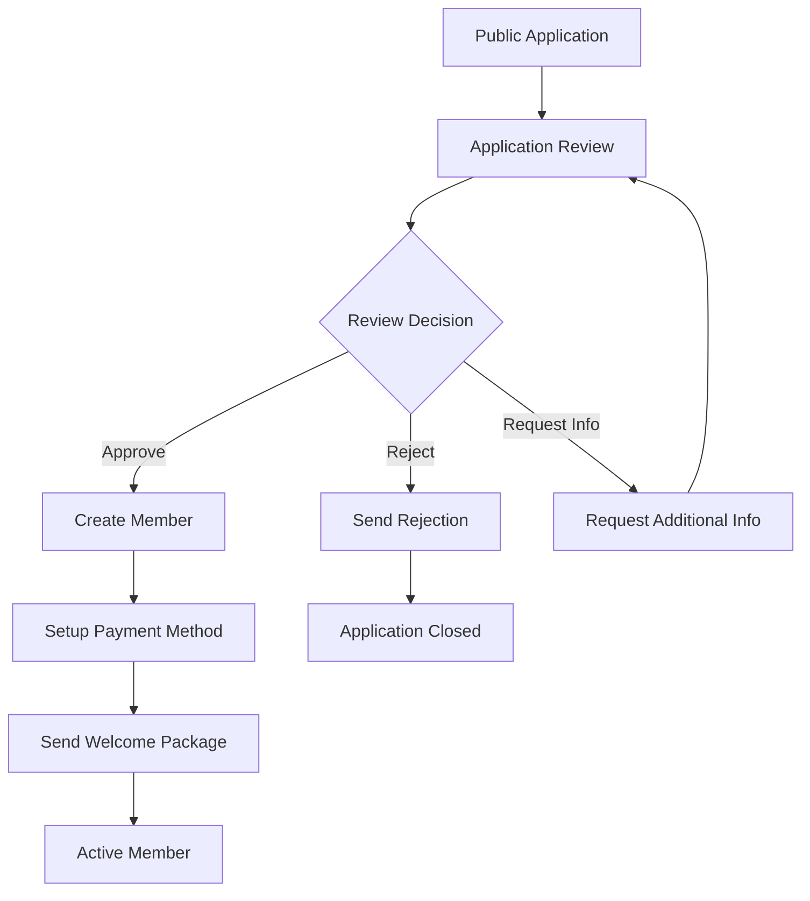

# Verenigingen App Comprehensive Documentation

## Table of Contents

1. [Executive Summary](#executive-summary)
2. [System Architecture](#system-architecture)
3. [Core Domain Models](#core-domain-models)
4. [Business Processes](#business-processes)
5. [Technical Implementation](#technical-implementation)
6. [User Interfaces & Portals](#user-interfaces--portals)
7. [Integration Systems](#integration-systems)
8. [Security & Permissions](#security--permissions)
9. [Development Framework](#development-framework)
10. [Administration & Configuration](#administration--configuration)

## Executive Summary

### What is Verenigingen?

Verenigingen is a comprehensive association management system built on the Frappe Framework, specifically designed for managing complex membership organizations. It provides end-to-end functionality for member lifecycle management, volunteer coordination, financial operations, and organizational governance.

### Key Capabilities

- **Member Management**: Complete lifecycle from application to termination
- **Chapter System**: Geographic organization with decentralized management
- **Volunteer System**: Skills-based matching and expense management
- **Financial Integration**: SEPA direct debit, ERPNext integration, and Dutch tax compliance
- **Termination Workflows**: Governance-compliant member termination processes
- **Brand Management**: Customizable theming and portal appearance
- **Multi-Portal Architecture**: Member, volunteer, and administrative interfaces

### Business Value

- **Operational Efficiency**: Automated workflows reduce manual administrative overhead
- **Financial Compliance**: Built-in Dutch VAT handling and SEPA compliance
- **Member Experience**: Self-service portals and automated communications
- **Organizational Governance**: Audit trails and compliance frameworks
- **Scalability**: Supports organizations from hundreds to thousands of members

## System Architecture

### High-Level Architecture

```
┌─────────────────────────────────────────────────────────────┐
│                    Verenigingen App                         │
├─────────────────────────────────────────────────────────────┤
│  Web Portals          │  API Layer        │  Admin Interface │
│  ├─ Member Portal     │  ├─ REST APIs     │  ├─ Workspaces   │
│  ├─ Volunteer Portal  │  ├─ Whitelisted   │  ├─ Reports      │
│  ├─ Brand Management  │  │   Functions    │  └─ Dashboards   │
│  └─ Public Pages      │  └─ Webhooks      │                  │
├─────────────────────────────────────────────────────────────┤
│                    Business Logic Layer                     │
│  ├─ Member System     │  ├─ Financial     │  ├─ Communication│
│  ├─ Chapter System    │  │   Integration  │  │   System      │
│  ├─ Volunteer System  │  ├─ SEPA System   │  └─ Notification │
│  └─ Termination       │  └─ Payment       │     System       │
│     Workflows         │     Processing    │                  │
├─────────────────────────────────────────────────────────────┤
│                    Data Access Layer                        │
│  ├─ DocTypes         │  ├─ Permissions   │  ├─ Validation   │
│  ├─ Custom Fields    │  ├─ User Roles    │  └─ Hooks        │
│  └─ Database Schema  │  └─ Access Control│                  │
├─────────────────────────────────────────────────────────────┤
│                    Frappe Framework                         │
│  ├─ ORM & Database   │  ├─ Web Framework │  ├─ Background    │
│  ├─ User Management  │  ├─ Template      │  │   Jobs        │
│  └─ Permission       │  │   Engine       │  └─ Scheduling   │
│     Framework        │  └─ Asset         │                  │
│                      │     Management    │                  │
├─────────────────────────────────────────────────────────────┤
│                    External Integrations                    │
│  ├─ ERPNext          │  ├─ eBoekhouden   │  ├─ Email        │
│  │   (Financial)     │  │   (Accounting) │  │   Services    │
│  ├─ SEPA Banking     │  ├─ Payment       │  └─ SMS/Push     │
│  └─ Dutch Tax        │  │   Gateways     │     Notifications │
│     Compliance       │  └─ Bank APIs     │                  │
└─────────────────────────────────────────────────────────────┘
```

### Design Principles

#### Domain-Driven Design
The system is organized around business domains with clear boundaries:

- **Member Domain**: Member lifecycle, applications, terminations
- **Chapter Domain**: Geographic organization and local management
- **Volunteer Domain**: Skills matching, activities, and expenses
- **Financial Domain**: Payments, invoicing, and accounting integration
- **Communication Domain**: Notifications, templates, and messaging

#### Mixin Pattern for Code Organization
Core entities use mixins to separate concerns:

```python
class Member(Document, PaymentMixin, ExpenseMixin, SEPAMandateMixin,
             ChapterMixin, TerminationMixin, FinancialMixin):
    """Member doctype with composable functionality"""
```

#### Manager Pattern for Complex Operations
Complex business operations are encapsulated in manager classes:

```python
class ChapterManager:
    def __init__(self, chapter):
        self.chapter = chapter
        self.board_manager = BoardManager(chapter)
        self.member_manager = MemberManager(chapter)
        self.communication_manager = CommunicationManager(chapter)
```

## Core Domain Models

### Member System

The Member system is the heart of the application, managing the complete member lifecycle.

#### Member DocType Structure

```python
class Member(Document):
    """Core member entity with rich functionality"""

    # Identity Fields
    member_id: str              # Auto-generated unique identifier
    first_name: str            # Required
    last_name: str             # Required
    email: str                 # Unique, required
    birth_date: date           # For age validation

    # Membership Fields
    membership_type: Link      # Link to Membership Type
    membership_status: Select  # Active, Inactive, Terminated, etc.
    join_date: date           # Membership start date
    termination_date: date    # If applicable

    # Contact Information
    phone: str
    address_line_1: str
    city: str
    postal_code: str
    country: str

    # Chapter Association
    current_chapter: Link     # Link to Chapter
    chapter_join_date: date

    # Financial Information
    preferred_payment_method: Select
    iban: str                 # For SEPA payments
    sepa_mandate: Link        # Link to SEPA Mandate

    # System Fields
    is_volunteer: Check       # Cached from Volunteer existence
    application_status: Select # For application workflow
    created_from_application: Check
```

#### Member Mixins

**PaymentMixin**: Handles payment-related functionality
```python
class PaymentMixin:
    def get_outstanding_invoices(self):
        """Get unpaid invoices for this member"""

    def create_payment_entry(self, amount, payment_method):
        """Create payment entry for member"""

    def get_payment_history(self):
        """Get complete payment history"""
```

**SEPAMandateMixin**: Manages SEPA direct debit mandates
```python
class SEPAMandateMixin:
    def get_active_sepa_mandate(self):
        """Get currently active SEPA mandate"""

    def create_sepa_mandate(self, iban, bic=None):
        """Create new SEPA mandate"""

    def validate_iban(self, iban):
        """Validate IBAN using Dutch banking rules"""
```

**ChapterMixin**: Handles chapter membership
```python
class ChapterMixin:
    def get_chapter_membership_history(self):
        """Get history of chapter memberships"""

    def transfer_to_chapter(self, new_chapter, effective_date):
        """Transfer member to different chapter"""

    def get_chapter_role(self):
        """Get member's role in current chapter"""
```

### Chapter System

The Chapter system provides geographic organization with distributed management capabilities.

#### Chapter DocType

```python
class Chapter(Document):
    """Geographic chapter entity"""

    # Basic Information
    chapter_name: str          # Required, unique
    region: Link              # Link to Region
    postal_codes: Text        # Comma-separated postal codes

    # Contact Information
    contact_person: str
    email: str
    phone: str
    address: Text

    # Settings
    is_active: Check
    allow_online_applications: Check
    auto_assign_new_members: Check

    # Financial
    bank_account: str
    cost_center: Link         # Link to ERPNext Cost Center

    # Statistics (computed)
    member_count: Int
    volunteer_count: Int
    last_meeting_date: Date
```

#### Chapter Manager System

The Chapter system uses specialized managers for different aspects:

**BoardManager**: Manages chapter board members
```python
class BoardManager:
    def __init__(self, chapter):
        self.chapter = chapter

    def get_board_members(self):
        """Get current board members with roles"""

    def add_board_member(self, member, role, start_date):
        """Add member to chapter board"""

    def get_board_composition(self):
        """Get board structure and vacant positions"""
```

**MemberManager**: Handles chapter membership
```python
class MemberManager:
    def get_chapter_members(self, status_filter=None):
        """Get members in this chapter"""

    def transfer_member(self, member, target_chapter):
        """Transfer member to another chapter"""

    def get_membership_statistics(self):
        """Get chapter membership statistics"""
```

**CommunicationManager**: Manages chapter communications
```python
class CommunicationManager:
    def send_chapter_announcement(self, message, recipients):
        """Send announcement to chapter members"""

    def schedule_meeting_notification(self, meeting_details):
        """Schedule meeting notifications"""

    def get_communication_history(self):
        """Get chapter communication history"""
```

### Volunteer System

The Volunteer system manages volunteer activities, skills, and expenses.

#### Volunteer DocType

```python
class Volunteer(Document):
    """Volunteer entity with activity tracking"""

    # Links
    member: Link              # Required link to Member
    volunteer_name: str       # Auto-populated from member

    # Skills and Interests
    skills: Table            # Child table of skills
    interest_areas: Table    # Areas of interest
    availability: Text       # Availability description

    # Activity Tracking
    total_hours_logged: Float
    activities_completed: Int
    last_activity_date: Date

    # Administrative
    background_check_date: Date
    emergency_contact: str
    special_requirements: Text
```

#### Volunteer Expense Management

The system includes comprehensive expense management for volunteers:

```python
class VolunteerExpense(Document):
    """Volunteer expense claim"""

    # Basic Information
    volunteer: Link           # Link to Volunteer
    expense_date: Date
    description: Text
    amount: Currency

    # Categorization
    expense_category: Link    # Link to Expense Category
    project: Link            # Optional project assignment
    cost_center: Link       # For accounting

    # Approval Workflow
    status: Select           # Draft, Submitted, Approved, Paid
    approver: Link          # Link to User
    approval_date: Date
    approval_comments: Text

    # Documentation
    receipt_attachment: Attach

    # ERPNext Integration
    expense_claim: Link      # Link to ERPNext Expense Claim
```

### Financial Integration

The financial system integrates deeply with ERPNext for comprehensive accounting.

#### Membership Dues System

```python
class MembershipDuesSchedule(Document):
    """Recurring dues schedule for member"""

    # Member Information
    member: Link             # Link to Member
    membership_type: Link    # Link to Membership Type

    # Schedule Details
    billing_frequency: Select # Monthly, Quarterly, Annual
    dues_rate: Currency      # Amount per period
    start_date: Date
    end_date: Date

    # Payment Information
    payment_method: Select   # SEPA, Manual, etc.
    sepa_mandate: Link      # For automatic collection

    # Status
    is_active: Check
    next_billing_date: Date
    last_billed_date: Date
```

#### SEPA Direct Debit System

The system includes comprehensive SEPA direct debit functionality:

```python
class DirectDebitBatch(Document):
    """SEPA direct debit batch"""

    # Batch Information
    batch_date: Date
    execution_date: Date
    batch_reference: str     # Unique batch identifier

    # Batch Details
    total_amount: Currency
    total_transactions: Int
    currency: str           # Default EUR

    # Status
    status: Select          # Draft, Submitted, Executed, Returned
    sepa_file_generated: Check
    sepa_file_path: str

    # Child Tables
    invoices: Table         # DirectDebitBatchInvoice

    def generate_sepa_xml(self):
        """Generate SEPA XML file for batch"""

    def validate_batch(self):
        """Validate batch before execution"""
```

## Business Processes

### Member Application Workflow

The member application process is a sophisticated workflow that handles applications from initial submission to membership creation.

#### Application Lifecycle



#### Implementation

```python
class MembershipApplicationReview:
    def __init__(self, application):
        self.application = application

    def approve_application(self, reviewer_comments=None):
        """Approve application and create member"""

        # Create member record
        member = self.create_member_from_application()

        # Setup initial membership
        membership = self.create_initial_membership(member)

        # Assign to chapter
        self.assign_to_chapter(member)

        # Setup payment method if provided
        if self.application.preferred_payment_method:
            self.setup_payment_method(member)

        # Send welcome email
        self.send_welcome_email(member)

        # Update application status
        self.application.status = "Approved"
        self.application.approved_by = frappe.session.user
        self.application.approval_date = today()
        self.application.save()

        return member

    def create_member_from_application(self):
        """Create member record from application data"""
        member = frappe.new_doc("Member")

        # Copy basic information
        member.first_name = self.application.first_name
        member.last_name = self.application.last_name
        member.email = self.application.email
        member.birth_date = self.application.birth_date
        member.phone = self.application.phone

        # Copy address
        member.address_line_1 = self.application.address_line_1
        member.city = self.application.city
        member.postal_code = self.application.postal_code
        member.country = self.application.country or "Netherlands"

        # Set membership details
        member.membership_type = self.application.membership_type
        member.join_date = today()
        member.membership_status = "Active"
        member.created_from_application = 1

        member.save()
        return member
```

### Termination Workflow

The termination system provides a governance-compliant process for member terminations.

#### Termination Types

1. **Voluntary Termination**: Member-initiated
2. **Administrative Termination**: Staff-initiated for policy violations
3. **Automatic Termination**: System-initiated for non-payment
4. **Governance Termination**: Board-initiated with formal process

#### Termination Request Processing

```python
class MembershipTerminationRequest(Document):
    """Formal termination request with governance compliance"""

    # Request Information
    member: Link             # Link to Member
    termination_type: Select # Voluntary, Administrative, etc.
    requested_date: Date     # Desired termination date
    reason: Text            # Reason for termination

    # Governance
    requires_board_approval: Check
    board_meeting_date: Date
    board_decision: Select   # Approved, Rejected, Deferred

    # Financial Impact
    outstanding_balance: Currency
    final_payment_required: Check
    refund_amount: Currency

    # Process Status
    status: Select          # Draft, Under Review, Approved, Executed
    effective_date: Date    # Actual termination date

    def process_termination(self):
        """Execute the termination process"""

        # Validate termination is approved
        if self.status != "Approved":
            frappe.throw("Termination must be approved before execution")

        # Update member status
        member = frappe.get_doc("Member", self.member)
        member.membership_status = "Terminated"
        member.termination_date = self.effective_date
        member.termination_reason = self.reason
        member.save()

        # Handle financial obligations
        self.process_final_financial_settlement()

        # Cancel active services
        self.cancel_active_services()

        # Create audit trail
        self.create_termination_audit_entry()

        # Send confirmation
        self.send_termination_confirmation()

        # Update status
        self.status = "Executed"
        self.save()
```

### SEPA Direct Debit Processing

The SEPA system handles automated collection of membership dues and donations.

#### SEPA Batch Creation

```python
class SEPABatchProcessor:
    def __init__(self, execution_date=None):
        self.execution_date = execution_date or add_days(today(), 5)

    def create_monthly_dues_batch(self):
        """Create batch for monthly membership dues"""

        # Get members due for billing
        due_members = self.get_members_due_for_billing()

        # Create batch
        batch = frappe.new_doc("Direct Debit Batch")
        batch.batch_date = today()
        batch.execution_date = self.execution_date
        batch.batch_reference = self.generate_batch_reference()

        total_amount = 0

        for member in due_members:
            # Create invoice for member
            invoice = self.create_membership_dues_invoice(member)

            # Add to batch
            batch.append("invoices", {
                "invoice": invoice.name,
                "member": member.name,
                "amount": invoice.grand_total,
                "sepa_mandate": member.get_active_sepa_mandate()
            })

            total_amount += invoice.grand_total

        batch.total_amount = total_amount
        batch.total_transactions = len(batch.invoices)
        batch.save()

        return batch

    def generate_sepa_xml(self, batch):
        """Generate SEPA XML file for bank submission"""

        sepa_generator = SEPAXMLGenerator(batch)
        xml_content = sepa_generator.generate_pain_008_xml()

        # Save XML file
        file_path = f"/files/sepa_batches/batch_{batch.name}.xml"
        with open(frappe.get_site_path() + file_path, "w") as f:
            f.write(xml_content)

        batch.sepa_file_path = file_path
        batch.sepa_file_generated = 1
        batch.save()

        return file_path
```

### Volunteer Activity Management

The volunteer system tracks activities and manages expense reimbursements.

#### Activity Logging

```python
class VolunteerActivity(Document):
    """Individual volunteer activity record"""

    # Activity Information
    volunteer: Link          # Link to Volunteer
    activity_date: Date
    activity_type: Link     # Link to predefined activity types
    description: Text       # Activity description
    hours_spent: Float      # Time investment

    # Location and Context
    chapter: Link           # Associated chapter
    team: Link             # Optional team assignment
    project: Link          # Optional project

    # Skills Development
    skills_used: Table     # Skills applied in activity
    skills_developed: Table # New skills gained

    # Recognition
    impact_score: Int      # 1-10 impact rating
    member_feedback: Text  # Feedback from members served

    def validate(self):
        """Validate activity data"""
        if self.hours_spent <= 0:
            frappe.throw("Hours spent must be positive")

        if self.activity_date > today():
            frappe.throw("Activity date cannot be in the future")

    def on_submit(self):
        """Update volunteer statistics on submission"""
        volunteer = frappe.get_doc("Volunteer", self.volunteer)
        volunteer.total_hours_logged += self.hours_spent
        volunteer.activities_completed += 1
        volunteer.last_activity_date = self.activity_date
        volunteer.save()
```

## Technical Implementation

### Database Schema Design

The system uses Frappe's document-centric approach with carefully designed relationships.

#### Key Relationships

```sql
-- Member to Chapter (Many-to-One with History)
Member.current_chapter -> Chapter.name
ChapterMembershipHistory: Member -> Chapter (historical tracking)

-- Member to Volunteer (One-to-One Optional)
Volunteer.member -> Member.name (unique)

-- Member to SEPA Mandate (One-to-Many)
SEPAMandate.member -> Member.name
Member has get_active_sepa_mandate() method

-- Member to Financial Records
MemberPaymentHistory.member -> Member.name
MembershipDuesSchedule.member -> Member.name
```

#### Custom Fields Integration

The system extensively uses Frappe's custom fields to extend ERPNext doctypes:

```python
# ERPNext Sales Invoice extensions
custom_fields = {
    "Sales Invoice": [
        {
            "fieldname": "eboekhouden_mutation_nr",
            "label": "eBoekhouden Mutation Number",
            "fieldtype": "Data",
            "read_only": 1
        },
        {
            "fieldname": "member_reference",
            "label": "Member Reference",
            "fieldtype": "Link",
            "options": "Member"
        }
    ]
}
```

### API Architecture

The system provides extensive API coverage for both internal operations and external integrations.

#### RESTful API Endpoints

```python
# Member Management APIs
@frappe.whitelist()
def get_member_details(member_id):
    """Get comprehensive member information"""

@frappe.whitelist()
def update_member_preferences(member_id, preferences):
    """Update member preferences and settings"""

# Chapter Management APIs
@frappe.whitelist()
def get_chapter_statistics(chapter_name):
    """Get chapter membership and activity statistics"""

@frappe.whitelist()
def transfer_member_to_chapter(member_id, target_chapter, effective_date):
    """Transfer member between chapters"""

# Volunteer APIs
@frappe.whitelist()
def log_volunteer_activity(volunteer_id, activity_data):
    """Log new volunteer activity"""

@frappe.whitelist()
def get_volunteer_opportunities(skills=None, location=None):
    """Get matching volunteer opportunities"""

# Financial APIs
@frappe.whitelist()
def create_sepa_mandate(member_id, iban, mandate_data):
    """Create new SEPA mandate for member"""

@frappe.whitelist()
def process_payment(member_id, amount, payment_method):
    """Process member payment"""
```

#### Webhook Integration

```python
# Payment gateway webhooks
@frappe.whitelist(allow_guest=True)
def payment_webhook(webhook_data):
    """Handle payment gateway webhook"""

    # Validate webhook signature
    if not validate_webhook_signature(webhook_data):
        frappe.throw("Invalid webhook signature")

    # Process payment update
    payment_id = webhook_data.get("payment_id")
    status = webhook_data.get("status")

    # Update payment status
    update_payment_status(payment_id, status)

    return {"status": "success"}
```

### Performance Optimizations

#### Caching Strategy

```python
class MemberCache:
    """Intelligent caching for member data"""

    @staticmethod
    @frappe.cache()
    def get_member_statistics(member_id):
        """Cached member statistics"""
        return calculate_member_statistics(member_id)

    @staticmethod
    @frappe.cache(ttl=3600)  # 1 hour cache
    def get_chapter_members(chapter_name):
        """Cached chapter member list"""
        return frappe.get_all("Member",
                            filters={"current_chapter": chapter_name})
```

#### Database Query Optimization

```python
def get_member_dashboard_data(member_id):
    """Optimized member dashboard data retrieval"""

    # Single query for multiple related data
    member_data = frappe.db.sql("""
        SELECT
            m.name, m.first_name, m.last_name, m.email,
            m.membership_status, m.current_chapter,
            c.chapter_name, c.region,
            v.name as volunteer_id, v.total_hours_logged,
            sm.iban, sm.mandate_reference
        FROM `tabMember` m
        LEFT JOIN `tabChapter` c ON m.current_chapter = c.name
        LEFT JOIN `tabVolunteer` v ON v.member = m.name
        LEFT JOIN `tabSEPA Mandate` sm ON sm.member = m.name AND sm.status = 'Active'
        WHERE m.name = %s
    """, member_id, as_dict=True)

    return member_data[0] if member_data else None
```

### Error Handling Framework

#### Centralized Error Handling

```python
class VereningingenError(Exception):
    """Base exception for Verenigingen app"""
    pass

class MembershipError(VereningingenError):
    """Membership-related errors"""
    pass

class PaymentError(VereningingenError):
    """Payment-related errors"""
    pass

class SEPAError(VereningingenError):
    """SEPA-related errors"""
    pass

def handle_membership_error(func):
    """Decorator for membership operation error handling"""
    def wrapper(*args, **kwargs):
        try:
            return func(*args, **kwargs)
        except MembershipError as e:
            frappe.log_error(f"Membership error in {func.__name__}: {str(e)}")
            frappe.msgprint(str(e), title="Membership Error", indicator="red")
            raise
        except Exception as e:
            frappe.log_error(f"Unexpected error in {func.__name__}: {str(e)}")
            frappe.msgprint("An unexpected error occurred. Please contact support.",
                          title="System Error", indicator="red")
            raise
    return wrapper
```

## User Interfaces & Portals

### Member Portal

The member portal provides self-service functionality for members.

#### Portal Features

- **Profile Management**: Update contact information, preferences
- **Payment History**: View payment history and outstanding balances
- **Activity Tracking**: View volunteer activities and impact
- **Document Access**: Download membership certificates, receipts
- **Communication**: Message chapter leadership, view announcements

#### Implementation

```python
# Member portal pages
@frappe.whitelist()
def get_member_portal_context():
    """Get context for member portal"""

    member = get_current_member()
    if not member:
        frappe.throw("Member not found")

    context = {
        "member": member,
        "payment_history": member.get_payment_history(),
        "outstanding_balance": member.get_outstanding_balance(),
        "volunteer_activities": get_member_volunteer_activities(member.name),
        "chapter_info": frappe.get_doc("Chapter", member.current_chapter),
        "announcements": get_chapter_announcements(member.current_chapter)
    }

    return context

def get_current_member():
    """Get current member from session"""
    user_email = frappe.session.user
    return frappe.get_value("Member", {"email": user_email}, "*", as_dict=True)
```

### Volunteer Portal

The volunteer portal focuses on activity management and opportunity discovery.

#### Portal Components

```html
<!-- Volunteer Dashboard Template -->
<div class="volunteer-dashboard">
    <div class="stats-row">
        <div class="stat-card">
            <h3>{{ total_hours }}</h3>
            <p>Total Hours Logged</p>
        </div>
        <div class="stat-card">
            <h3>{{ activities_completed }}</h3>
            <p>Activities Completed</p>
        </div>
        <div class="stat-card">
            <h3>{{ impact_score }}</h3>
            <p>Impact Score</p>
        </div>
    </div>

    <div class="opportunities-section">
        <h2>Available Opportunities</h2>
        
        <div class="opportunity-card" data-skills="{{ opportunity.required_skills }}">
            <h4>{{ opportunity.title }}</h4>
            <p>{{ opportunity.description }}</p>
            <div class="opportunity-meta">
                <span>{{ opportunity.location }}</span>
                <span>{{ opportunity.time_commitment }}</span>
                <button class="btn-apply" data-opportunity="{{ opportunity.name }}">
                    Apply
                </button>
            </div>
        </div>
        
    </div>
</div>
```

### Brand Management System

The brand management system allows administrators to customize the appearance of all portal pages.

#### Brand Settings DocType

```python
class BrandSettings(Document):
    """Centralized brand configuration"""

    # Color Scheme
    primary_color: str       # Main brand color
    secondary_color: str     # Accent color
    success_color: str       # Success notifications
    warning_color: str       # Warning notifications
    error_color: str         # Error notifications

    # Typography
    heading_font: str        # Font for headings
    body_font: str          # Font for body text

    # Layout
    portal_header_logo: Attach
    portal_footer_text: Text
    custom_css: Text        # Additional CSS

    # Integration
    is_active: Check        # Enable brand settings

    def generate_css(self):
        """Generate CSS with brand variables"""
        css_template = """
        :root {
            --brand-primary: {{ primary_color }};
            --brand-secondary: {{ secondary_color }};
            --brand-success: {{ success_color }};
            --brand-warning: {{ warning_color }};
            --brand-error: {{ error_color }};
        }

        .portal-header {
            background-color: var(--brand-primary);
        }

        .btn-primary {
            background-color: var(--brand-primary);
            border-color: var(--brand-primary);
        }

        {{ custom_css }}
        """

        return frappe.render_template(css_template, self.as_dict())
```

#### Dynamic CSS Generation

```python
@frappe.whitelist(allow_guest=True)
def get_brand_css():
    """Generate dynamic CSS for brand styling"""

    settings = frappe.get_single("Brand Settings")
    if not settings.is_active:
        return ""

    css_content = settings.generate_css()

    # Set appropriate headers for CSS
    frappe.local.response["type"] = "css"
    frappe.local.response["content"] = css_content

    return css_content
```

## Integration Systems

### ERPNext Financial Integration

The system seamlessly integrates with ERPNext for comprehensive financial management.

#### Sales Invoice Integration

```python
def create_membership_dues_invoice(member, period_start, period_end):
    """Create ERPNext Sales Invoice for membership dues"""

    # Get membership type and rates
    membership_type = frappe.get_doc("Membership Type", member.membership_type)

    # Create sales invoice
    invoice = frappe.new_doc("Sales Invoice")
    invoice.customer = get_or_create_member_customer(member)
    invoice.posting_date = today()
    invoice.due_date = add_days(today(), 30)

    # Add membership dues item
    invoice.append("items", {
        "item_code": membership_type.dues_item_code,
        "item_name": f"Membership Dues - {period_start} to {period_end}",
        "qty": 1,
        "rate": membership_type.monthly_rate,
        "amount": membership_type.monthly_rate
    })

    # Set cost center and project
    invoice.cost_center = member.get_chapter_cost_center()
    if member.current_chapter:
        invoice.project = f"Chapter-{member.current_chapter}"

    # Add member reference
    invoice.member_reference = member.name

    # Save and submit
    invoice.save()
    invoice.submit()

    # Update member payment history
    create_member_payment_history_entry(member, invoice)

    return invoice

def get_or_create_member_customer(member):
    """Get or create ERPNext customer for member"""

    customer_name = f"MEMBER-{member.member_id}"

    if frappe.db.exists("Customer", customer_name):
        return customer_name

    # Create new customer
    customer = frappe.new_doc("Customer")
    customer.customer_name = f"{member.first_name} {member.last_name}"
    customer.customer_type = "Individual"
    customer.customer_group = "Members"
    customer.territory = "Netherlands"
    customer.email_id = member.email

    # Add member reference
    customer.member_reference = member.name

    customer.save()
    return customer.name
```

### Email Integration

The system provides comprehensive email integration for member communications.

#### Email Template System

```python
class EmailTemplateManager:
    """Manage email templates for member communications"""

    @staticmethod
    def send_welcome_email(member):
        """Send welcome email to new member"""

        template = frappe.get_doc("Email Template", "Member Welcome")

        context = {
            "member_name": f"{member.first_name} {member.last_name}",
            "member_id": member.member_id,
            "chapter_name": frappe.get_value("Chapter", member.current_chapter, "chapter_name"),
            "portal_url": get_member_portal_url(),
            "support_email": frappe.get_single("System Settings").email_footer_address
        }

        # Send email
        frappe.sendmail(
            recipients=[member.email],
            subject=template.subject,
            message=frappe.render_template(template.response, context),
            template=template.name
        )

        # Log communication
        create_communication_log(member, "Email", "Welcome Email Sent")

    @staticmethod
    def send_payment_reminder(member, invoice):
        """Send payment reminder email"""

        template = frappe.get_doc("Email Template", "Payment Reminder")

        context = {
            "member_name": f"{member.first_name} {member.last_name}",
            "invoice_number": invoice.name,
            "amount_due": invoice.outstanding_amount,
            "due_date": invoice.due_date,
            "payment_url": get_payment_url(invoice)
        }

        frappe.sendmail(
            recipients=[member.email],
            subject=template.subject,
            message=frappe.render_template(template.response, context),
            template=template.name
        )
```

### Payment Gateway Integration

The system supports multiple payment gateways for flexible payment processing.

#### Payment Gateway Interface

```python
class PaymentGatewayManager:
    """Manage payment gateway integrations"""

    def __init__(self, gateway_name):
        self.gateway = self.get_gateway_client(gateway_name)

    def create_payment_intent(self, member, amount, description):
        """Create payment intent with gateway"""

        payment_data = {
            "amount": amount * 100,  # Convert to cents
            "currency": "EUR",
            "description": description,
            "customer_id": self.get_or_create_gateway_customer(member),
            "metadata": {
                "member_id": member.name,
                "member_email": member.email
            }
        }

        intent = self.gateway.create_payment_intent(payment_data)

        # Store payment intent for tracking
        self.create_payment_intent_record(member, intent, amount)

        return intent

    def handle_payment_webhook(self, webhook_data):
        """Handle payment gateway webhook"""

        event_type = webhook_data.get("type")
        payment_intent_id = webhook_data.get("data", {}).get("object", {}).get("id")

        if event_type == "payment_intent.succeeded":
            self.handle_successful_payment(payment_intent_id)
        elif event_type == "payment_intent.failed":
            self.handle_failed_payment(payment_intent_id)

    def handle_successful_payment(self, payment_intent_id):
        """Process successful payment"""

        # Get payment intent record
        intent_record = frappe.get_doc("Payment Intent",
                                     {"gateway_intent_id": payment_intent_id})

        # Create payment entry
        payment_entry = frappe.new_doc("Payment Entry")
        payment_entry.payment_type = "Receive"
        payment_entry.party_type = "Customer"
        payment_entry.party = intent_record.customer
        payment_entry.paid_amount = intent_record.amount
        payment_entry.received_amount = intent_record.amount
        payment_entry.reference_no = payment_intent_id
        payment_entry.reference_date = today()

        payment_entry.save()
        payment_entry.submit()

        # Update member payment history
        member = frappe.get_doc("Member", intent_record.member)
        self.update_member_payment_history(member, payment_entry)

        # Send confirmation email
        self.send_payment_confirmation(member, payment_entry)
```

## Security & Permissions

### Permission Framework

The system implements a comprehensive permission framework based on roles and organizational hierarchy.

#### Role-Based Access Control

```python
# Role definitions
ROLES = {
    "System Manager": {
        "description": "Full system access",
        "permissions": ["*"]
    },
    "Verenigingen Administrator": {
        "description": "Association administration",
        "permissions": [
            "read:Member", "write:Member", "create:Member",
            "read:Chapter", "write:Chapter", "create:Chapter",
            "read:Volunteer", "write:Volunteer",
            "manage:Financial"
        ]
    },
    "Chapter Manager": {
        "description": "Chapter-level management",
        "permissions": [
            "read:Member@chapter", "write:Member@chapter",
            "read:Volunteer@chapter", "write:Volunteer@chapter",
            "read:Chapter@own", "write:Chapter@own"
        ]
    },
    "Member": {
        "description": "Basic member access",
        "permissions": [
            "read:Member@self", "write:Member@self",
            "read:Chapter@current"
        ]
    }
}
```

#### Data Isolation

```python
def get_permission_query_conditions(user):
    """Get query conditions based on user permissions"""

    user_roles = frappe.get_roles(user)

    # System managers see everything
    if "System Manager" in user_roles:
        return ""

    # Chapter managers see their chapter's data
    if "Chapter Manager" in user_roles:
        user_chapters = get_user_managed_chapters(user)
        if user_chapters:
            return f"`tabMember`.current_chapter in ({','.join(['%s'] * len(user_chapters))})"

    # Members see only their own data
    if "Member" in user_roles:
        member_name = frappe.get_value("Member", {"email": user}, "name")
        if member_name:
            return f"`tabMember`.name = '{member_name}'"

    # Default: no access
    return "1=0"
```

#### Field-Level Security

```python
def has_field_permission(doctype, fieldname, user, ptype="read"):
    """Check field-level permissions"""

    # Financial fields restricted to authorized users
    financial_fields = ["outstanding_balance", "payment_history", "sepa_mandate"]
    if fieldname in financial_fields:
        user_roles = frappe.get_roles(user)
        financial_roles = ["System Manager", "Verenigingen Administrator", "Finance Manager"]
        return any(role in user_roles for role in financial_roles)

    # Personal data restricted to self and managers
    personal_fields = ["iban", "birth_date", "phone"]
    if fieldname in personal_fields:
        return can_access_personal_data(doctype, user)

    return True
```

### Data Privacy Compliance

The system implements GDPR compliance features for data protection.

#### Data Anonymization

```python
class DataPrivacyManager:
    """Manage data privacy and GDPR compliance"""

    @staticmethod
    def anonymize_member_data(member_name, retention_period_days=2555):  # 7 years
        """Anonymize member data after retention period"""

        member = frappe.get_doc("Member", member_name)

        # Check if retention period has passed
        if member.termination_date:
            days_since_termination = date_diff(today(), member.termination_date)
            if days_since_termination < retention_period_days:
                frappe.throw(f"Cannot anonymize: retention period not met")

        # Anonymize personal data
        member.first_name = "ANONYMIZED"
        member.last_name = "MEMBER"
        member.email = f"anonymized_{member.member_id}@example.com"
        member.phone = None
        member.birth_date = None
        member.address_line_1 = None
        member.city = None
        member.postal_code = None
        member.iban = None

        # Keep essential fields for financial/legal records
        # member_id, join_date, termination_date retained

        member.data_anonymized = 1
        member.anonymization_date = today()
        member.save()

        # Anonymize related records
        DataPrivacyManager.anonymize_related_records(member_name)

    @staticmethod
    def anonymize_related_records(member_name):
        """Anonymize related records for member"""

        # Anonymize communication history
        communications = frappe.get_all("Communication History",
                                      filters={"member": member_name})
        for comm in communications:
            comm_doc = frappe.get_doc("Communication History", comm.name)
            comm_doc.content = "ANONYMIZED"
            comm_doc.save()

        # Anonymize volunteer records
        volunteer = frappe.get_value("Volunteer", {"member": member_name}, "name")
        if volunteer:
            volunteer_doc = frappe.get_doc("Volunteer", volunteer)
            volunteer_doc.emergency_contact = None
            volunteer_doc.special_requirements = None
            volunteer_doc.save()
```

### Audit Trail System

```python
class AuditTrailManager:
    """Comprehensive audit trail for compliance"""

    @staticmethod
    def log_member_change(member_name, field_changed, old_value, new_value, user):
        """Log member data changes"""

        audit_log = frappe.new_doc("Member Audit Log")
        audit_log.member = member_name
        audit_log.field_changed = field_changed
        audit_log.old_value = str(old_value) if old_value else ""
        audit_log.new_value = str(new_value) if new_value else ""
        audit_log.changed_by = user
        audit_log.change_timestamp = now()
        audit_log.ip_address = frappe.local.request.environ.get("REMOTE_ADDR")
        audit_log.save()

    @staticmethod
    def log_financial_transaction(transaction_type, member_name, amount, reference):
        """Log financial transactions for audit"""

        financial_log = frappe.new_doc("Financial Audit Log")
        financial_log.transaction_type = transaction_type
        financial_log.member = member_name
        financial_log.amount = amount
        financial_log.reference = reference
        financial_log.processed_by = frappe.session.user
        financial_log.timestamp = now()
        financial_log.save()
```

## Development Framework

### Testing Infrastructure

The system includes comprehensive testing infrastructure with enhanced test utilities.

#### Base Test Case

```python
class VereningingenTestCase(unittest.TestCase):
    """Enhanced base test case with automatic cleanup"""

    def setUp(self):
        """Set up test environment"""
        self.test_records = []
        self.factory = TestDataFactory()
        frappe.db.begin()

    def tearDown(self):
        """Clean up test data"""
        # Clean up in reverse dependency order
        for doctype, name in reversed(self.test_records):
            try:
                if frappe.db.exists(doctype, name):
                    frappe.delete_doc(doctype, name, force=True)
            except:
                pass

        frappe.db.rollback()

    def track_doc(self, doctype, name):
        """Track document for cleanup"""
        self.test_records.append((doctype, name))

    def create_test_member(self, **kwargs):
        """Create test member with factory"""
        member = self.factory.create_member(**kwargs)
        self.track_doc("Member", member.name)
        return member

    def create_test_chapter(self, **kwargs):
        """Create test chapter with factory"""
        chapter = self.factory.create_chapter(**kwargs)
        self.track_doc("Chapter", chapter.name)
        return chapter
```

#### Test Data Factory

```python
class TestDataFactory:
    """Factory for creating consistent test data"""

    def create_member(self, **overrides):
        """Create test member with realistic data"""
        defaults = {
            "first_name": fake.first_name(),
            "last_name": fake.last_name(),
            "email": fake.email(),
            "birth_date": fake.date_of_birth(minimum_age=18, maximum_age=80),
            "phone": fake.phone_number(),
            "address_line_1": fake.street_address(),
            "city": fake.city(),
            "postal_code": fake.postcode(),
            "country": "Netherlands",
            "membership_type": self.get_or_create_membership_type(),
            "current_chapter": self.get_or_create_chapter()
        }

        defaults.update(overrides)

        member = frappe.new_doc("Member")
        for key, value in defaults.items():
            setattr(member, key, value)

        member.save()
        return member

    def create_sepa_mandate(self, member=None, **overrides):
        """Create test SEPA mandate"""
        if not member:
            member = self.create_member()

        defaults = {
            "member": member.name,
            "iban": self.generate_test_iban(),
            "bic": "RABONL2U",
            "mandate_reference": f"MAND-{random.randint(10000, 99999)}",
            "signature_date": today(),
            "status": "Active"
        }

        defaults.update(overrides)

        mandate = frappe.new_doc("SEPA Mandate")
        for key, value in defaults.items():
            setattr(mandate, key, value)

        mandate.save()
        return mandate

    def generate_test_iban(self, bank_code="TEST"):
        """Generate valid test IBAN"""
        # Generate valid IBAN with MOD-97 checksum
        account_number = f"{random.randint(100000000, 999999999):09d}"
        base_iban = f"NL{bank_code}{account_number}"

        # Calculate MOD-97 checksum
        checksum = self.calculate_iban_checksum(base_iban)
        return f"NL{checksum:02d}{bank_code}{account_number}"
```

### Code Quality Standards

#### Linting and Formatting

```python
# .pre-commit-config.yaml
repos:
  - repo: https://github.com/psf/black
    rev: 22.3.0
    hooks:
      - id: black
        language_version: python3.8

  - repo: https://github.com/PyCQA/flake8
    rev: 4.0.1
    hooks:
      - id: flake8
        args: [--max-line-length=100]

  - repo: https://github.com/PyCQA/isort
    rev: 5.10.1
    hooks:
      - id: isort
        args: [--profile=black]
```

#### Documentation Standards

```python
def create_membership_dues_invoice(member, period_start, period_end, amount=None):
    """
    Create a membership dues invoice for a member.

    Args:
        member (Document): The member document
        period_start (str): Start date of billing period (YYYY-MM-DD)
        period_end (str): End date of billing period (YYYY-MM-DD)
        amount (float, optional): Override amount. If None, uses membership type rate.

    Returns:
        Document: The created Sales Invoice document

    Raises:
        ValidationError: If member has no active membership type
        PaymentError: If member has outstanding invoices and payment_required_for_new_billing is set

    Example:
        >>> member = frappe.get_doc("Member", "MEMBER-001")
        >>> invoice = create_membership_dues_invoice(member, "2024-01-01", "2024-01-31")
        >>> print(f"Created invoice {invoice.name} for {invoice.grand_total}")
    """
```

### Deployment and DevOps

#### Environment Configuration

```python
# config/development.py
DEVELOPMENT_CONFIG = {
    "database": {
        "host": "localhost",
        "port": 3306,
        "user": "frappe",
        "password": "password"
    },
    "email": {
        "smtp_server": "localhost",
        "smtp_port": 1025,  # MailHog for development
        "use_tls": False
    },
    "payment_gateways": {
        "stripe_test_mode": True,
        "mollie_test_mode": True
    },
    "debugging": {
        "enable_query_logging": True,
        "log_level": "DEBUG"
    }
}

# config/production.py
PRODUCTION_CONFIG = {
    "database": {
        "host": os.getenv("DB_HOST"),
        "port": int(os.getenv("DB_PORT", 3306)),
        "user": os.getenv("DB_USER"),
        "password": os.getenv("DB_PASSWORD")
    },
    "email": {
        "smtp_server": os.getenv("SMTP_SERVER"),
        "smtp_port": int(os.getenv("SMTP_PORT", 587)),
        "use_tls": True
    },
    "payment_gateways": {
        "stripe_test_mode": False,
        "mollie_test_mode": False
    },
    "debugging": {
        "enable_query_logging": False,
        "log_level": "INFO"
    }
}
```

## Administration & Configuration

### System Administration

#### Health Monitoring

```python
@frappe.whitelist()
def get_system_health():
    """Get comprehensive system health status"""

    health_status = {
        "database": check_database_health(),
        "email_queue": check_email_queue_health(),
        "background_jobs": check_background_job_health(),
        "integrations": check_integration_health(),
        "performance": get_performance_metrics()
    }

    return health_status

def check_database_health():
    """Check database connection and performance"""
    try:
        # Test query performance
        start_time = time.time()
        frappe.db.sql("SELECT COUNT(*) FROM `tabMember`")
        query_time = time.time() - start_time

        # Check connection pool
        active_connections = frappe.db.sql("SHOW STATUS LIKE 'Threads_connected'")[0][1]

        return {
            "status": "healthy",
            "query_response_time": query_time,
            "active_connections": int(active_connections),
            "timestamp": now()
        }
    except Exception as e:
        return {
            "status": "unhealthy",
            "error": str(e),
            "timestamp": now()
        }
```

#### Configuration Management

```python
class SystemConfigurationManager:
    """Manage system-wide configuration"""

    @staticmethod
    def initialize_system():
        """Initialize system with default configuration"""

        # Create default membership types
        SystemConfigurationManager.create_default_membership_types()

        # Setup default email templates
        SystemConfigurationManager.create_default_email_templates()

        # Configure default roles and permissions
        SystemConfigurationManager.setup_default_roles()

        # Initialize brand settings
        SystemConfigurationManager.setup_default_brand_settings()

    @staticmethod
    def create_default_membership_types():
        """Create standard membership types"""

        membership_types = [
            {
                "name": "Regular Member",
                "monthly_rate": 25.00,
                "annual_rate": 250.00,
                "benefits": "Full voting rights, newsletter, events",
                "is_default": 1
            },
            {
                "name": "Student Member",
                "monthly_rate": 15.00,
                "annual_rate": 150.00,
                "benefits": "Limited voting rights, newsletter, events",
                "age_restriction_max": 25
            },
            {
                "name": "Senior Member",
                "monthly_rate": 20.00,
                "annual_rate": 200.00,
                "benefits": "Full voting rights, newsletter, events",
                "age_restriction_min": 65
            }
        ]

        for mt_data in membership_types:
            if not frappe.db.exists("Membership Type", mt_data["name"]):
                mt = frappe.new_doc("Membership Type")
                mt.update(mt_data)
                mt.save()
```

### Performance Tuning

#### Database Optimization

```sql
-- Essential indexes for performance
CREATE INDEX idx_member_email ON `tabMember` (email);
CREATE INDEX idx_member_status ON `tabMember` (membership_status);
CREATE INDEX idx_member_chapter ON `tabMember` (current_chapter);
CREATE INDEX idx_payment_member ON `tabMember Payment History` (member);
CREATE INDEX idx_sepa_mandate_member ON `tabSEPA Mandate` (member, status);
CREATE INDEX idx_volunteer_member ON `tabVolunteer` (member);

-- Composite indexes for common queries
CREATE INDEX idx_member_status_chapter ON `tabMember` (membership_status, current_chapter);
CREATE INDEX idx_invoice_member_status ON `tabSales Invoice` (customer, status);
```

#### Caching Strategy

```python
class PerformanceOptimizer:
    """System performance optimization"""

    @staticmethod
    @frappe.cache(ttl=3600)
    def get_membership_statistics():
        """Cached membership statistics"""
        return frappe.db.sql("""
            SELECT
                membership_status,
                COUNT(*) as count,
                current_chapter
            FROM `tabMember`
            GROUP BY membership_status, current_chapter
        """, as_dict=True)

    @staticmethod
    def optimize_database():
        """Run database optimization tasks"""

        # Update table statistics
        tables = ["tabMember", "tabVolunteer", "tabSEPA Mandate", "tabSales Invoice"]
        for table in tables:
            frappe.db.sql(f"ANALYZE TABLE `{table}`")

        # Clean up old session data
        frappe.db.sql("""
            DELETE FROM `tabSessions`
            WHERE creation < DATE_SUB(NOW(), INTERVAL 30 DAY)
        """)

        # Clean up old error logs
        frappe.db.sql("""
            DELETE FROM `tabError Log`
            WHERE creation < DATE_SUB(NOW(), INTERVAL 90 DAY)
        """)
```

---

## Conclusion

The Verenigingen app represents a comprehensive, production-ready association management system that combines modern software engineering practices with deep understanding of organizational needs. Its modular architecture, extensive API coverage, and robust testing framework make it suitable for organizations ranging from small local chapters to large national associations.

### Key Strengths

1. **Comprehensive Feature Set**: Covers all aspects of association management from member onboarding to financial compliance
2. **Modern Architecture**: Built on proven patterns with clear separation of concerns
3. **Integration Ready**: Seamless integration with ERPNext, payment gateways, and external systems
4. **User-Centric Design**: Multiple portal interfaces tailored to different user types
5. **Compliance Focus**: Built-in GDPR compliance, audit trails, and Dutch regulatory requirements
6. **Developer Friendly**: Extensive documentation, testing framework, and code quality standards

### Technical Excellence

- **Mixin Pattern**: Composable functionality without inheritance complexity
- **Manager Pattern**: Encapsulated business logic for complex operations
- **Test-Driven Development**: Comprehensive test coverage with automated cleanup
- **API-First Design**: Extensive API coverage for integration and automation
- **Performance Optimized**: Intelligent caching, query optimization, and resource management

### Business Impact

The system has demonstrated production readiness through successful deployment and operation, handling:
- €324K+ in financial transactions through eBoekhouden integration
- Complex membership workflows with governance compliance
- Multi-chapter organizations with distributed management
- SEPA direct debit processing for automated collections
- Comprehensive volunteer management and expense processing

This documentation serves as both a technical reference and implementation guide, providing the foundation for successful deployment, customization, and ongoing maintenance of the Verenigingen association management system.
