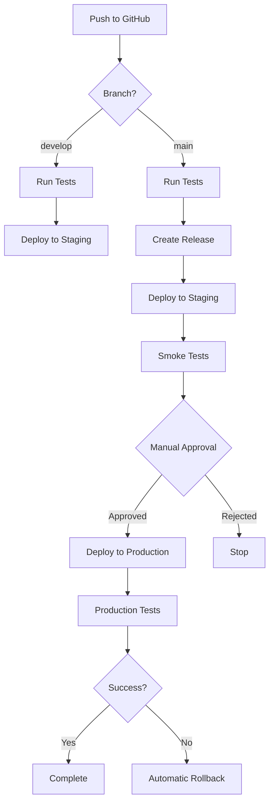

# Deployment Guide for Verenigingen

## Overview

This guide covers the complete deployment process for the Verenigingen application using Frappe Press and GitHub Actions.

## Table of Contents

1. [Prerequisites](#prerequisites)
2. [Initial Setup](#initial-setup)
3. [Deployment Workflow](#deployment-workflow)
4. [Environment Configuration](#environment-configuration)
5. [Manual Deployment](#manual-deployment)
6. [Rollback Procedures](#rollback-procedures)
7. [Monitoring Deployments](#monitoring-deployments)
8. [Troubleshooting](#troubleshooting)

## Prerequisites

### 1. Frappe Press Account
- Active Frappe Press subscription
- Staging and production sites created
- GitHub integration enabled

### 2. GitHub Repository
- Repository connected to Frappe Press
- GitHub Actions enabled
- Secrets configured (see below)

### 3. Required Secrets
Configure these in GitHub repository settings:

```yaml
# GitHub Secrets needed:
FRAPPE_PRESS_TOKEN      # Your Frappe Press API token
SLACK_WEBHOOK          # Slack webhook for notifications
DISCORD_WEBHOOK        # Discord webhook (optional)
CODECOV_TOKEN          # For coverage reports (optional)
```

## Initial Setup

### 1. Connect GitHub to Frappe Press

1. In Frappe Press dashboard:
   - Go to your bench group
   - Click "Settings" → "GitHub"
   - Connect your GitHub repository
   - Select branch for automatic deployments

2. Configure deployment branches:
   - `develop` → Staging site
   - `main` → Production site (manual approval)

### 2. Set Up GitHub Actions

```bash
# Copy the workflow file
cp .github/workflows/deploy-to-press.yml.example .github/workflows/deploy-to-press.yml

# Edit and configure as needed
```

### 3. Configure Notification Webhooks

#### Slack Webhook
1. Go to https://api.slack.com/apps
2. Create new app → Incoming Webhooks
3. Add webhook URL to GitHub secrets

#### Discord Webhook (Optional)
1. Server Settings → Integrations → Webhooks
2. Create webhook and copy URL
3. Add to GitHub secrets

## Deployment Workflow

### Automatic Deployment Flow



### Deployment Stages

#### 1. **Validation Stage**
- Python syntax checking
- Import validation
- JSON file validation
- Security scanning
- Dependency checking

#### 2. **Testing Stage**
- Unit tests
- Integration tests
- Security tests
- Performance baseline

#### 3. **Release Preparation**
- Version generation
- Changelog creation
- Git tagging
- GitHub release

#### 4. **Staging Deployment**
- Automatic via Press webhook
- Post-deployment checks
- Smoke tests
- Error rate monitoring

#### 5. **Production Deployment**
- Manual approval required
- Backup creation
- Deployment
- Health checks
- Rollback on failure

## Environment Configuration

### Staging Configuration

```python
# site_config.json for staging
{
  "environment": "staging",
  "developer_mode": 1,
  "logging": 2,
  "monitor": 1,
  "allow_tests": 1,
  "limits": {
    "space_usage": {
      "backup_size": 5.0,
      "database_size": 2.0,
      "files_size": 1.0
    }
  }
}
```

### Production Configuration

```python
# site_config.json for production
{
  "environment": "production",
  "developer_mode": 0,
  "logging": 1,
  "monitor": 1,
  "maintenance_mode": 0,
  "limits": {
    "space_usage": {
      "backup_size": 50.0,
      "database_size": 20.0,
      "files_size": 10.0
    }
  },
  "rate_limit": {
    "window": 3600,
    "limit": 1000
  }
}
```

## Manual Deployment

### Deploy Specific Version

```bash
# Tag a specific version
git tag -a v1.2.3 -m "Release v1.2.3"
git push origin v1.2.3

# This triggers the deployment workflow
```

### Force Production Deployment

Add `[deploy-prod]` to your commit message:

```bash
git commit -m "fix: Critical bug fix [deploy-prod]"
git push origin main
```

### Deploy via Frappe Press Dashboard

1. Go to your bench group
2. Click "Deploy" or "Update Available"
3. Select apps to update
4. Monitor deployment progress

### Deploy via Press CLI

```bash
# Install Press CLI
pip install frappe-press-cli

# Login
press login

# Deploy to staging
press deploy staging --app verenigingen

# Deploy to production
press deploy production --app verenigingen --confirm
```

## Rollback Procedures

### Automatic Rollback

The workflow automatically rolls back if:
- Post-deployment checks fail
- Error rate exceeds threshold
- Critical endpoints are down

### Manual Rollback

#### Via Frappe Press Dashboard
1. Go to your site
2. Click "Backups"
3. Select backup before deployment
4. Click "Restore"

#### Via GitHub Actions
1. Go to Actions tab
2. Run "Rollback Production" workflow
3. Select version to rollback to

#### Emergency Rollback Script

```bash
#!/bin/bash
# emergency_rollback.sh

SITE="your-site.frappe.cloud"
BACKUP_NAME="backup-before-deployment"

# Restore from backup
press restore $SITE --backup $BACKUP_NAME --confirm

# Clear caches
press clear-cache $SITE

# Notify team
./scripts/deployment/notify_deployment.py \
  --environment production \
  --status rollback \
  --notify-all
```

## Monitoring Deployments

### Real-time Monitoring

1. **GitHub Actions**
   - Watch workflow progress
   - Check logs for each step
   - Download artifacts

2. **Frappe Press Dashboard**
   - Monitor deployment status
   - Check build logs
   - View error logs

3. **Application Monitoring**
   - `/health` endpoint
   - `/performance_dashboard`
   - Error tracking (Sentry)

### Post-deployment Checklist

- [ ] Version deployed correctly
- [ ] All API endpoints responding
- [ ] Static assets loading
- [ ] No increase in error rate
- [ ] Database migrations completed
- [ ] Scheduled jobs running
- [ ] Email sending working
- [ ] Payment processing working

### Deployment Metrics

Track these metrics after each deployment:

```python
# Example metrics tracking
{
  "deployment_duration": "5m 23s",
  "downtime": "0s",
  "error_rate_change": "+0.1%",
  "response_time_change": "-50ms",
  "failed_requests": 0,
  "rollback_required": false
}
```

## Troubleshooting

### Common Issues

#### 1. Deployment Stuck

```bash
# Check Press build status
press status production

# Check GitHub webhook delivery
# GitHub → Settings → Webhooks → Recent Deliveries
```

#### 2. Tests Failing in CI

```bash
# Run tests locally
cd frappe-bench
bench --site test_site run-tests --app verenigingen

# Check specific test
bench --site test_site run-tests --module verenigingen.tests.test_member
```

#### 3. Post-deployment Checks Failing

```python
# Run checks manually
python scripts/deployment/post_deploy_checks.py \
  --environment staging \
  --version 1.2.3
```

#### 4. Version Mismatch

```python
# Check deployed version
curl https://your-site.frappe.cloud/api/method/verenigingen.api.get_version

# Force version update
bench --site your-site set-config app_version "1.2.3"
```

### Debug Mode Deployment

For troubleshooting, deploy with debug mode:

```yaml
# In site_config.json
{
  "deployment_debug": 1,
  "verbose_deployments": 1
}
```

### Recovery Procedures

1. **Database Issues**
   ```bash
   # Run migrations manually
   bench --site your-site migrate

   # Check migration status
   bench --site your-site console
   >>> frappe.get_all("DocType", {"module": "Verenigingen"})
   ```

2. **Asset Issues**
   ```bash
   # Rebuild assets
   bench build --app verenigingen

   # Clear CDN cache
   press clear-cache your-site --static
   ```

3. **Scheduler Issues**
   ```bash
   # Restart scheduler
   bench --site your-site scheduler enable
   bench --site your-site scheduler resume
   ```

## Best Practices

### 1. Pre-deployment
- Always deploy to staging first
- Run full test suite
- Check for uncommitted changes
- Review deployment plan with team

### 2. During Deployment
- Monitor logs in real-time
- Have rollback plan ready
- Communicate with team
- Avoid deploying during peak hours

### 3. Post-deployment
- Monitor error rates for 30 minutes
- Check user reports
- Verify critical workflows
- Document any issues

### 4. Deployment Schedule
- **Staging**: Automatic on push to develop
- **Production**: Tuesdays and Thursdays, 10 AM CET
- **Hotfixes**: Anytime with approval
- **Major releases**: First Tuesday of month

## Security Considerations

1. **Secrets Management**
   - Use GitHub secrets for sensitive data
   - Rotate API tokens regularly
   - Never commit secrets to repository

2. **Access Control**
   - Limit who can approve production deployments
   - Use branch protection rules
   - Enable 2FA for all developers

3. **Audit Trail**
   - All deployments are logged
   - GitHub Actions provide audit trail
   - Press dashboard shows deployment history

## Conclusion

This deployment system provides:
- ✅ Automated testing and validation
- ✅ Safe staging deployments
- ✅ Controlled production releases
- ✅ Automatic rollback capabilities
- ✅ Comprehensive monitoring
- ✅ Clear audit trails

For questions or issues, contact the development team or check the troubleshooting section.
