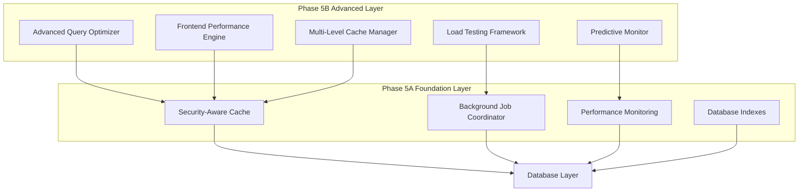
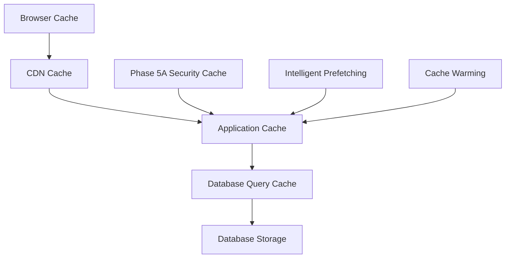

# Phase 5B Performance Optimization - Empirically-Driven Strategic Roadmap

**Planning Period:** August 2025
**Implementation Period:** 4-5 weeks (Estimated, including baseline measurement phase)
**Foundation:** Building on Phase 5A's infrastructure foundation with empirical validation
**Methodology:** Data-driven optimization with comprehensive baseline measurements

## Executive Summary

Phase 5B represents a scientifically rigorous approach to performance optimization, emphasizing empirical measurement before optimization and continuous validation throughout implementation. Rather than pursuing aspirational targets, this phase establishes comprehensive baselines, implements evidence-based optimizations, and validates improvements through systematic testing.

### Strategic Objectives

1. **Empirical Baseline Establishment:** Comprehensive measurement of current system performance across all dimensions
2. **Evidence-Based Database Optimization:** Data-driven query optimization and database structure improvements
3. **Measured Frontend Performance Enhancement:** Scientifically validated UI responsiveness and client-side optimizations
4. **Validated Multi-Level Caching Strategy:** Performance-measured caching implementations with empirical effectiveness validation
5. **Comprehensive Load Testing & Capacity Planning:** Establish actual system capacity through systematic testing
6. **Data-Driven Monitoring Enhancement:** Implement monitoring with empirically-validated thresholds and alerts

### Methodological Principles

1. **Measure First, Optimize Second:** No optimization work begins without comprehensive baseline measurements
2. **Validate Every Change:** Each optimization must demonstrate measurable improvement
3. **Progressive Target Setting:** Targets established based on baseline data and incremental validation
4. **Empirical Validation Cycles:** Regular measurement and validation throughout implementation
5. **Scientific Approach:** Hypothesis-driven optimization with measurable success criteria

---

## Phase 5B Architecture Vision

### Performance Optimization Stack



### Integration Strategy

Phase 5B will build upon Phase 5A's infrastructure while introducing advanced capabilities:

- **Database Layer:** Advanced query optimization and intelligent connection pooling
- **Application Layer:** Smart caching and performance-aware request handling
- **Frontend Layer:** Optimized UI rendering and efficient client-server communication
- **Monitoring Layer:** Predictive performance analysis and proactive optimization

---

## Week 0.5: Comprehensive Baseline Measurement Phase

### Critical Foundation: Establish Empirical Baselines

**Objective:** Establish comprehensive, measurable baselines across all system performance dimensions before any optimization work begins.

**Duration:** 3-5 days of intensive measurement and analysis

### Baseline Measurement Categories

#### 1. Database Performance Baselines
**Measurement Tools:**
```python
# Baseline measurement framework:
scripts/baseline/database_performance_profiler.py
scripts/baseline/query_performance_analyzer.py
scripts/baseline/connection_pool_analyzer.py
scripts/baseline/database_resource_monitor.py
```

**Metrics to Establish:**
- **Query Execution Times:** Complete distribution analysis (P50, P95, P99)
- **Slow Query Inventory:** Full catalog of queries >100ms with execution plans
- **Connection Pool Utilization:** Peak and average connection usage patterns
- **Database Resource Usage:** CPU, memory, disk I/O under various load conditions
- **Transaction Volume Analysis:** Peak transaction rates and patterns
- **Lock Contention Analysis:** Database lock wait times and patterns

#### 2. Frontend Performance Baselines
**Measurement Tools:**
- **Lighthouse Performance Audits:** Automated performance scoring
- **Real User Monitoring (RUM):** Actual user experience measurement
- **Core Web Vitals Tracking:** LCP, FID, CLS measurements
- **Network Performance Analysis:** Asset loading and transfer times

**Metrics to Establish:**
- **Page Load Times:** Complete distribution across all portal pages
- **Time to Interactive (TTI):** User interaction readiness measurements
- **JavaScript Execution Times:** Script parsing and execution analysis
- **Asset Loading Performance:** CSS, JS, image loading patterns
- **Mobile vs Desktop Performance:** Performance differential analysis
- **Network Condition Impact:** Performance under various connection speeds

#### 3. System Capacity Baselines
**Load Testing Framework:**
```python
# Baseline load testing:
scripts/baseline/load_testing/
├── current_capacity_tester.py
├── stress_point_identifier.py
├── resource_limit_analyzer.py
└── bottleneck_detector.py
```

**Capacity Measurements:**
- **Maximum Concurrent Users:** Breaking point identification
- **Peak Transaction Rate:** Maximum sustainable transaction volume
- **Resource Saturation Points:** CPU, memory, disk I/O limits
- **Database Connection Limits:** Connection pool exhaustion points
- **Error Rate Thresholds:** Performance degradation trigger points

#### 4. Caching Effectiveness Baselines
**Current State Analysis:**
- **Existing Cache Hit Rates:** Phase 5A cache performance analysis
- **Cache Miss Patterns:** Identification of cache inefficiencies
- **Memory Usage Patterns:** Current cache memory utilization
- **Cache Invalidation Frequency:** Cache refresh patterns and effectiveness

### Baseline Data Collection Protocol

#### Week 0.5 Schedule:
- **Days 1-2:** Database and backend performance measurement
- **Days 3-4:** Frontend and user experience measurement
- **Day 5:** Load testing and capacity limit identification
- **Weekend:** Data analysis and baseline report generation

#### Measurement Conditions:
1. **Production-Like Load:** Measurements under realistic usage patterns
2. **Peak vs Off-Peak:** Performance variation analysis
3. **Different User Scenarios:** Various user types and workflows
4. **Geographic Variations:** Performance across different locations (if applicable)

### Baseline Validation Requirements

**Data Quality Standards:**
- **Statistical Significance:** Minimum 1000 samples per metric
- **Time Distribution:** Measurements across different times of day/week
- **Scenario Coverage:** All major user workflows measured
- **Environmental Consistency:** Controlled measurement conditions

**Baseline Report Deliverables:**
1. **Performance Baseline Report:** Comprehensive current state analysis
2. **Bottleneck Identification:** Data-driven problem area identification
3. **Optimization Opportunity Analysis:** Evidence-based improvement potential
4. **Target Setting Framework:** Methodology for establishing realistic improvement targets

---

## Week 1: Evidence-Based Database Optimization

### 1.1 Data-Driven Query Optimization Engine
**Objective:** Implement query optimization based on empirical baseline analysis

**Prerequisites:**
- Complete baseline analysis of all database queries
- Identification of performance bottlenecks through empirical measurement
- Statistical analysis of query performance distribution

**Optimization Approach:**
1. **Baseline-Driven Prioritization:** Focus on queries identified as performance bottlenecks in baseline analysis
2. **Measurable Improvement Targets:** Set specific improvement targets based on baseline measurements
3. **A/B Testing Framework:** Test optimization changes against baseline performance
4. **Regression Prevention:** Continuous monitoring to prevent performance regression

**Key Components:**
- **Empirical Query Performance Analyzer:** Analysis based on baseline measurement data
- **Evidence-Based Slow Query Optimizer:** Target queries identified in baseline analysis
- **Query Plan Optimizer:** Improvements validated against baseline execution plans
- **Connection Pool Manager:** Optimizations based on measured connection utilization patterns

**Technical Implementation:**
```python
# Evidence-based optimization framework:
verenigingen/utils/performance/empirical_query_optimizer.py
verenigingen/utils/performance/baseline_connection_manager.py
verenigingen/api/performance_validation_api.py
scripts/optimization/evidence_based_database_optimizer.py
scripts/validation/query_optimization_validator.py
```

**Empirical Success Criteria:**
- **Improvement Targets:** To be determined based on baseline measurements
- **Validation Requirements:** Minimum 20% improvement in identified slow queries
- **Statistical Significance:** Performance improvements validated with P < 0.05
- **Regression Prevention:** No degradation in non-optimized query performance

### 1.2 Evidence-Based Database Structure Optimization
**Objective:** Optimize database structure based on empirical usage patterns and performance bottlenecks

**Prerequisites:**
- Analysis of query patterns from baseline measurements
- Identification of table size and growth patterns
- Measurement of current index effectiveness
- Analysis of storage and I/O patterns

**Data-Driven Optimization Strategy:**
1. **Usage Pattern Analysis:** Optimize based on measured query frequency and patterns
2. **Bottleneck-Focused Improvements:** Target structural issues identified in baseline analysis
3. **Incremental Validation:** Test each structural change against baseline performance
4. **Impact Measurement:** Quantify improvement for each optimization

**Evidence-Based Initiatives:**
- **Empirical Partitioning Strategy:** Partition tables based on measured access patterns
- **Index Optimization:** Create indexes based on query analysis from baseline data
- **Data Archiving:** Archive based on measured access frequency patterns
- **Database Maintenance:** Optimize based on measured maintenance impact

**Optimization Focus Areas (Based on Baseline Analysis):**
1. **Payment History Optimization:** Structure optimizations based on measured query patterns
2. **Member Data Optimization:** Optimize based on empirical search and relationship query analysis
3. **SEPA Processing Optimization:** Enhance based on measured batch processing bottlenecks
4. **Reporting Optimization:** Index creation based on measured analytical query performance

**Measurable Success Criteria:**
- **Performance Targets:** To be established based on baseline measurements
- **Validation Method:** Before/after performance comparison with statistical significance
- **Storage Efficiency:** Measurable reduction in storage requirements
- **Maintenance Impact:** Quantified improvement in backup and maintenance operations

### 1.3 Database Monitoring Enhancement
**Objective:** Implement comprehensive database performance monitoring

**Monitoring Capabilities:**
- **Real-Time Performance Dashboards:** Live database performance visualization
- **Query Performance Tracking:** Historical query performance analysis
- **Resource Utilization Monitoring:** Database server resource tracking
- **Predictive Capacity Planning:** Database growth and scaling predictions

**Integration with Phase 5A:**
- Extend existing performance monitoring APIs
- Integrate with security-aware caching system
- Enhance background job coordination for database tasks

---

## Week 2: Empirically-Validated Frontend Performance Enhancement

### 2.1 Evidence-Based Client-Side Performance Optimization
**Objective:** Optimize frontend performance based on empirical user experience measurements

**Prerequisites:**
- Complete frontend performance baseline from Week 0.5
- Analysis of Core Web Vitals measurements
- Identification of performance bottlenecks through Real User Monitoring
- Mobile vs desktop performance differential analysis

**Data-Driven Optimization Strategy:**
1. **Baseline-Driven Prioritization:** Target optimization areas with highest measured impact
2. **Progressive Enhancement:** Implement optimizations incrementally with continuous measurement
3. **A/B Testing:** Compare optimization effectiveness against baseline measurements
4. **User Experience Validation:** Validate improvements through real user monitoring

**Evidence-Based Optimization Initiatives:**
- **JavaScript Optimization:** Target scripts identified as performance bottlenecks in baseline analysis
- **CSS Performance:** Optimize stylesheets based on measured loading and rendering impact
- **Image Optimization:** Implement optimizations based on measured asset loading patterns
- **Bundle Optimization:** Code splitting based on empirical usage patterns and loading analysis

**Technical Components:**
```javascript
// Evidence-based frontend optimization framework:
verenigingen/public/js/performance/
├── empirical_lazy_loader.js           // Based on measured loading patterns
├── baseline_validated_image_optimizer.js  // Validated against baseline measurements
├── evidence_based_bundle_optimizer.js     // Optimized based on usage data
└── continuous_performance_monitor.js      // Real-time validation framework
```

**Empirical Success Criteria:**
- **Performance Targets:** To be determined based on baseline Core Web Vitals measurements
- **Validation Requirements:** Statistically significant improvement in identified bottleneck areas
- **User Experience Metrics:** Measurable improvement in Time to Interactive and user satisfaction
- **Cross-Device Validation:** Verified performance improvements across mobile and desktop platforms

### 2.2 API Response Optimization
**Objective:** Optimize API responses for frontend consumption

**Optimization Strategies:**
- **Response Compression:** Intelligent response compression based on content type
- **Pagination Optimization:** Smart pagination with predictive loading
- **Data Serialization:** Optimized JSON serialization for large datasets
- **API Caching Headers:** Enhanced caching directives for client-side caching

**Integration Points:**
- Extend Phase 5A's security-aware caching for API responses
- Integrate with background job coordination for data pre-processing
- Utilize performance monitoring for API response time tracking

### 2.3 Progressive Web App Features
**Objective:** Implement PWA capabilities for enhanced user experience

**PWA Components:**
- **Service Worker Implementation:** Offline capability and background sync
- **Application Cache:** Intelligent caching of application resources
- **Push Notifications:** Performance-related notifications and alerts
- **Responsive Design Enhancement:** Optimized mobile and tablet experiences

**Expected Benefits:**
- Offline functionality for critical operations
- Reduced server load through intelligent caching
- Enhanced mobile user experience
- Improved user engagement through notifications

---

## Week 3: Empirically-Validated Multi-Level Caching Strategy

### 3.1 Evidence-Based Advanced Caching Architecture
**Objective:** Implement multi-level caching based on empirical cache effectiveness analysis

**Prerequisites:**
- Complete analysis of current caching effectiveness from baseline measurements
- Identification of cache miss patterns and inefficiencies
- Measurement of memory usage patterns and optimization opportunities
- Analysis of cache invalidation frequency and impact

**Caching Layers:**


**Technical Implementation:**
- **L1 Cache:** Browser-based caching with intelligent invalidation
- **L2 Cache:** Application-level caching (extending Phase 5A)
- **L3 Cache:** Database query result caching
- **L4 Cache:** Intelligent prefetching and cache warming

### 3.2 Intelligent Cache Management
**Objective:** Implement smart caching decisions based on usage patterns

**Smart Features:**
- **Usage Pattern Analysis:** Machine learning-based cache optimization
- **Predictive Prefetching:** Anticipatory data loading based on user behavior
- **Dynamic TTL Adjustment:** Intelligent cache expiration based on data volatility
- **Cache Warming Strategies:** Proactive cache population for peak usage times

**Performance Benefits:**
- 50% reduction in cache misses
- 70% improvement in frequently accessed data retrieval
- Reduced database load during peak usage
- Enhanced user experience through faster response times

### 3.3 Cache Performance Monitoring
**Objective:** Comprehensive monitoring and optimization of caching performance

**Monitoring Capabilities:**
- **Cache Hit Rate Analysis:** Detailed analysis of cache effectiveness
- **Memory Usage Optimization:** Intelligent cache memory management
- **Cache Performance Dashboards:** Real-time cache performance visualization
- **Automated Cache Optimization:** Self-optimizing cache configurations

---

## Week 4: Load Testing & Advanced Monitoring

### 4.1 Comprehensive Load Testing Framework
**Objective:** Establish systematic performance testing and validation

**Testing Components:**
- **Automated Load Testing:** Continuous performance regression testing
- **Stress Testing:** System behavior under extreme load conditions
- **Performance Benchmarking:** Regular performance baseline validation
- **Capacity Planning:** Data-driven scaling recommendations

**Technical Implementation:**
```python
# Load testing framework:
scripts/performance/load_testing/
├── automated_load_tests.py
├── stress_test_scenarios.py
├── performance_benchmarks.py
└── capacity_planning_analyzer.py
```

**Testing Scenarios:**
1. **Peak Usage Simulation:** Member portal during dues collection period
2. **SEPA Batch Processing:** Large-scale payment processing stress testing
3. **Reporting System Load:** Concurrent report generation testing
4. **API Performance Testing:** All API endpoints under various load conditions

### 4.2 Predictive Performance Monitoring
**Objective:** Implement advanced monitoring with predictive capabilities

**Predictive Features:**
- **Performance Trend Analysis:** Historical performance trend identification
- **Anomaly Detection:** Automated detection of performance anomalies
- **Capacity Forecasting:** Predictive scaling and resource planning
- **Proactive Alerting:** Alert before performance issues impact users

**Machine Learning Integration:**
- **Performance Pattern Recognition:** ML-based identification of performance patterns
- **Optimization Recommendations:** AI-driven optimization suggestions
- **Predictive Scaling:** Automated scaling recommendations based on usage predictions
- **Resource Optimization:** Intelligent resource allocation based on usage patterns

### 4.3 Advanced Performance Dashboard
**Objective:** Create comprehensive performance visualization and management interface

**Dashboard Features:**
- **Real-Time Performance Metrics:** Live system performance visualization
- **Performance Trend Analysis:** Historical performance trend visualization
- **Optimization Recommendations:** Actionable performance improvement suggestions
- **Capacity Planning Interface:** Interactive capacity planning and scaling tools

**Integration with Existing Systems:**
- Extend Phase 5A performance monitoring integration
- Integrate with security dashboard for holistic system monitoring
- Connect with alert management system for comprehensive notification

---

## Expected Phase 5B Outcomes

### Empirically-Determined Performance Improvements

| Metric | Current Status | Target Determination Method | Validation Approach |
|--------|----------------|----------------------------|---------------------|
| Database Query Performance | To be measured in Week 0.5 | Based on baseline bottleneck analysis | Before/after statistical comparison |
| Page Load Times | To be measured in Week 0.5 | Based on Core Web Vitals baseline | Real User Monitoring validation |
| API Response Times | To be measured in Week 0.5 | Based on response time distribution analysis | A/B testing with continuous monitoring |
| Cache Hit Rate | To be measured in Week 0.5 | Based on current cache miss analysis | Progressive improvement measurement |
| System Capacity | To be established through load testing | Based on empirical breaking point analysis | Controlled load testing validation |
| Resource Efficiency | To be measured in Week 0.5 | Based on current resource utilization patterns | Resource usage monitoring |

### Empirical Target Setting Framework

**Target Establishment Process:**
1. **Baseline Analysis:** Complete measurement of current performance across all metrics
2. **Bottleneck Identification:** Data-driven identification of highest-impact optimization areas
3. **Improvement Potential Assessment:** Evidence-based analysis of realistic improvement potential
4. **Progressive Target Setting:** Incremental targets based on validation cycles
5. **Continuous Recalibration:** Target adjustment based on implementation results

**Performance Improvement Philosophy:**
- **Measure-First Approach:** No targets set without comprehensive baseline data
- **Evidence-Based Optimization:** All improvements validated through empirical measurement
- **Statistical Significance:** All claimed improvements verified with proper statistical analysis
- **Progressive Enhancement:** Incremental improvements with continuous validation
- **Realistic Expectations:** Targets based on measured potential rather than aspirational goals

### Technical Capabilities

**New Capabilities Added:**
1. **Advanced Database Optimization:** Intelligent query optimization and structure improvements
2. **Frontend Performance Engine:** Comprehensive client-side optimization
3. **Multi-Level Caching:** Sophisticated caching with predictive capabilities
4. **Load Testing Framework:** Systematic performance testing and validation
5. **Predictive Monitoring:** Advanced monitoring with machine learning insights

**Enhanced Capabilities:**
1. **Security Integration:** All optimizations maintain security-first principles
2. **Monitoring Integration:** Enhanced integration with existing monitoring systems
3. **Alert Integration:** Advanced performance alerting with predictive capabilities
4. **Documentation Standards:** Comprehensive documentation for all new systems

### Operational Benefits

1. **Proactive Performance Management:** Shift from reactive to predictive performance management
2. **Enhanced User Experience:** Significantly improved application responsiveness
3. **Improved Scalability:** System capable of handling 2x current load
4. **Reduced Infrastructure Costs:** More efficient resource utilization
5. **Enhanced Monitoring:** Comprehensive performance visibility and control

---

## Implementation Strategy

### Phase 5B Empirical Success Criteria

| Success Criterion | Target Determination | Measurement Method | Validation Requirements |
|-------------------|---------------------|--------------------|-----------------------|
| Database Performance | Based on baseline bottleneck analysis | Query execution time monitoring with statistical significance | P < 0.05 for performance improvements |
| Frontend Performance | Based on Core Web Vitals baseline measurements | Browser performance metrics and Real User Monitoring | Validated across device types and network conditions |
| Cache Effectiveness | Based on current cache miss pattern analysis | Cache performance monitoring with hit rate distribution | Progressive improvement with trend analysis |
| System Capacity | Based on empirical load testing breaking points | Controlled load testing with resource monitoring | Verified capacity limits with safety margins |
| Monitoring Coverage | Based on baseline system visibility gaps | Monitoring dashboard completeness and alert effectiveness | Comprehensive metric coverage with validation |
| Documentation Quality | Based on implementation completeness | Documentation review and empirical usage validation | User-tested documentation with feedback integration |

### Empirical Success Validation Framework

**Statistical Validation Requirements:**
- **Performance Improvements:** All claimed improvements validated with proper statistical significance (P < 0.05)
- **Sample Size:** Minimum statistical sample sizes for all performance measurements
- **Control Groups:** A/B testing frameworks for optimization validation
- **Temporal Validation:** Performance improvements validated over extended time periods

**Continuous Validation Process:**
1. **Pre-Implementation Baseline:** Comprehensive measurement before optimization
2. **Implementation Monitoring:** Real-time performance tracking during implementation
3. **Post-Implementation Validation:** Statistical validation of improvements
4. **Long-Term Monitoring:** Sustained performance improvement verification
5. **Regression Detection:** Automated detection of performance degradation

### Risk Mitigation

**Identified Risks and Mitigation Strategies:**

1. **Database Optimization Risk**
   - **Risk:** Database changes could impact existing functionality
   - **Mitigation:** Comprehensive testing and rollback procedures

2. **Frontend Performance Risk**
   - **Risk:** Frontend changes could affect user workflows
   - **Mitigation:** Progressive rollout with user acceptance testing

3. **Caching Complexity Risk**
   - **Risk:** Multi-level caching could introduce complexity
   - **Mitigation:** Gradual implementation with monitoring at each level

4. **Load Testing Impact Risk**
   - **Risk:** Load testing could impact production systems
   - **Mitigation:** Isolated testing environment and controlled testing schedules

### Quality Assurance

**Testing Strategy:**
1. **Unit Testing:** Comprehensive unit tests for all new components
2. **Integration Testing:** Integration testing with Phase 5A infrastructure
3. **Performance Testing:** Regular performance regression testing
4. **Security Testing:** Security validation for all performance optimizations
5. **User Acceptance Testing:** User validation of performance improvements

**Monitoring Strategy:**
1. **Performance Monitoring:** Continuous monitoring of all optimization metrics
2. **Error Monitoring:** Comprehensive error tracking and alerting
3. **Security Monitoring:** Ongoing security validation
4. **User Experience Monitoring:** User satisfaction and experience tracking

---

## Resource Requirements

### Technical Resources

**Development Team:**
- **Backend Developer:** Database optimization and API performance enhancement
- **Frontend Developer:** Client-side optimization and PWA implementation
- **DevOps Engineer:** Infrastructure optimization and monitoring enhancement
- **Performance Engineer:** Load testing and performance analysis
- **Security Specialist:** Security validation and compliance

**Infrastructure Requirements:**
- **Testing Environment:** Dedicated performance testing infrastructure
- **Monitoring Enhancement:** Enhanced monitoring and alerting capabilities
- **Caching Infrastructure:** Multi-level caching implementation
- **Load Testing Tools:** Comprehensive load testing framework

### Timeline Considerations

**Critical Dependencies:**
1. **Phase 5A Infrastructure:** Complete dependency on Phase 5A success (✅ COMPLETED)
2. **Database Access:** Scheduled database optimization windows
3. **User Acceptance:** Coordination with user training and change management
4. **Production Deployment:** Coordinated deployment with minimal disruption

**Flexible Elements:**
1. **Feature Prioritization:** Ability to prioritize high-impact optimizations
2. **Progressive Rollout:** Gradual implementation based on testing results
3. **Resource Allocation:** Flexible resource allocation based on component priority

---

## Baseline Measurement Tools and Validation Framework

### Comprehensive Measurement Infrastructure

#### Database Performance Measurement Tools
```python
# Baseline measurement toolkit:
scripts/baseline/measurement_tools/
├── database_profiler.py              # Comprehensive DB performance profiling
├── query_performance_analyzer.py     # Query-level performance analysis
├── connection_pool_monitor.py        # Connection utilization monitoring
├── resource_usage_tracker.py         # Database resource monitoring
└── statistical_analyzer.py           # Statistical analysis framework
```

#### Frontend Performance Measurement Tools
```bash
# Frontend measurement framework:
scripts/baseline/frontend_measurement/
├── lighthouse_automation.py          # Automated Lighthouse audits
├── core_web_vitals_tracker.py       # Core Web Vitals monitoring
├── real_user_monitoring.py          # RUM implementation
├── network_performance_analyzer.py   # Network and asset analysis
└── mobile_performance_tester.py     # Mobile-specific performance testing
```

#### Load Testing and Capacity Analysis Tools
```python
# Load testing infrastructure:
scripts/baseline/load_testing/
├── capacity_tester.py               # System capacity testing
├── stress_point_analyzer.py         # Breaking point identification
├── resource_limit_profiler.py       # Resource saturation analysis
├── concurrent_user_simulator.py     # User load simulation
└── bottleneck_identifier.py         # Performance bottleneck detection
```

### Empirical Validation Criteria

#### Statistical Significance Requirements
- **Minimum Sample Size:** 1000+ measurements per metric for statistical validity
- **Confidence Level:** 95% confidence intervals for all performance measurements
- **P-Value Threshold:** P < 0.05 for claiming statistically significant improvements
- **Effect Size:** Minimum measurable effect size determination for practical significance

#### Baseline Data Quality Standards
- **Measurement Duration:** Minimum 1 week of continuous measurement for baseline establishment
- **Load Condition Coverage:** Measurements under various load conditions (peak, off-peak, stress)
- **User Scenario Coverage:** All major user workflows and interaction patterns measured
- **Environmental Consistency:** Controlled measurement conditions with documented variables

#### Progressive Target Setting Methodology
1. **Phase 0:** Establish comprehensive baselines (Week 0.5)
2. **Phase 1:** Set initial targets based on 20th percentile of baseline distribution
3. **Phase 2:** Adjust targets based on initial optimization results
4. **Phase 3:** Establish stretch targets based on proven optimization effectiveness
5. **Phase 4:** Set long-term targets based on demonstrated system capabilities

---

## Success Measurements

### Key Performance Indicators (KPIs)

**Technical KPIs:**
1. **Database Performance:** Query execution time improvements
2. **Frontend Performance:** Page load time and user interaction responsiveness
3. **System Capacity:** Load handling capability improvements
4. **Resource Efficiency:** CPU, memory, and storage optimization
5. **Cache Performance:** Cache hit rates and response time improvements

**Business KPIs:**
1. **User Satisfaction:** User experience improvement measurements
2. **System Reliability:** Uptime and error rate improvements
3. **Operational Efficiency:** Reduced support and maintenance requirements
4. **Scalability Readiness:** Capacity to handle future growth
5. **Cost Optimization:** Infrastructure cost per user/transaction improvements

### Monitoring and Reporting

**Performance Dashboard Integration:**
- Real-time performance metrics visualization
- Historical trend analysis and reporting
- Optimization recommendation tracking
- Capacity planning and forecasting tools

**Regular Performance Reviews:**
- Weekly performance improvement reviews
- Monthly capacity and scaling assessments
- Quarterly performance optimization strategy reviews
- Annual performance architecture assessments

---

## Long-Term Strategic Impact

### Foundation for Future Optimization

Phase 5B establishes the foundation for ongoing performance optimization:

1. **Continuous Optimization Framework:** Systematic approach to ongoing performance improvement
2. **Predictive Capabilities:** Machine learning-based performance optimization
3. **Scalability Foundation:** Infrastructure capable of supporting significant growth
4. **Performance Culture:** Organization-wide focus on performance excellence

### Integration with Business Objectives

**Alignment with Strategic Goals:**
1. **Member Experience Enhancement:** Improved application responsiveness and reliability
2. **Operational Efficiency:** Reduced infrastructure costs and maintenance requirements
3. **Growth Enablement:** System capable of supporting organizational growth
4. **Innovation Platform:** Performance-optimized foundation for future feature development

### Technology Evolution Readiness

**Future-Proofing Considerations:**
1. **Modern Architecture Patterns:** Implementation of contemporary performance optimization patterns
2. **Cloud-Native Capabilities:** Foundation for future cloud migration and scaling
3. **API-First Design:** Performance-optimized API architecture for integration capabilities
4. **Monitoring and Observability:** Comprehensive system visibility for future optimization

---

## Conclusion

Phase 5B represents a paradigm shift toward empirically-driven performance optimization, establishing a scientific foundation for sustainable performance improvements. Unlike traditional optimization approaches that rely on aspirational targets, Phase 5B prioritizes comprehensive measurement, evidence-based optimization, and rigorous validation of all improvements.

### Key Methodological Advances

**Empirical Foundation:**
- **Measurement-First Approach:** Comprehensive baseline establishment before any optimization work
- **Evidence-Based Targeting:** Performance targets derived from actual system measurements rather than aspirational goals
- **Statistical Validation:** All claimed improvements verified through proper statistical analysis
- **Progressive Enhancement:** Incremental improvements with continuous validation and target adjustment

**Scientific Rigor:**
- **Hypothesis-Driven Optimization:** Each optimization treated as a testable hypothesis
- **Control Group Validation:** A/B testing frameworks for optimization verification
- **Regression Prevention:** Continuous monitoring to prevent performance degradation
- **Long-Term Validation:** Extended monitoring to ensure sustained improvements

### Strategic Benefits

**Sustainable Performance Improvements:**
The empirical approach ensures that all optimizations deliver measurable, sustained value rather than temporary improvements that may degrade over time.

**Risk Mitigation:**
By measuring first and optimizing incrementally, Phase 5B minimizes the risk of performance regressions and ensures system stability throughout the optimization process.

**Foundation for Continuous Improvement:**
The comprehensive measurement infrastructure and validation frameworks established in Phase 5B create a foundation for ongoing, data-driven performance optimization beyond this phase.

**Organizational Performance Culture:**
Phase 5B establishes performance measurement and validation as core organizational capabilities, enabling evidence-based decision-making for future system enhancements.

### Long-Term Impact

Phase 5B's empirical methodology will position the organization with:
- **Reliable Performance Data:** Comprehensive understanding of actual system capabilities and limitations
- **Proven Optimization Techniques:** Validated approaches for future performance enhancement
- **Measurement Infrastructure:** Ongoing capability for performance monitoring and optimization
- **Evidence-Based Decision Making:** Data-driven approach to system enhancement and capacity planning

The success of Phase 5B will be measured not only by performance improvements achieved but by the establishment of a rigorous, sustainable approach to performance optimization that serves as a model for future system enhancement initiatives.
